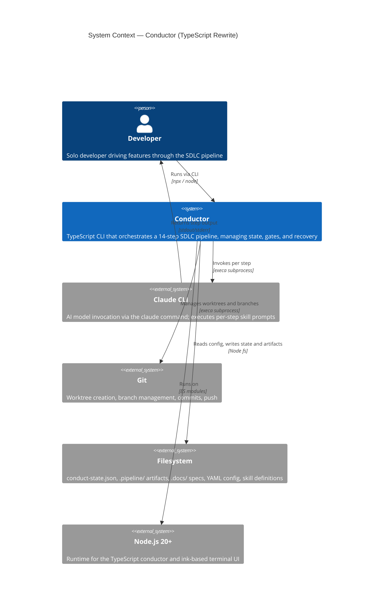
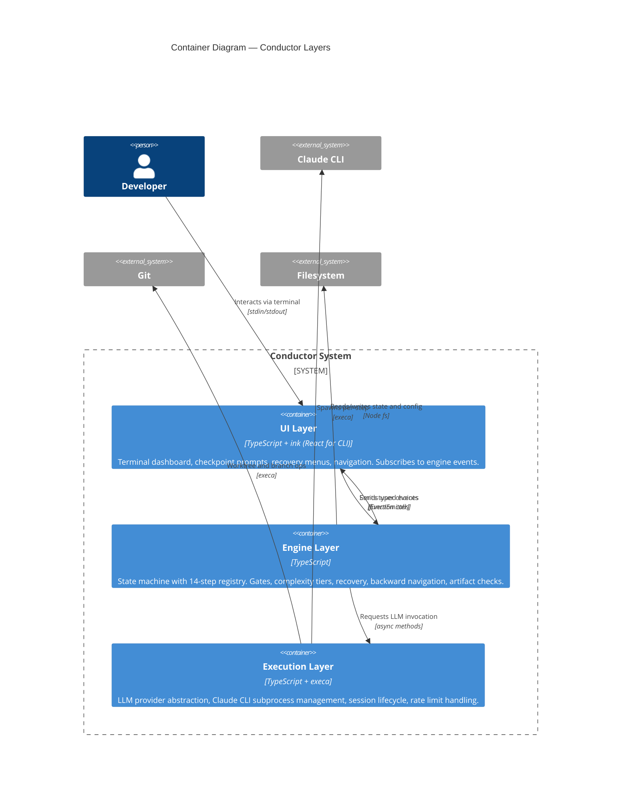
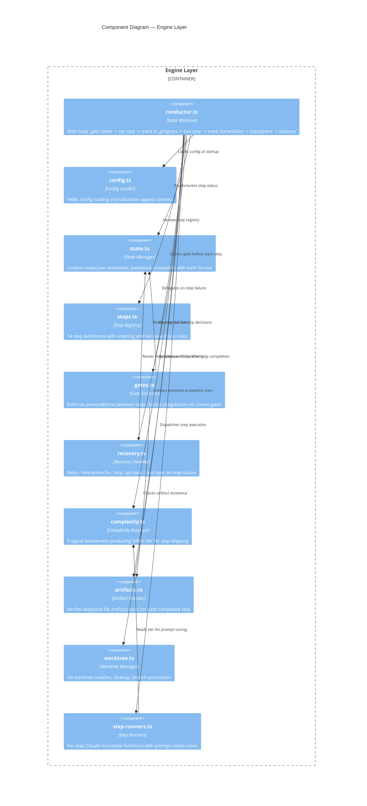
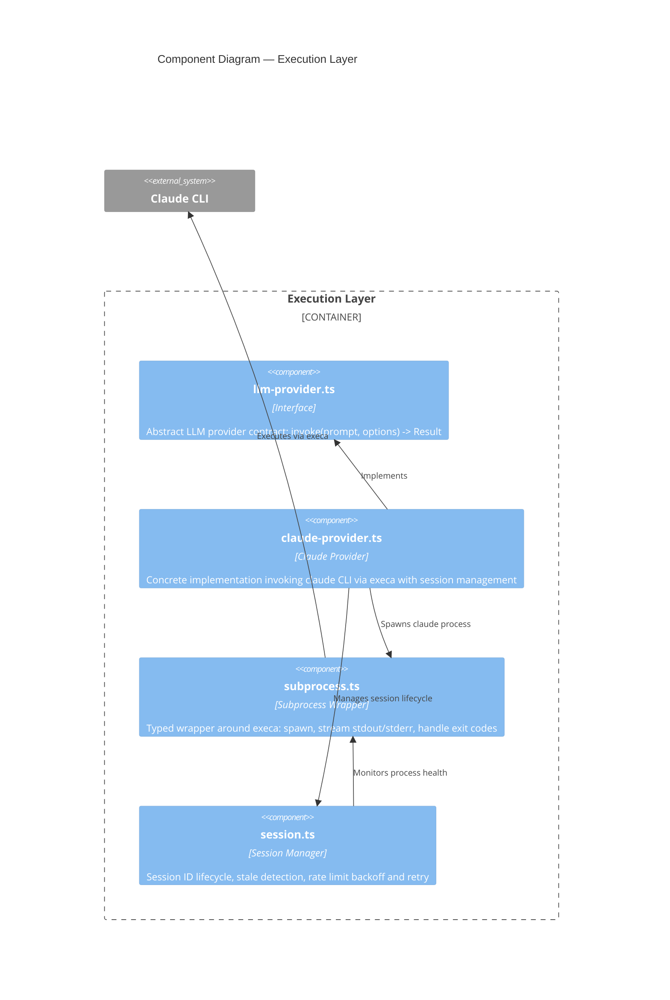
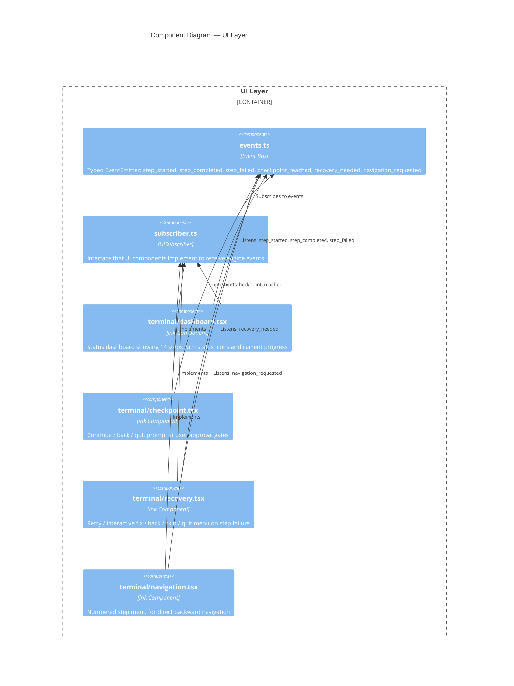
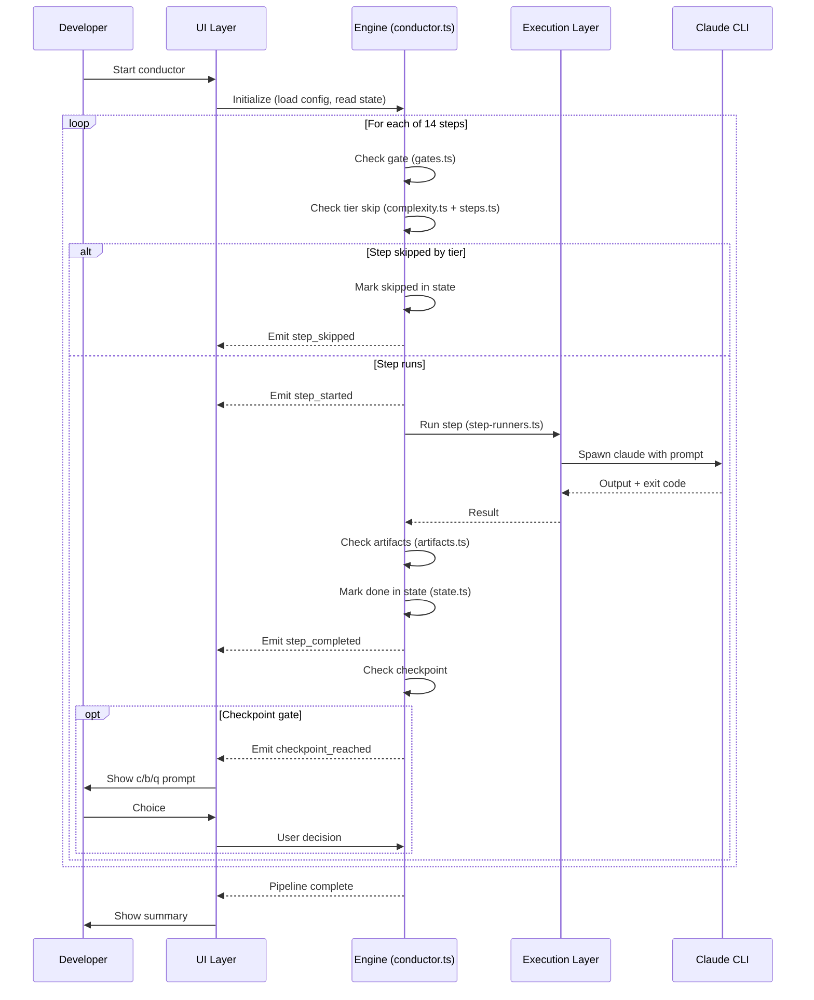
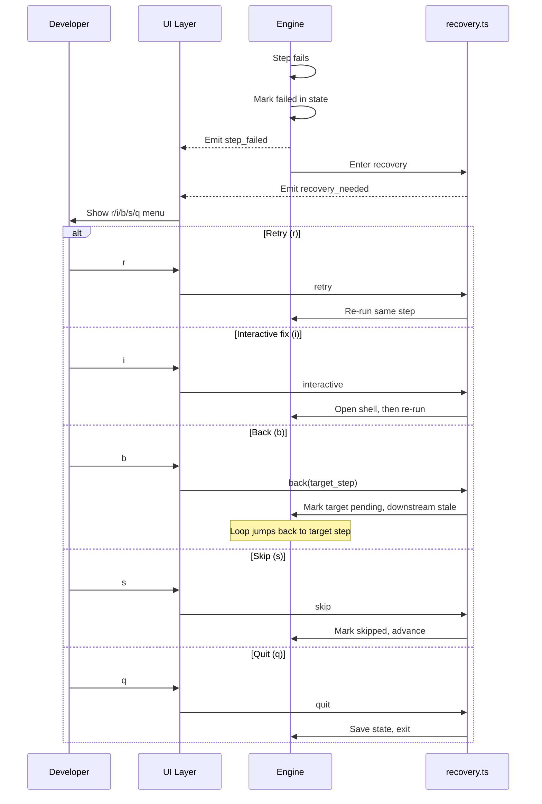

# C4 Architecture Diagrams: Conductor Rewrite (TypeScript)

Phase 3 of the pluggable harness migration. The conductor is rewritten from a
3100-line bash script (`bin/conduct`) into a typed, layered TypeScript application
with event-driven UI, structured recovery, and backward-compatible state management.

---

## Level 1: System Context

Shows the conductor system boundary, its primary user, and the external systems
it depends on.



---

## Level 2: Container Diagram

The conductor is a single deployable unit with three internal layers. Data flows
downward (Engine -> Execution -> external systems) and events flow upward
(Engine -> UI).



---

## Level 3: Component Diagram — Engine Layer

The core of the conductor. The state machine drives a 14-step loop, consulting
gates, complexity tiers, and artifact checks at each transition.



---

## Level 3: Component Diagram — Execution Layer

Abstracts LLM invocation behind a provider interface. Currently one concrete
provider (Claude CLI via execa).



---

## Level 3: Component Diagram — UI Layer

Event-driven terminal UI built with ink (React for CLI). The engine emits typed
events; UI components subscribe and render accordingly.



---

## Key Data Flows

### Main Loop (happy path)



### Recovery Flow (step failure)



---

## Project Structure

```
src/conductor/
  src/
    engine/              # Layer 1
      conductor.ts       # State machine + main loop
      config.ts          # YAML config loading
      state.ts           # conduct-state.json I/O
      steps.ts           # Step registry + ordering
      gates.ts           # Gate enforcement
      recovery.ts        # Failure recovery logic
      complexity.ts      # S/M/L tier assessment
      artifacts.ts       # Artifact existence checks
      worktree.ts        # Git worktree management
      step-runners.ts    # Per-step invocation
    execution/           # Layer 2
      llm-provider.ts    # Abstract provider interface
      claude-provider.ts # Claude CLI implementation
      subprocess.ts      # Typed subprocess wrapper
      session.ts         # Session lifecycle
    ui/                  # Layer 3
      events.ts          # Typed EventEmitter
      subscriber.ts      # UISubscriber interface
      terminal/
        dashboard.tsx    # 14-step status display
        checkpoint.tsx   # c/b/q prompt
        recovery.tsx     # r/i/b/s/q menu
        navigation.tsx   # Step selection menu
    types/               # Shared type definitions
    index.ts             # CLI entry (commander)
  test/
    engine/
    execution/
    ui/
    integration/
```
