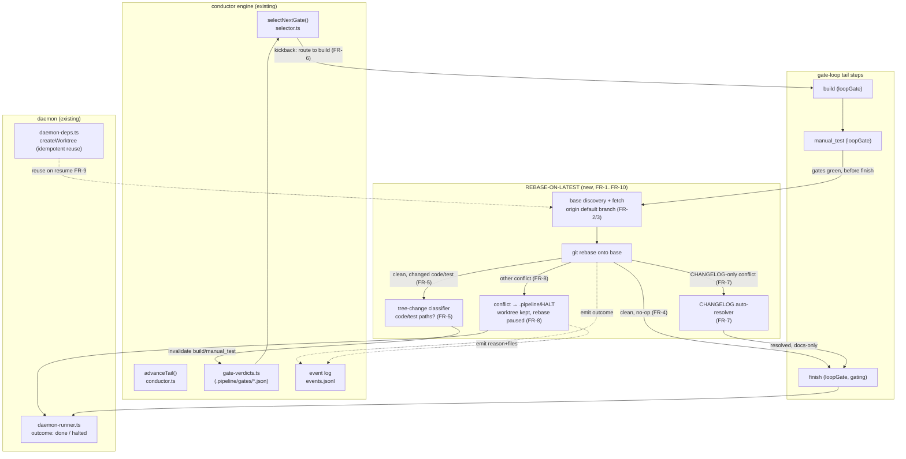
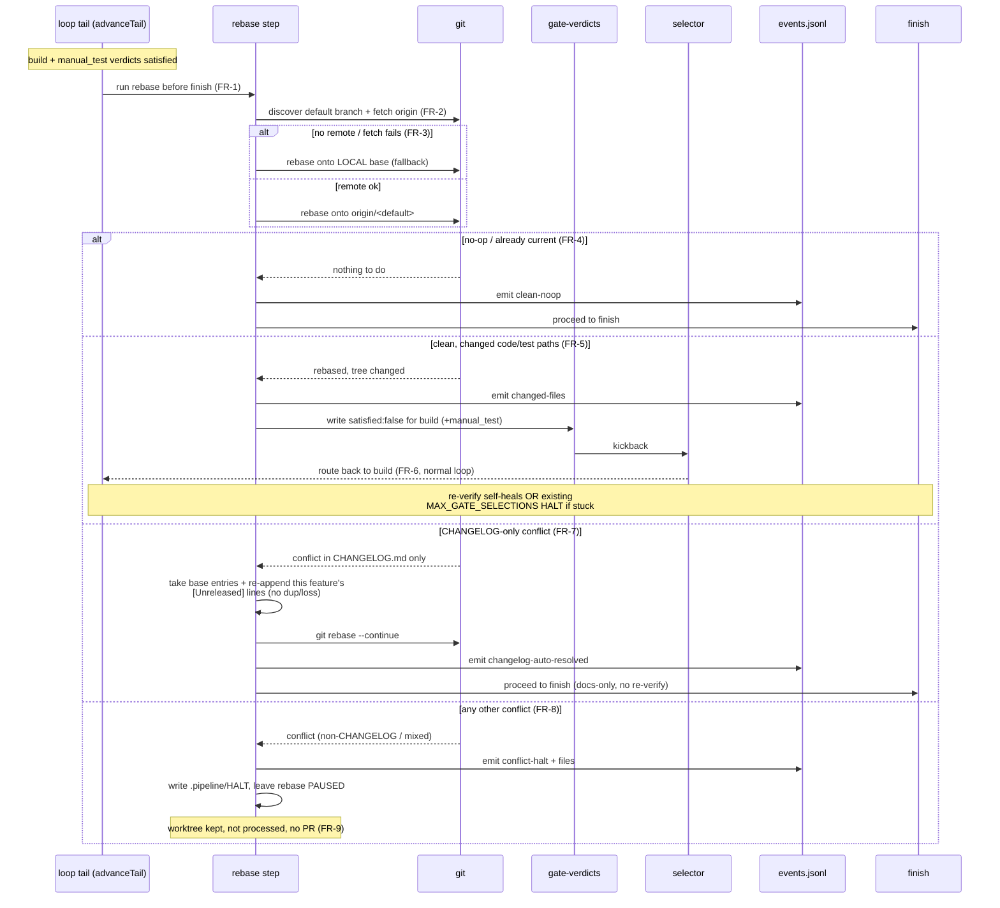
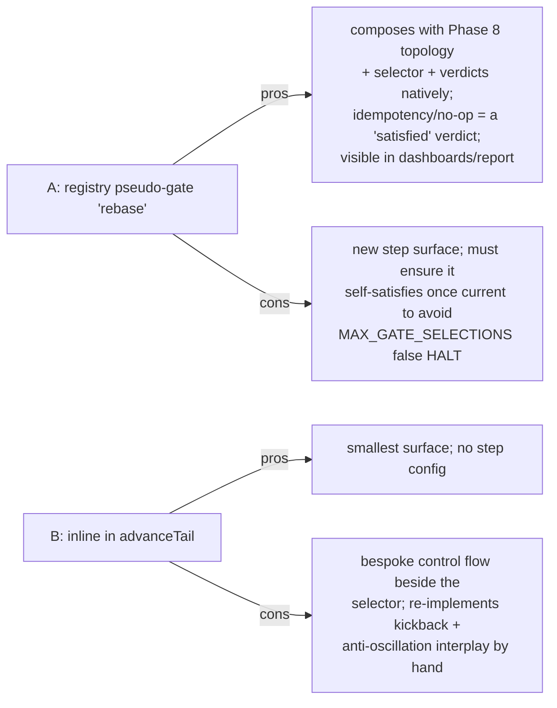

# Architecture: Phase 9.0 — Rebase-on-Latest Loop Tail

**Last updated:** 2026-06-25
**Scope:** The daemon gate-loop **tail** (`build → manual_test → finish`) and where the new
rebase-on-latest behavior is inserted. Modification to existing internal machinery — not a new
system. Consumed by `/architecture-review` to decide the insertion mechanism.
**Source PRD/stories:** `.docs/specs/2026-06-25-phase-9.0-rebase-on-latest.md`,
`.docs/stories/phase-9.0-rebase-on-latest.md`

---

## Component view — loop tail with rebase insertion

---

## Sequence — rebase outcomes before finish

---

## Insertion-mechanism decision surface (for architecture-review)

The rebase logic must run **after `manual_test` is satisfied and before `finish`**, and on a
file-changing clean rebase it must produce a kickback-shaped invalidation of `build`. Two ways
to wire it in:

**Option A — new registry pseudo-gate step `rebase`** (`loopGate: true`,
`prerequisites: [manual_test]`, before `finish`). Phase 8 already derives the gate-loop topology
from the step registry, so a new loop-gate step composes with `selectNextGate`/verdicts natively.
The rebase's own "satisfied" verdict + the existing kickback path handle re-verification and the
anti-oscillation HALT for free.

**Option B — inline rebase in `advanceTail`** just before dispatching `finish`. No registry/step
surface; a focused block that fetches, rebases, classifies the diff, writes invalidation verdicts
or HALT.

> **Design constraint (from conflict-check):** whichever option, the rebase must be a **no-op
> once the branch is current** (FR-4), so re-entry after a kickback does not re-invalidate and
> trip the existing `MAX_GATE_SELECTIONS` anti-oscillation HALT.

## Legend

- **Solid arrows** — control/data flow. **Dotted arrows** — event emission / resume reuse.
- **loopGate** — a step the selector can route back to via a kickback verdict (Phase 8 topology).
- **Existing** components are unchanged; the **REBASE** subgraph is the new Phase 9.0 surface.

## Change Log

| Date | Change | Reason |
|------|--------|--------|
| 2026-06-25 | Initial focused loop-tail + rebase-outcome diagrams | Phase 9.0 architecture input |
