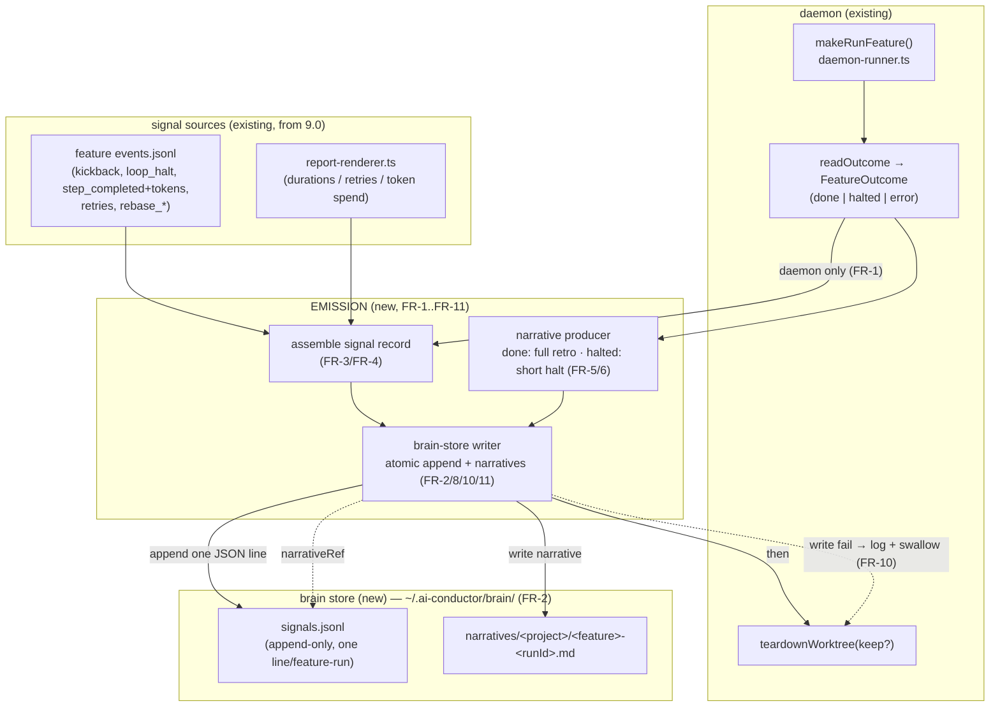
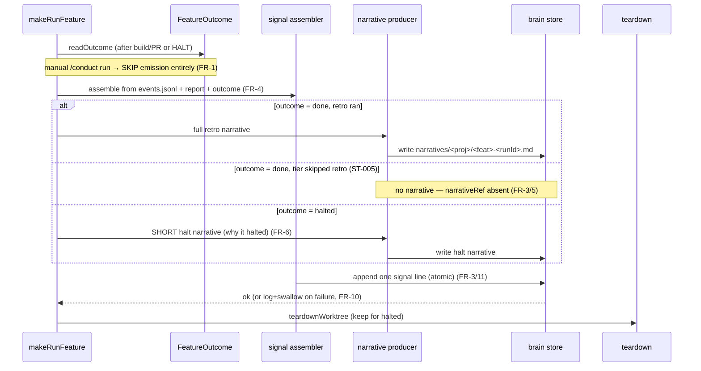
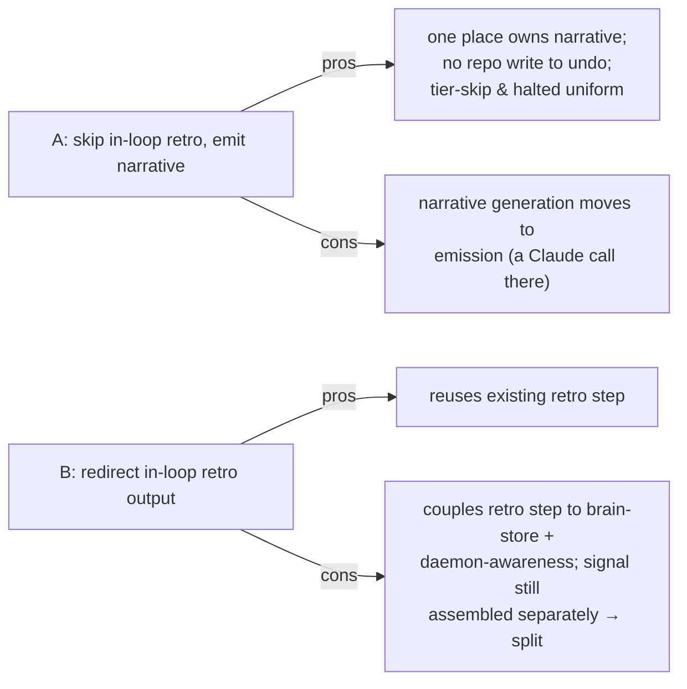

# Architecture: Phase 9.1 — Retro-Signal Emission Path

**Last updated:** 2026-06-25
**Scope:** The daemon's feature-completion emission path into the brain store. Additive to the
existing daemon; no new loop instrumentation. Consumed by `/architecture-review`.
**Source:** PRD/stories `2026-06-25-phase-9.1-retro-signal-brain-memory.md`

---

## Component view — emission on daemon completion

---

## Sequence — done / halted / retro-skipped

> Emission runs **after `readOutcome`, before `teardownWorktree`**, so the worktree context
> (diff, events, stories) is still available to the narrative producer.

---

## Decision surface for architecture-review (the retro-redirect mechanism)

The structured signal is emission-owned regardless. The open decision is how the **narrative** is
produced for daemon runs without landing in the repo:

- **Option A — skip the in-loop retro step for daemon runs; emission produces the narrative.**
  The gate loop omits `retro` under the daemon; the emission step generates done/halted narratives
  straight into the store.
- **Option B — keep the in-loop retro step; redirect its output to the store.** The `retro` step,
  when under the daemon, writes to the brain store instead of `.docs/retros/`.

## Legend
- **Solid** = data/control flow; **dotted** = reference / best-effort / failure path.
- **Existing** components unchanged; **EMISSION** + **brain store** are the new 9.1 surface.

## Change Log
| Date | Change | Reason |
|------|--------|--------|
| 2026-06-25 | Initial emission-path component + sequence diagrams | Phase 9.1 architecture input |
