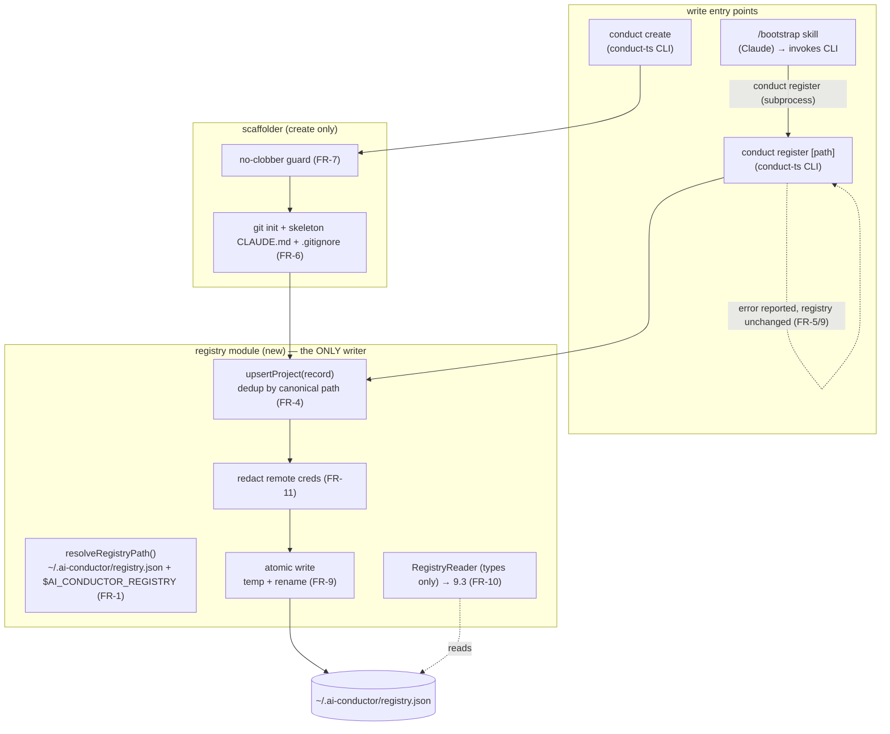
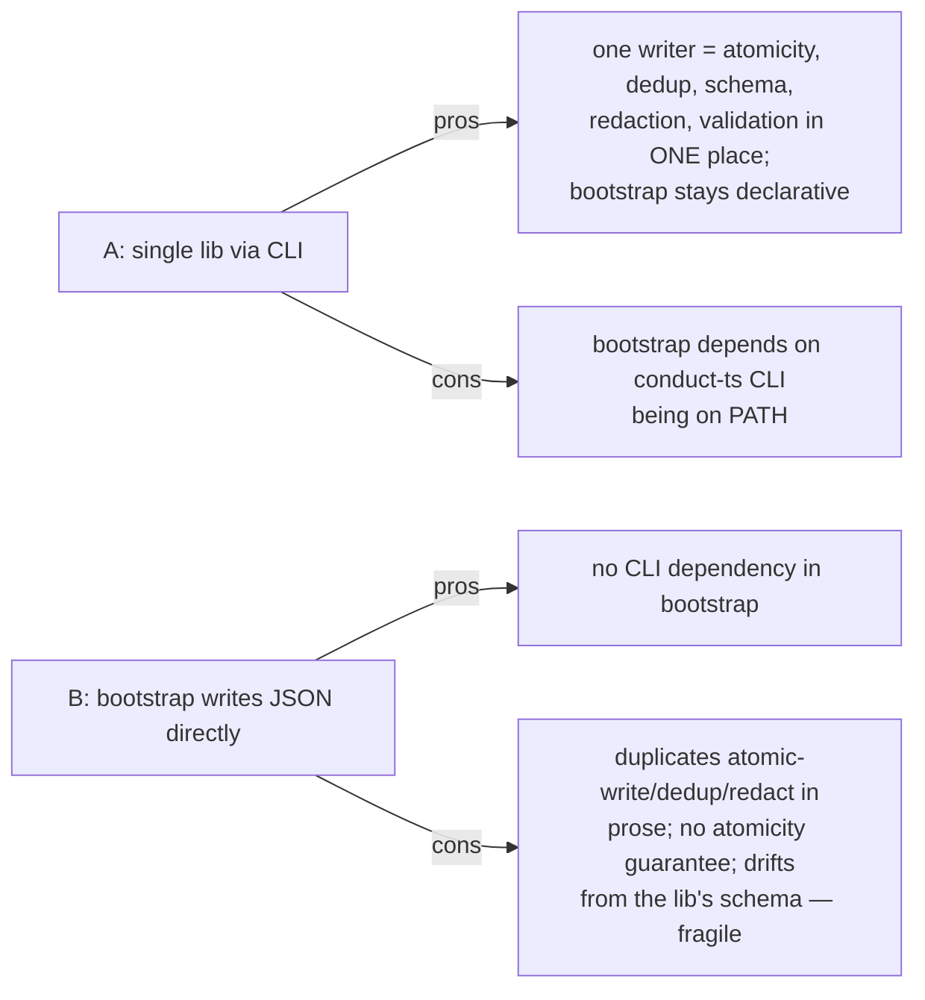

# Architecture: Phase 9.2 — Project Registry

**Last updated:** 2026-06-25
**Scope:** The registry module + its write entry points (`register`, `create`, `/bootstrap`).
Additive; consumed by `/architecture-review`.
**Source:** PRD/stories `2026-06-25-phase-9.2-registry-project-creation.md`

---

## Component view — single writer lib, multiple entry points



---

## Sequence — register / create / bootstrap

```mermaid
sequenceDiagram
    participant U as operator / brain / bootstrap
    participant C as conduct CLI
    participant L as registry lib
    participant F as registry.json

    alt register [path]
        U->>C: conduct register /abs/proj
        C->>L: validate (exists + is git repo)
        Note over C,L: not git / missing → exit≠0, F UNCHANGED (FR-5)
        L->>L: record {name, abs path, remote(redacted), status: registered}
        L->>F: upsert (dedup by canonical path) + atomic temp→rename (FR-4/9)
    else create <name> [--remote]
        U->>C: conduct create app
        C->>L: no-clobber check (dir empty?)
        Note over C,L: non-empty → exit≠0, NOTHING written (FR-7)
        C->>C: git init + skeleton CLAUDE.md + .gitignore (FR-6)
        C->>L: upsert {status: created}
    else bootstrap (existing project)
        U->>C: conduct register (subprocess, from SKILL.md)
        C->>L: upsert (idempotent; preserve `created` provenance)
    end
    L-->>U: report success / reported error (NOT swallowed, FR-9)
```

---

## Decision surface for architecture-review (registry write + integration)

**The fork:** how does `/bootstrap` (a Markdown skill run by Claude) get a project into the
registry?

- **Option A — single writer lib behind the CLI; bootstrap calls `conduct register`.** All writes
  (register, create, bootstrap) funnel through one TS registry module exposed as CLI subcommands.
- **Option B — bootstrap writes `registry.json` directly** (Claude follows SKILL.md prose to edit
  the JSON).



## Legend
- **Solid** = control/data flow; **dotted** = read / error path.
- **registry module** is the single writer; CLI commands + bootstrap are entry points.

## Change Log
| Date | Change | Reason |
|------|--------|--------|
| 2026-06-25 | Initial registry component + sequence diagrams | Phase 9.2 architecture input |
