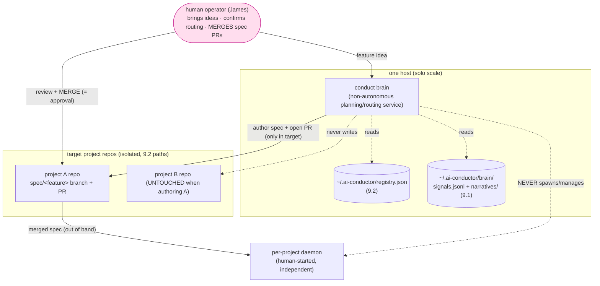
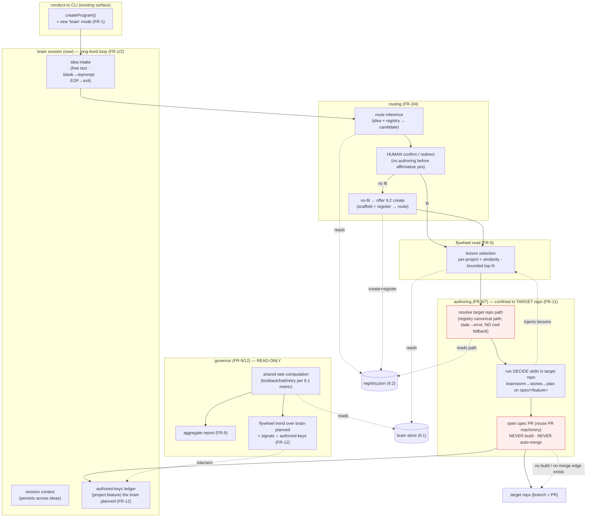
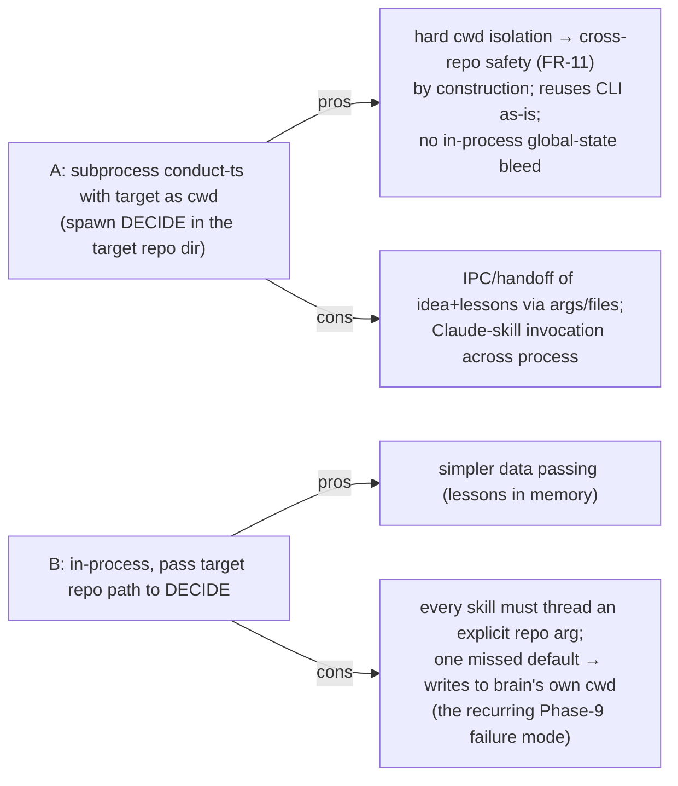

# Architecture: Phase 9.3 — Supervisor / Brain (capstone)

**Last updated:** 2026-06-25
**Scope:** The non-autonomous `conduct brain` planning/routing service — the consumer that ties
9.1 (brain store) + 9.2 (registry) together and produces spec PRs into target repos. Additive; it
**reads** the store/registry and **writes specs only to target project repos** (branch + PR). It
never builds and never auto-merges. Consumed by `/architecture-review`.
**Source:** PRD/stories `2026-06-25-phase-9.3-supervisor-brain.md`; conflict report
`.docs/conflicts/2026-06-25-phase-9.3-supervisor-brain.md`
**Reuses (existing):** `RegistryReader`/`ProjectRecord` (9.2 `registry.ts`, types-only),
`BrainStoreReader`/`BrainSignal` (9.1 `brain-store.ts`, types-only), the DECIDE skills
(brainstorm→stories→plan), the existing PR machinery (finish/pr), `createProgram()` CLI surface.

---

## System context (L1) — the brain as planning co-pilot across repos



> The only path from idea → build runs **through the operator's merge** of the spec PR (FR-7/FR-10).
> The brain's responsibility ends at the merged spec; the daemon consumes it separately (FR-8).

---

## Component view — inside `conduct brain`



---

## Sequence — idea → route → flywheel → author → spec PR

```mermaid
sequenceDiagram
    participant U as operator
    participant B as brain loop
    participant Rg as RegistryReader (9.2)
    participant St as BrainStoreReader (9.1)
    participant T as target repo
    participant P as PR machinery

    U->>B: conduct brain (start)
    B->>Rg: listProjects()
    B->>St: open store
    Note over B: missing registry → 0 projects; missing store → flywheel no-op (FR-1)
    loop until exit (FR-2)
        U->>B: feature idea (blank → reprompt)
        B->>Rg: infer candidate (idea × registry) (FR-3)
        B-->>U: propose target + rationale
        alt confirm
            U-->>B: yes (affirmative required)
        else redirect to registered project
            U-->>B: pick other (unknown name → reject/reprompt)
        else no fit
            B-->>U: offer create
            U-->>B: yes → 9.2 create + register (FR-4)
        else decline / empty
            Note over B,T: ZERO repo writes — back to prompt (FR-3 neg)
        end
        B->>St: select relevant lessons (project+similarity, bounded) (FR-5)
        B->>Rg: resolve canonical target path (stale → ERROR, no cwd fallback) (FR-11)
        B->>T: branch spec/<feature>; run brainstorm→stories→plan (FR-6)
        Note over B,T: dirty tree not clobbered; existing branch not force-overwritten;<br/>failed DECIDE step → NO PR; NO build/impl files
        B->>P: open spec PR (FR-7)
        Note over B,P: NEVER gh pr merge · NEVER pipeline/build (FR-7/10)
        B->>B: record (project,feature) in authored-keys ledger (FR-12)
        P-->>U: PR URL (merge = approval)
    end
    U->>B: exit → session summary (ideas, PRs)
    Note over B: governor report/trend = read-only over store ∩ authored-keys (FR-9/12)
```

---

## Decision surfaces for architecture-review (→ ADRs)

The PRD's open questions plus the two conflict-check carry-ins. Each becomes (or feeds) an ADR.

### DS-1 (primary fork): how does the brain run the DECIDE skills against *another* repo?



**Recommendation:** **A** — cwd-isolated subprocess makes FR-11 structural, not vigilance-based.

### DS-2 — routing inference (FR-3)
LLM over (idea × registry records: name/remote/path/recent features) → ranked candidates with
rationale; threshold for "no fit" → create offer (FR-4). Decide: inference prompt location, the
no-fit threshold, and tie-handling (surface top-N vs auto-pick — story requires surface).

### DS-3 — lesson-selection strategy for the flywheel read (FR-5)
Per-project first, then similarity (keyword/recency) across projects; **bounded top-N** with the
bound logged. Decide: similarity function (keyword vs embedding), N, and the digest shape injected
into DECIDE.

### DS-4 — spec PR opener (FR-7)
Reuse the existing `/pr` skill vs a brain-specific opener. Decide: which, and the no-remote
fallback (commit on branch, report PR-skip — must be non-fatal).

### DS-5 (conflict-check carry-in) — path canonicalization for cross-repo safety (FR-11)
9.2 FR-4 deferred symlink canonicalization. The brain resolves the **canonical** target path and
**errors before any write** if it's missing/stale — **no cwd fallback**. Decide: canonicalize here
vs push into the 9.2 reader; pairs with DS-1.

### DS-6 (conflict-check carry-in) — brain-planned provenance (FR-12)
9.1's signal schema has no provenance field. Brain derives the brain-planned set from its
**authored-keys ledger** and **intersects** with store signals — no 9.1 change. Decide: where the
ledger lives (brain session state vs a 9.2 `ProjectRecord` field) and whether to *additionally* add
a `source` marker to the 9.1 signal (Option 2, deferred).

### DS-7 — non-autonomy by construction (FR-10)
Guarantee there is **no `brain → build` and no auto-merge** code path. Decide: structural
enforcement (brain module must not import the pipeline/build or merge entry points) + the test that
asserts it; and that any harness self-edit the brain proposes is a **PR through existing gates**,
never auto-applied.

## Legend
- **Solid** = control/data flow; **dotted** = read / reference / "never-happens" boundary.
- **Pink (operator)** = the non-negotiable human approval gate. **Red (pr/target)** = the
  cross-repo + non-autonomy danger surface where FR-11/FR-10 must hold.
- **Existing** (registry/store readers, DECIDE, PR machinery, CLI) reused unchanged; the **brain
  session / routing / flywheel read / authoring / governor** are the new 9.3 surface.

## Change Log
| Date | Change | Reason |
|------|--------|--------|
| 2026-06-25 | Initial system-context + component + sequence diagrams; 7 decision surfaces | Phase 9.3 architecture input |
