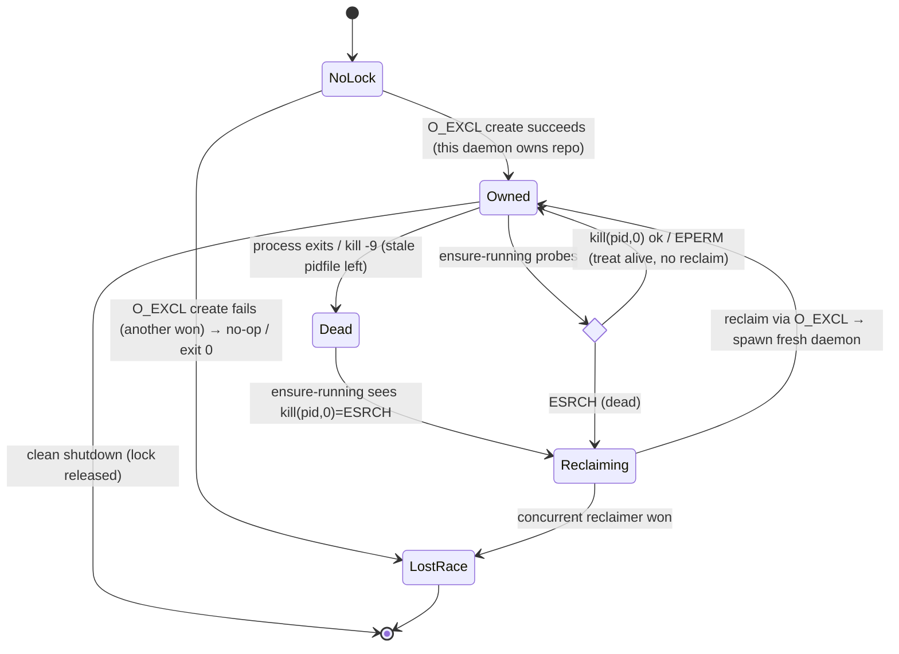

# Architecture: Phase 9.3 (Redesign) — Engineer Loop, Intake Port & Daemon Liveness

**Last updated:** 2026-06-26
**Scope:** The agent-hosted engineer loop, the intake port (claude-session adapter only this phase),
and the daemon pidfile-lock liveness / ensure-running mechanism. Extends the 9.0/9.1/9.2 phase
diagrams. Source PRD: `2026-06-26-phase-9.3-engineer-redesign.md`.

## 1. Control plane / data plane (containers, L2)

The engineer (control plane) and the per-repo daemon (data plane) are coupled **only** by the
merged spec PR + the approved artifacts on `main`. There is no live control connection.

```mermaid
graph TD
  Operator([Operator · phone/chat])

  subgraph CP["ENGINEER SESSION — control plane (agent-hosted, interactive)"]
    PORT["Intake Port<br/>(Envelope contract)"]
    CS["claude-session adapter<br/>(rides the chat)"]
    ROUTE["Routing<br/>(reason in-chat over registry · NO claude -p)"]
    DECIDE["Human-gated DECIDE in chat<br/>brainstorm→stories→plan"]
    PR["spec/&lt;slug&gt; branch + PR opener"]
    ENSURE["ensure-running<br/>(liveness check → spawn iff none/stale)"]
    GOV["Read-only governor reporting"]
  end

  subgraph FUT["9.3b (future · out of scope) "]
    GH["github-issues adapter"]
    INBOX["inbox poll / async buffer"]
    WB["bidirectional write-back"]
  end

  subgraph STORE["Shared state (read-mostly)"]
    REG["9.2 registry.json<br/>(routing · canonical repo paths · daemonState mirror)"]
    ES["9.1 engineer store<br/>(signals.jsonl + narratives)"]
  end

  subgraph DP["PER-REPO DAEMON — data plane (background, 1 per repo)"]
    LOCK[".daemon/daemon.pid<br/>O_EXCL lock = 1-per-repo mutex"]
    SCAN["discoverBacklog<br/>(plan + stories Accepted + dep-tree + !processed)"]
    BUILD["build → PR"]
  end

  TARGET[("Target repo<br/>.docs/specs|stories|plans + spec PR")]

  Operator -->|idea| CS --> PORT --> ROUTE
  Operator -.confirm/redirect.-> ROUTE
  ROUTE -->|registry read| REG
  ROUTE --> DECIDE
  DECIDE -->|flywheel read| ES
  DECIDE --> PR --> TARGET
  PR --> ENSURE
  ENSURE -->|none/stale: spawn detached cwd=repoPath| LOCK
  ENSURE -.alive: no-op.-> LOCK
  ENSURE -. non-authoritative mirror .-> REG
  GOV -->|read-only| ES

  Operator ==>|MERGE spec PR · human gate #2| TARGET
  TARGET ==>|merged spec on main| SCAN
  LOCK --> SCAN --> BUILD --> TARGET

  GH -.9.3b.-> INBOX -.9.3b.-> PORT
  WB -.9.3b.-> GH

  classDef future stroke-dasharray:5 5,fill:#f7f7f7,color:#888;
  class FUT,GH,INBOX,WB future;
```

**Legend**
- **Solid** = in scope this phase. **Dashed `future`** = 9.3b (github-issues adapter, inbox poll,
  bidirectional write-back) — the port is the stable seam they attach to.
- **`==>` heavy edges** = the *only* coupling between control and data planes: the operator merging
  the spec PR, and the daemon then seeing the merged spec on `main`.
- The engineer **never builds and never merges**; `ensure-running` is fire-and-forget, no lifecycle
  ownership.

## 2. Engineer loop — one idea (sequence)

```mermaid
sequenceDiagram
  actor Op as Operator (chat)
  participant CS as claude-session adapter
  participant Port as Intake Port
  participant Eng as Engineer (agent)
  participant Reg as 9.2 registry
  participant ES as 9.1 store
  participant Repo as Target repo
  participant Ens as ensure-running
  participant D as Daemon

  Op->>CS: type feature idea
  CS->>Port: Envelope{source=claude-session, sourceRef, text, status=pending}
  Port-->>Port: validate (reject empty text; dedup on source+sourceRef)
  Port->>Eng: pending Envelope
  Eng->>Reg: read known projects (canonical paths)
  Eng-->>Op: propose target repo + rationale (in-chat, no claude -p)
  Op-->>Eng: confirm (or redirect / create-on-no-fit)
  Eng->>ES: flywheel read — relevant prior lessons
  Eng->>Repo: human-gated DECIDE → Status:Accepted artifacts on spec/<slug>
  Eng->>Repo: open spec PR (never gh pr merge)
  Eng->>Ens: ensure-running(repoPath)
  alt no/stale daemon
    Ens->>D: launchDaemonDetached(cwd=repoPath) [O_EXCL lock]
  else daemon alive
    Ens-->>Ens: no-op
  end
  Eng-->>Op: PR URL; loop ready for next idea
  Note over Op,Repo: Operator MERGES the spec PR (gate #2) → daemon builds from main
```

## 3. Pidfile-lock liveness lifecycle (state)

`.daemon/daemon.pid` holds `{ pid, uuid, startedAt }`. The atomic `O_EXCL` create *is* the
1-per-repo mutex; liveness is `process.kill(pid, 0)` (no heartbeat threshold).



**Invariants**
- Exactly one daemon ever passes the lock gate per repo (FR-20).
- `EPERM` (pid exists, not ours) → treated **alive** — never reclaim a lock we can't prove dead (FR-18).
- A stale lock is always reclaimable → a repo is never permanently refused (FR-19).
- Registry `daemonState` is a **non-authoritative mirror** for reporting only; the pidfile decides
  (FR-23).

## Change Log

| Date | Change | Reason |
|------|--------|--------|
| 2026-06-26 | Initial generation | Phase 9.3 redesign DECIDE — control/data-plane split, engineer-loop sequence, pidfile-lock lifecycle |
