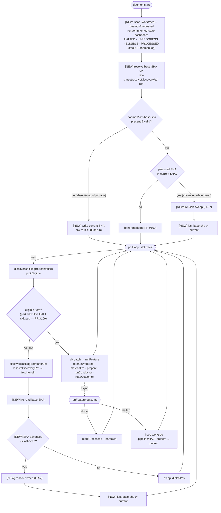
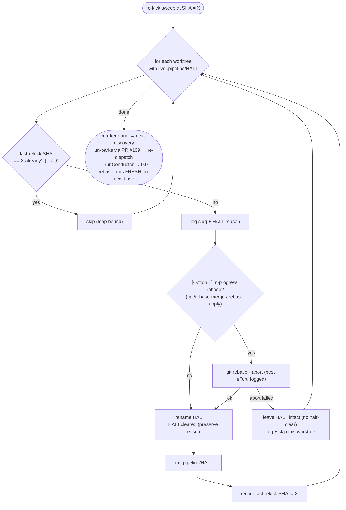
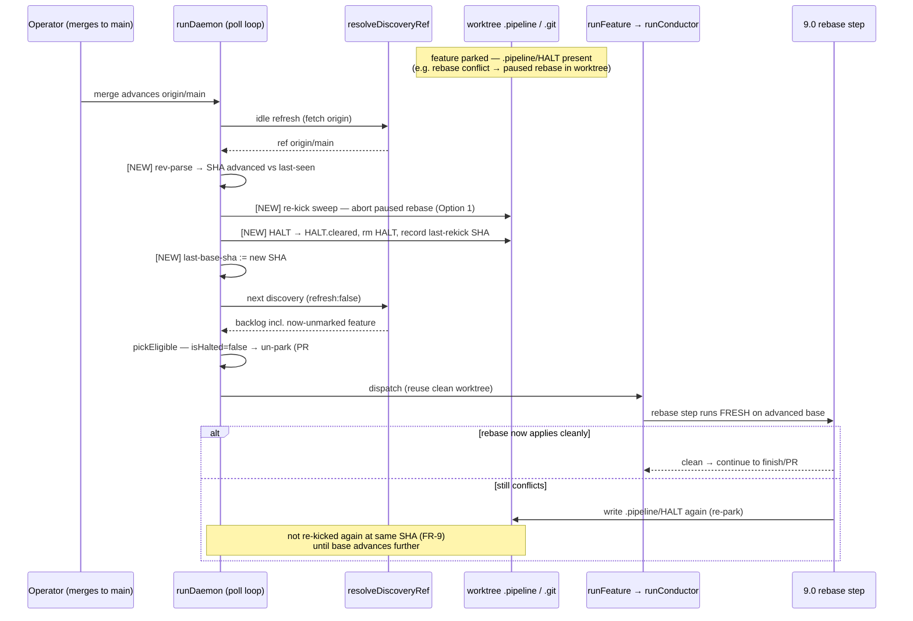

# Architecture: Daemon Halt-Reconciliation

**Last updated:** 2026-06-28
**Scope:** The daemon's startup + poll/dispatch control flow in `src/conductor`, showing this
feature's additions (startup dashboard, base-SHA tracking, main-advance re-kick sweep) and how
they compose with the existing discovery/park/un-park machinery (PR #109) and Phase 9.0's rebase
step. Current-state + additions. New elements marked **[NEW]**.

## Diagram 1 — Daemon control-flow state machine (startup + run loop)

### Re-kick sweep detail (FR-7, both call sites)

## Diagram 2 — Base-advance re-kick composes with PR #109 un-park + 9.0 rebase

## Legend

- **[NEW]** — added by this feature. Unmarked nodes are existing daemon behavior.
- **parked** — a worktree with a live `.pipeline/HALT`; PR #109 skips it at `pickEligible`.
- **un-park** — clearing `.pipeline/HALT` makes `isHalted` false, so the existing discovery path
  re-dispatches the feature. The re-kick sweep performs **no** direct dispatch (FR-8).
- **last-base-sha** — `.daemon/last-base-sha`, the persisted last-seen base SHA driving both the
  startup downtime-advance check and the live-advance check.
- **last-rekick SHA** — per-feature guard (FR-9); bounds re-kick to one attempt per base SHA.

## Composition notes

- The sweep appears at **two** call sites (startup downtime-advance and live idle-refresh advance)
  but is the **same** routine. Both update `last-base-sha` after running so an advance fires once.
- The feature adds **no new dispatch path**: dispatch, teardown, and processed-ledger discipline
  are unchanged. The only new write paths are `.daemon/last-base-sha`, `.pipeline/HALT.cleared`,
  and the rebase abort.
- Phase 9.0 is a **downstream consumer**: re-kick returns the worktree to a clean tip so 9.0's
  rebase runs fresh; 9.0's own re-park-on-conflict then governs whether the feature re-halts.
- **FR-12 rebase-first (sentinel):** the sweep drops a `.pipeline/REKICK` sentinel alongside
  clearing the marker. On re-dispatch, the conductor's worktree run-entry
  (`runConductorInWorktree`) sees the sentinel and runs 9.0's rebase-onto-latest **before** the
  pending gate re-verifies (then deletes the sentinel, one-shot). This is what makes a gate-failure
  halt (e.g. prd-audit) integrate the advanced base before re-running the gate, rather than
  re-failing on the stale base. Re-kick reuses 9.0's rebase; it does not reimplement it, and does
  no gap routing (gate loop / `/remediate` own that).
- **New modules:** `engine/daemon-sha.ts` (SHA parse/read/persist), `engine/daemon-dashboard.ts`
  (scan + render), `engine/daemon-rekick.ts` (sweep). Orchestration in `daemon.ts` `runDaemon` via
  new optional `DaemonDeps` hooks; real I/O wired in `daemon-cli.ts`.

## Change Log

| Date | Change | Reason |
|------|--------|--------|
| 2026-06-28 | Initial generation | Daemon halt-reconciliation design (startup dashboard + main-advance re-kick), composing with PR #109 and Phase 9.0 |
| 2026-06-28 | Added FR-12 rebase-first (REKICK sentinel) + new-module map | Plan-update: re-kicked feature must rebase onto the advanced base before re-verifying its pending gate (ADR-013) |
