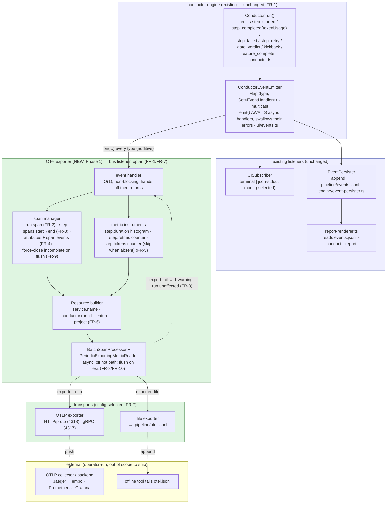
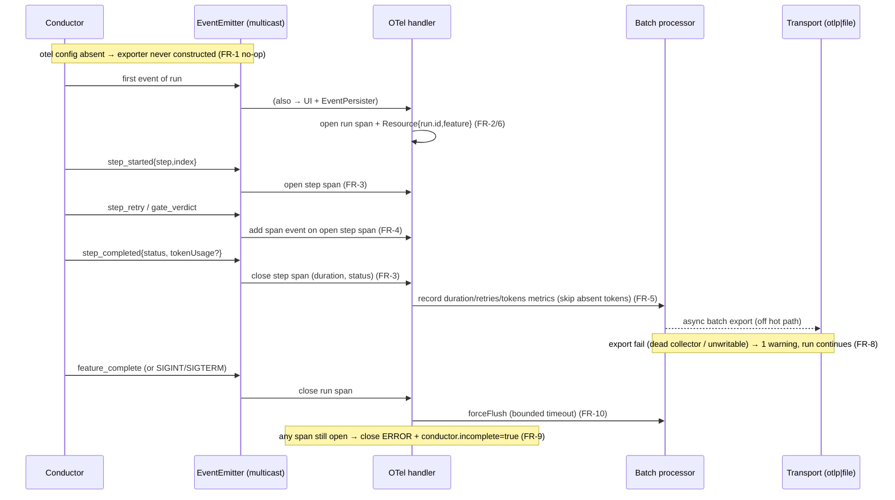
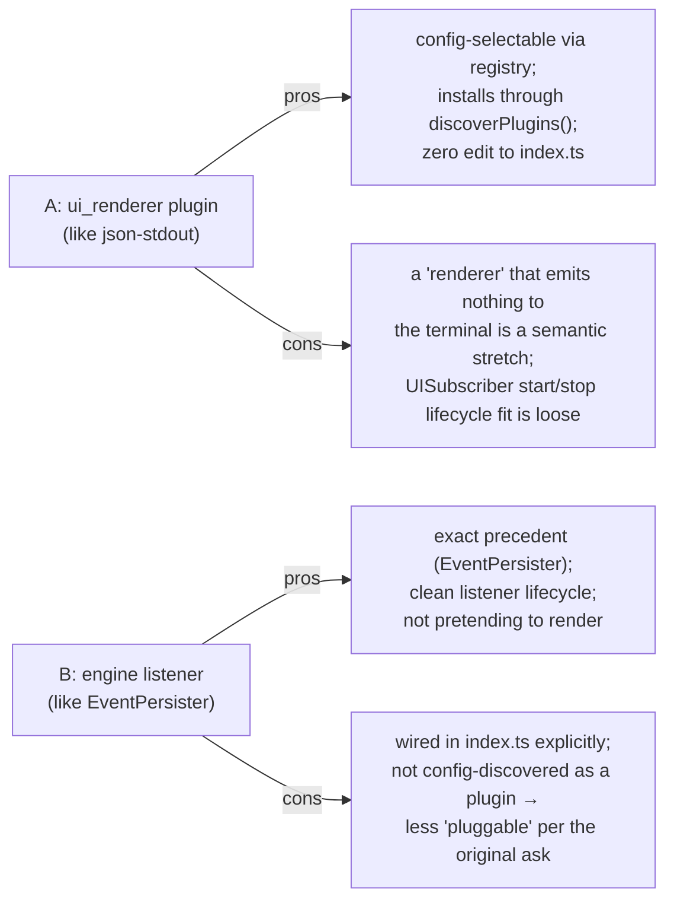

# Architecture: OTel Observability — Phase 1 (exporter on the event bus)

**Last updated:** 2026-06-28
**Scope:** The new OpenTelemetry exporter as an additive listener on the existing
`ConductorEventEmitter`, translating `ConductorEvent`s into OTel traces + metrics over two
config-selected transports (OTLP push / file). Phase 2 (build-task spans) and Phase 3 (subagent
spans) are out of scope. Consumed by `/architecture-review`.
**Source:** PRD/stories `2026-06-28-otel-observability.md` (FR-1…FR-10)

---

## Component view — bus fan-out with the new OTel exporter

> **Distinct sinks:** `EventPersister` → `.pipeline/events.jsonl`; OTel file transport →
> `.pipeline/otel.jsonl`. No file or bus contention (see conflict-check clean pass).

---

## Sequence — run lifecycle → spans, metrics, flush

---

## Decision surface for architecture-review (the OPEN question)

How is the exporter installed and wired? Both place it on the same bus; the difference is the
seam it registers through.

**Other items for architecture-review to settle (do not block Phase 1 shipping):**
- OTLP default protocol: HTTP/proto (4318) vs gRPC (4317).
- Where `conductor.run.id` is sourced (`.pipeline/conduct-session-id` vs generated) — FR-6.
- Whether file transport emits OTLP-JSON lines vs an OTel file-exporter encoding.

## Legend
- **Green** = new Phase-1 surface; **blue** = existing, unchanged.
- **Solid** = data/control flow; **dotted** = best-effort / failure / external push.
- All new flow hangs off `bus.on(...)` — no emission site in the engine is modified (FR-1).

## Change Log
| Date | Change | Reason |
|------|--------|--------|
| 2026-06-28 | Initial OTel exporter component + sequence + decision-surface diagrams | Phase 1 architecture input |
