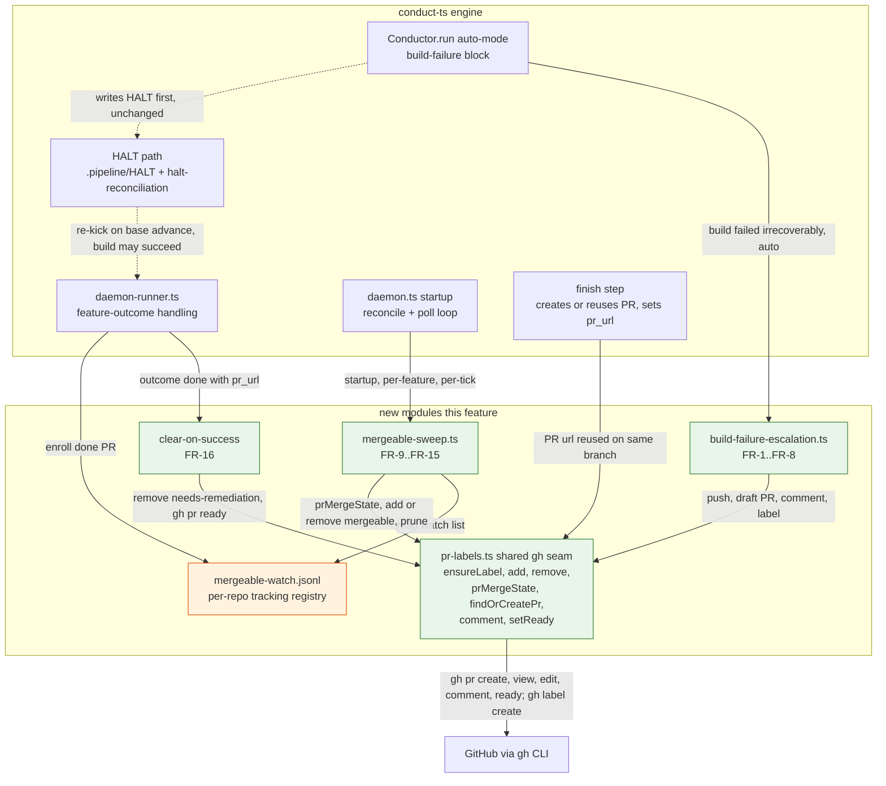
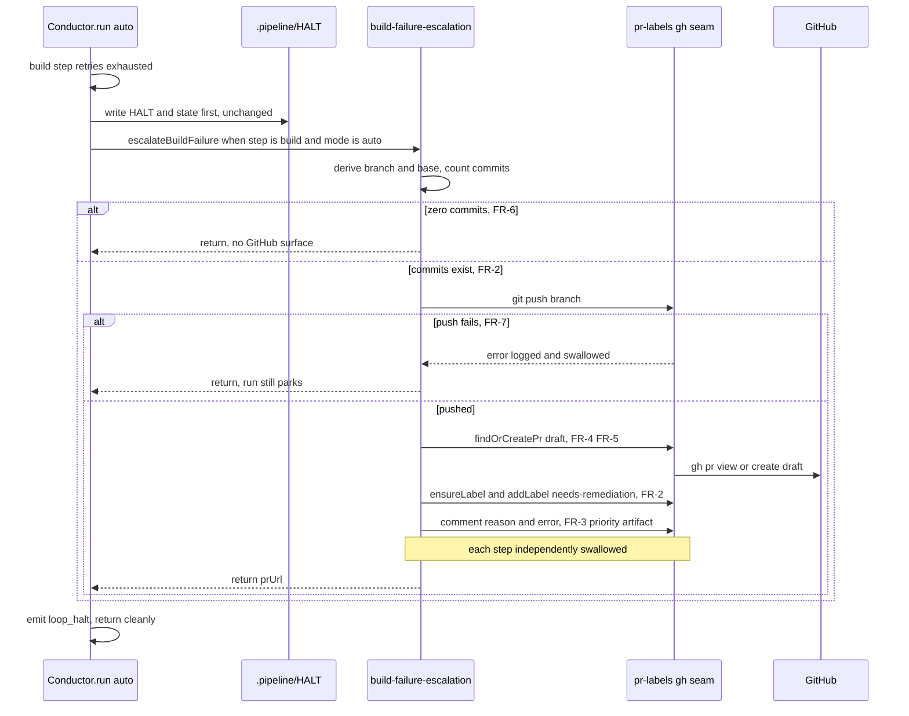
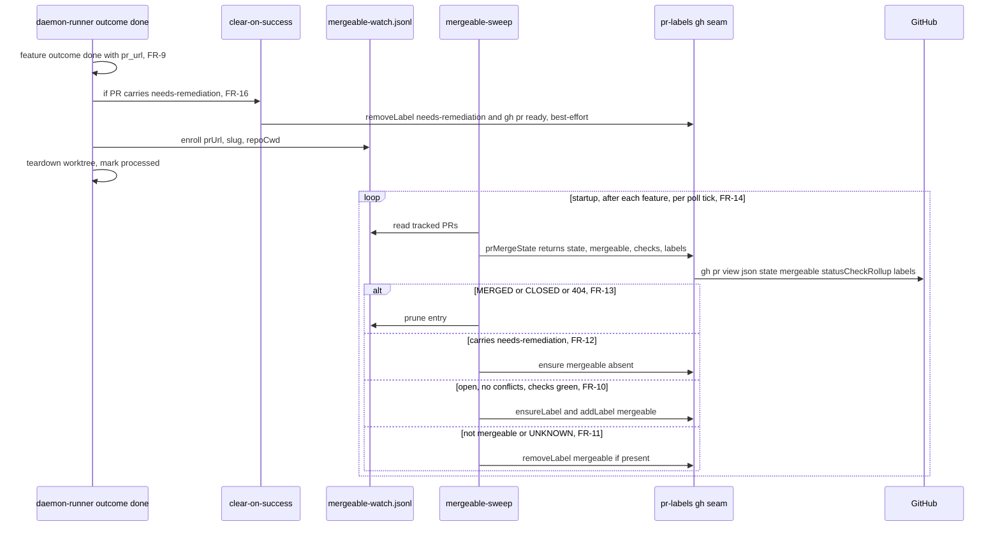

# Architecture: Daemon PR Labeling

**Last updated:** 2026-06-29
**Scope:** The two daemon-mode PR-labeling behaviors (`needs-remediation`, `mergeable`), the new
shared gh PR-ops module, the mergeable watch registry + sweep, and how they attach to existing
conductor/daemon pieces (HALT path, halt-reconciliation, `/finish` PR creation). Spec:
`.docs/specs/2026-06-29-daemon-pr-labels.md` (FR-1…FR-16).

## Component view (L3)

### Legend
- **Green** = new modules added by this feature. **Orange node** = new persisted state.
- Solid arrows = direct calls / data flow. Dashed arrows = existing/indirect relationships.
- All `new` → `GitHub` edges are **best-effort**: every `pr-labels.ts` primitive is internally
  try/caught and non-throwing (FR-7, FR-15), so a gh failure never propagates back into the
  conductor/daemon control flow.
- `pr-labels.ts` is the single seam over `gh`; both behaviors and clear-on-success go through it,
  so GitHub interaction is testable with injected fake runners.

## Sequence: needs-remediation surfacing (FR-1..FR-8)

## Sequence: done-outcome → clear-on-success + mergeable sweep (FR-9..FR-16)

## Change Log

| Date | Change | Reason |
|------|--------|--------|
| 2026-06-29 | Initial generation | New feature: daemon PR labeling (needs-remediation + mergeable, FR-1…FR-16) |

## Notes for architecture-review
- `pr-labels.ts` is the **only** new code that talks to `gh`; the three behaviors compose it. This
  isolates the external boundary (single mock point, single retry/swallow policy).
- The watch registry is **per-repo** (`.daemon/`-adjacent), self-pruning, and stateless to
  reconstruct (the sweep re-derives label truth from GitHub each pass), so a lost/corrupt registry
  degrades to "no labels" rather than wrong labels.
- No new container, DB table, or external system — only a new file-backed registry and a new CLI
  boundary usage (`gh`). System-context/containers diagrams unchanged.
