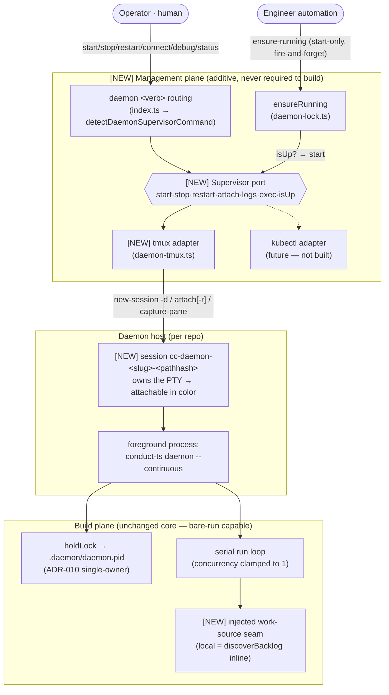
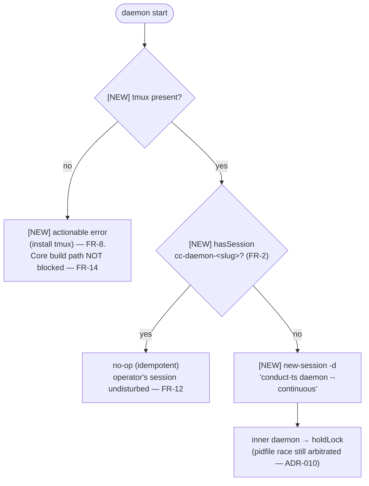
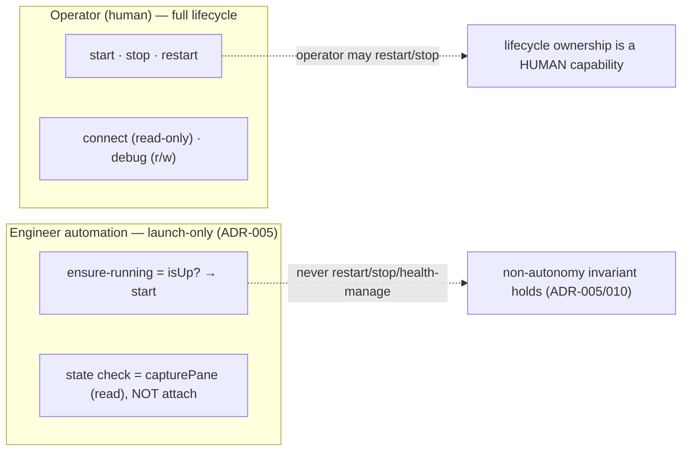

# Architecture: Daemon Supervised Hosting

**Last updated:** 2026-06-29
**Scope:** How the per-repo build daemon is **hosted and managed** in `src/conductor` —
inverting the detached `stdio:'ignore'` spawn into a foreground daemon hosted behind a
swappable **Supervisor port** (tmux adapter now). Shows the management plane vs. the build
plane, the operator-vs-automation authority split (preserving ADR-005/ADR-010), and the
intake/execute seam. Current-state + additions. New elements marked **[NEW]**.

## Diagram 1 — Containers: management plane vs. build plane

## Diagram 2 — `daemon start` decision (idempotent, two-layer)

## Diagram 3 — Authority split (the ADR-005 invariant, preserved)

## Notes

- **Bare-run invariant (FR-14):** the build plane has no dependency on the management plane.
  `conduct-ts daemon --continuous` runs standalone with no tmux present; tmux is purely the
  attach/manage layer. This is also the container/k8s entrypoint contract.
- **Single-owner preserved (ADR-010):** the foreground daemon still calls `holdLock`, so the
  pidfile remains the source of truth for inner 1-per-repo ownership; the session layer is an
  outer idempotency check, not a replacement.
- **Session naming:** `cc-daemon-<slug>-<pathhash>` — tmux sessions are a per-user global
  namespace, so the path hash prevents two same-named repos from colliding (FR-11).
- **Seam (not split):** the run loop consumes `BacklogItem`s from an injected work-source;
  the local adapter is today's inline `discoverBacklog`. A future intake/execute process split
  is an adapter swap, not built here.
