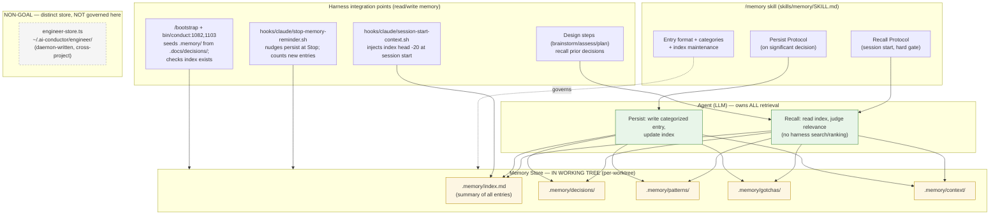

# Components: Harness Memory Subsystem — Current State

**Last updated:** 2026-06-29
**Scope:** The harness `/memory` system as it exists today, plus every integration point that
reads or writes it. This is the **as-is baseline** the Pluggable Memory feature
(`.docs/specs/2026-06-29-pluggable-memory-source.md`) must preserve (FR-9, FR-10) and extend.
Generated to ground `/architecture-review` — it shows where the 6 open questions land.

## Diagram

## Where the 6 open questions land on this diagram

The PRD defers 6 implementation trade-offs to architecture-review. Each maps to a seam above:

| # | Open question (PRD) | Seam in current state | What changes |
|---|---|---|---|
| 1 | How platforms integrate so the LLM queries them directly (MCP vs. alternatives) | **Agent → Store** edge (today a direct filesystem read) | A platform-resolution layer + an agent-queryable interface (e.g. MCP) for non-default platforms |
| 2 | How a platform is adopted/installed (operator UX, provisioning, credentials) | **BOOT / bin/conduct** | A new adopt/remove action; today there is none (default is implicit) |
| 3 | Where shared memory lives + cross-worktree durability | **Store (in working tree)** — the FR-5 entanglement | Move the default store out of the worktree to a per-project durable location |
| 4 | How an existing project's memory is migrated safely | **Store** + **BOOT seed path** | A one-time, reversible migration of `.memory/` to the new location |
| 5 | Where per-platform retrieval guidance lives | **/memory skill (FMT) vs. per-platform bundle** | Default guidance stays in the skill; non-default platforms carry their own (FR-4) |
| 6 | How a project expresses its platform choice (config surface) | new — no selection mechanism exists today | Per-project selection resolved at run start (FR-1, FR-2) |

## Legend

- **Green (Agent)** — the LLM. Owns recall, ranking, relevance (FR-3, the invariant). The harness
  must add **no** search/embedding logic.
- **Yellow (Store)** — persisted memory. **Today it lives inside the working tree** (`.memory/`),
  so it is per-branch/per-worktree and lost on worktree removal — the exact gap FR-5 closes.
- **Dashed grey (Separate)** — the engineer/retro-signal store. Shares only the `~/.ai-conductor/`
  namespace; it is a PRD Non-Goal and is **not** part of this feature.
- Solid arrows = read/write data flow. Dotted = "governs/describes."

## Change Log

| Date | Change | Reason |
|------|--------|--------|
| 2026-06-29 | Initial generation | Baseline the current memory subsystem for the Pluggable Memory architecture-review |
