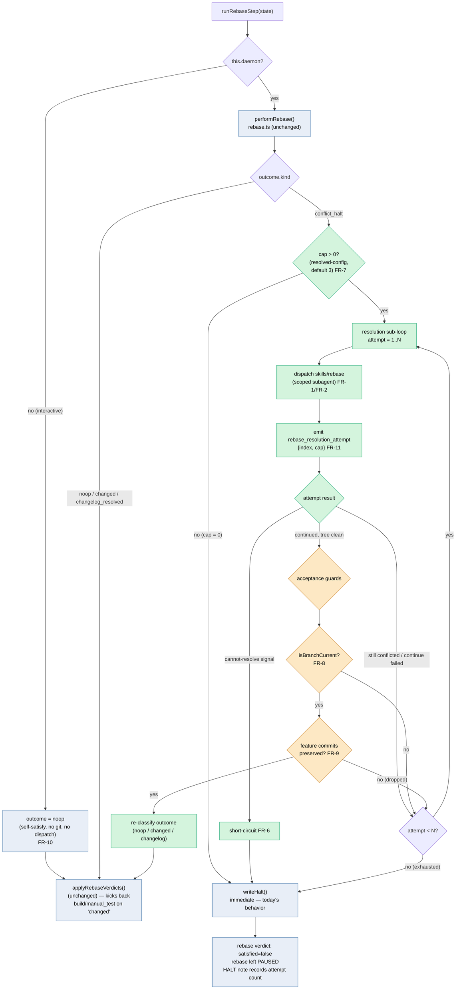

# Architecture: Gated Rebase-Conflict Resolution Sub-Loop

**Last updated:** 2026-06-29
**Scope:** The resolution sub-loop inserted into `runRebaseStep` between `performRebase`'s
`conflict_halt` outcome and `writeHalt`. Extends Phase 9.0
(`2026-06-25-phase-9.0-rebase-loop-tail.md`). Modification to existing internal machinery — not a
new system. Consumed by `/architecture-review` to author the amending ADR for the ADR-001 dispatch
exception.
**Source PRD/stories:** `.docs/specs/2026-06-29-rebase-resolution-skill.md`,
`.docs/stories/rebase-resolution-skill.md`

---

## Control flow — `runRebaseStep` with resolution sub-loop

## Legend

- **Green** — new in this feature (the gated resolution sub-loop, dispatch, events, cap).
- **Orange** — the two load-bearing acceptance guards. A resolution that claims success but fails
  `isBranchCurrent` (FR-8) or drops feature commits (FR-9) is **rejected back into the attempt
  loop**, never accepted. This is what makes "trust the suite as the net" safe.
- **Blue** — existing, unchanged machinery (`performRebase`, `applyRebaseVerdicts`, `writeHalt`,
  the interactive no-op).
- **Termination:** every path reaches either `applyRebaseVerdicts` (satisfied, possibly with a
  build/manual_test kickback) or `writeHalt` (paused for a human). The sub-loop is bounded by N.

## Relationship to ADR-001

ADR-001 (APPROVED) made the rebase step engine-native and prompt-free. This feature dispatches a
prompt **only** inside the green `conflict_halt` sub-path. Detection (`performRebase`,
`isBranchCurrent`) and the satisfied predicate stay engine-native. The amending ADR authored at
`/architecture-review` records this narrowed exception.

## Change Log

| Date | Change | Reason |
|------|--------|--------|
| 2026-06-29 | Initial generation | New resolution sub-loop for feat/rebase-resolution-skill |
