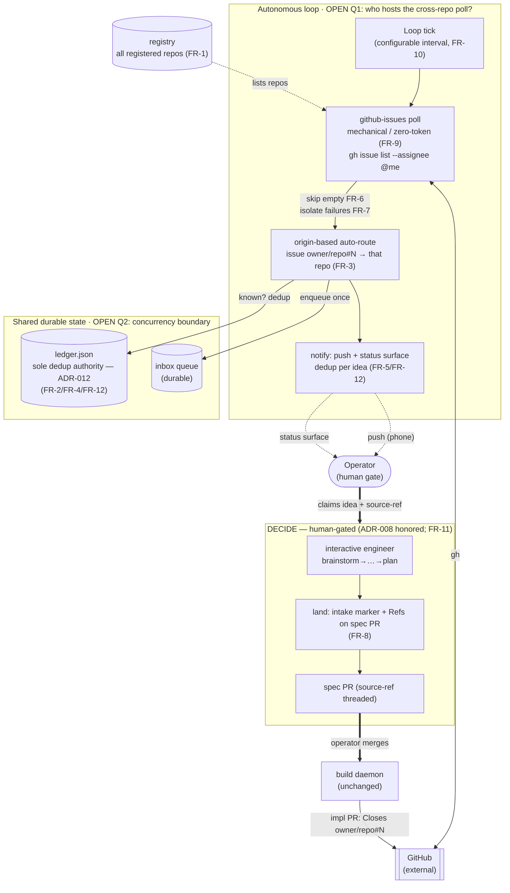
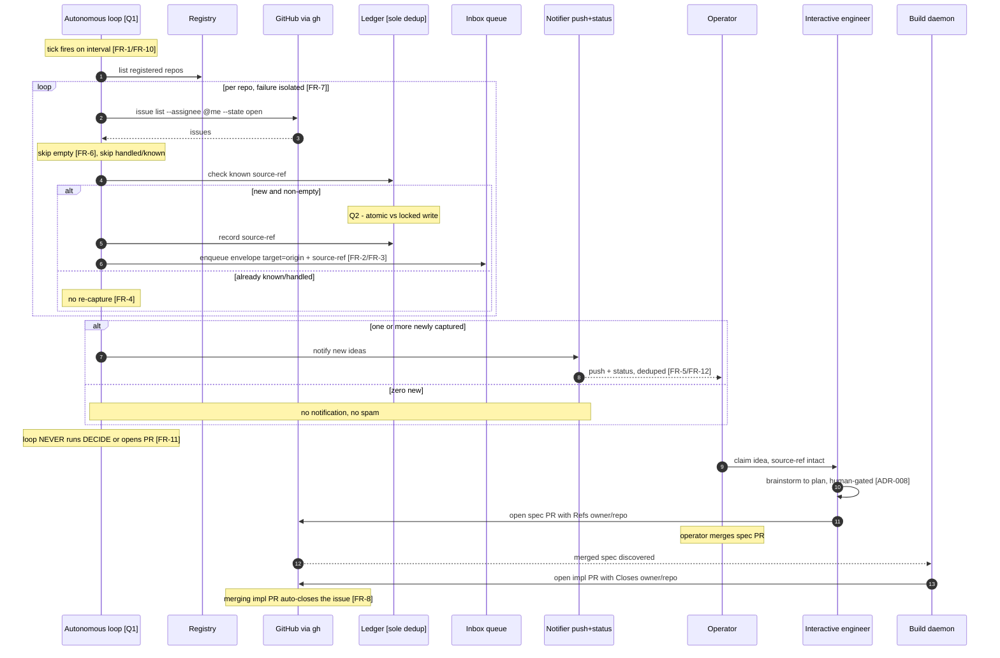

# Architecture: Background Auto-Intake on the Conduct Loop

**Last updated:** 2026-06-30
**Scope:** The intake poll path on the autonomous loop and the human-gated DECIDE boundary for the
Background Auto-Intake feature. Consumed by `/architecture-review`.

PRD: `.docs/specs/2026-06-30-background-intake-conduct-loop.md` ·
Stories: `.docs/stories/background-intake-conduct-loop.md` ·
Conflicts: `.docs/conflicts/2026-06-30-background-intake-conduct-loop.md`

## Flow (container/component view)

## Sequence (intake → notify → DECIDE → auto-close)

## Legend

- **Solid arrows** = mechanical, zero-token data flow inside the loop. **Bold `==>`** = an explicit
  human action (operator claim / merge). **Dotted arrows** = notifications / advisory reads.
- **`OPEN Q1`** (subgraph `LOOP`): which process hosts the cross-repo poll — a single
  supervisor/"brain" loop polling all registered repos, or each per-repo build daemon polling its
  own repo. Decides whether more than one ledger writer can exist.
- **`OPEN Q2`** (subgraph `STATE`): the shared-ledger concurrency boundary. Step 7 of the sequence
  (`record`) is the contended read-modify-write; its safety mechanism (single-writer by
  construction vs. file-lock + atomic write) follows directly from Q1.
- **ADR-012** = ledger is the sole dedup authority. **ADR-008** = engineer loop is interactive,
  not headless — honored because DECIDE stays human-gated. **ADR-007** = interactive routing gate,
  to be amended for origin-routing (FR-3).

## Change Log

| Date | Change | Reason |
|------|--------|--------|
| 2026-06-30 | Initial generation | Background Auto-Intake DECIDE phase; marks Q1/Q2 for architecture-review |
