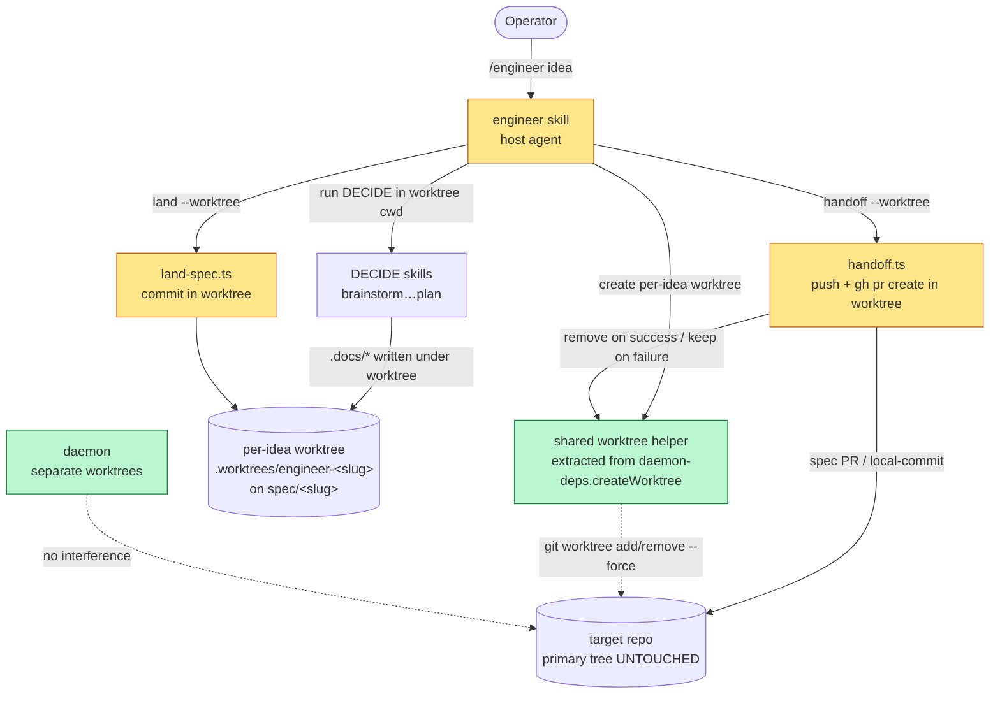

# Architecture: Engineer Worktree Isolation

**Date:** 2026-06-30
**Scope:** the engineer idea→spec authoring path (skill + `land-spec.ts` / `handoff.ts` /
engineer-CLI) moving from shared-checkout authoring to per-idea worktree isolation.
Spec: `.docs/specs/2026-06-30-engineer-worktree-isolation.md`.

## Component view (what changes)



Legend: **amber** = changed by this spec (skill + the two primitives gain a worktree cwd);
**green** = reused/unchanged mechanism (the daemon's worktree helper; the daemon itself).

## Sequence — one idea, success path

```mermaid
sequenceDiagram
  participant OP as Operator
  participant SK as engineer skill
  participant WH as worktree helper
  participant G as git (target repo)
  participant DEC as DECIDE skills
  participant LAND as land-spec.ts
  participant HO as handoff.ts

  OP->>SK: idea (slug derived)
  SK->>WH: createWorktree(slug)
  WH->>G: git worktree add -b spec/&lt;slug&gt; .worktrees/engineer-&lt;slug&gt; &lt;default&gt;
  alt worktree add fails
    G-->>WH: error
    WH-->>SK: throw
    SK-->>OP: ABORT (FR-7) — primary tree untouched, zero writes
  else worktree ready
    G-->>WH: worktree on spec/&lt;slug&gt;
    WH-->>SK: { path, branch }
    SK->>DEC: run DECIDE with cwd = worktree path
    DEC->>G: write .docs/* INSIDE worktree only (FR-1/FR-2)
    SK->>LAND: land(worktree path)
    LAND->>G: stage idea's .docs + commit on spec/&lt;slug&gt; (FR-3/FR-9)
    SK->>HO: handoff(worktree path, branch)
    HO->>G: git push (if remote) + gh pr create --head spec/&lt;slug&gt; (cwd=worktree)
    HO-->>SK: { prUrl | local-commit } + ledger + ensureRunning nudge (FR-4)
    SK->>WH: teardown(keep=false)
    WH->>G: git worktree remove --force (branch + commit persist, FR-5)
    SK-->>OP: ✅ spec delivered
  end
```

## Key architectural points

1. **The shared-checkout `checkout -b … / checkout back` dance is deleted.** `land-spec.ts` no
   longer switches the primary tree's branch; the `spec/<slug>` branch already exists *as the
   worktree's branch*, so `land` just commits in-place (root cause of the conflict removed).
2. **Reuse, don't reinvent.** `daemon-deps.ts:createWorktree` already encodes the leftover-branch /
   detached-worktree reconciliation (FR-11) and `--force` teardown. Extract a shared helper so the
   engineer and daemon share one worktree story (PRD NFR: parity).
3. **cwd is the isolation seam.** Today `landSpec`/`openSpecPr` hardcode `cwd: target.canonicalPath`.
   The change threads the **worktree path** as cwd while keeping `target.canonicalPath` as the
   registry anchor for resolution + the AuthoringGuard prefix root (ADR-008's path-prefix guard is
   retained, now rooted at the worktree's `.docs/`).
4. **Naming disjoint from the daemon** (conflict-check Finding 2): the engineer worktree dir is
   `engineer`-scoped so a concurrent daemon worktree in the same repo never collides.
5. **Primary tree never receives a `checkout`/`switch`** — the asserted invariant (FR-2) and the
   reason a running daemon is safe (FR-8).
```
