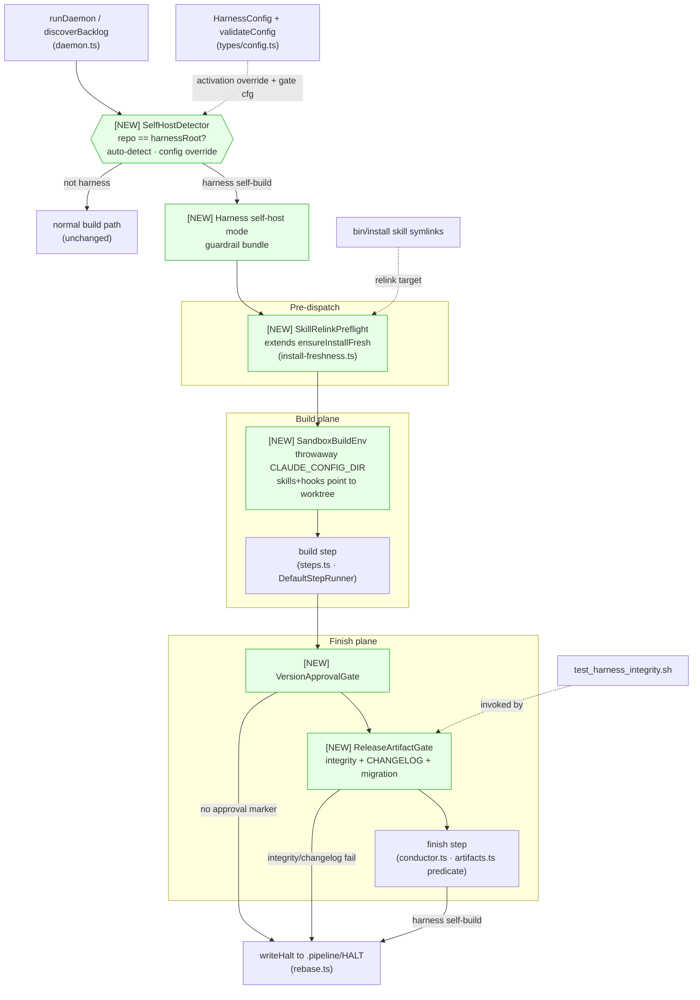
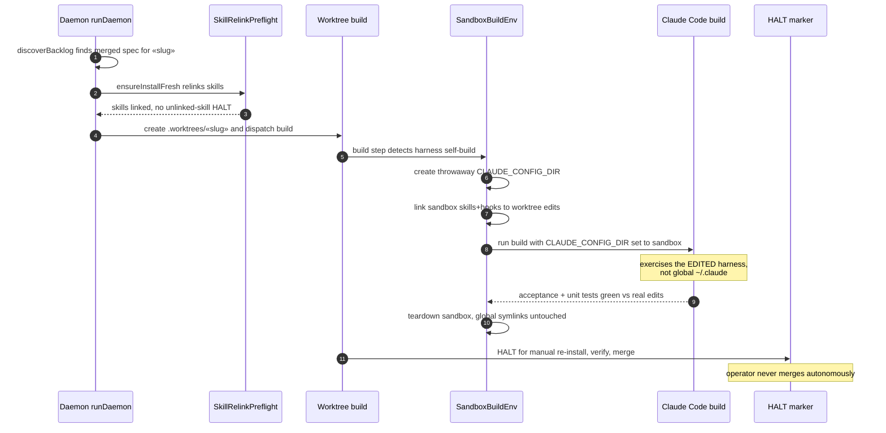
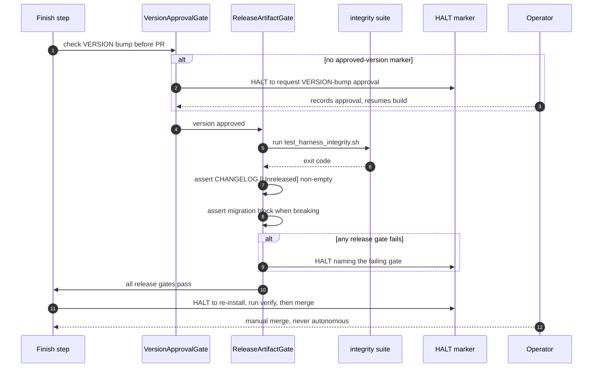

# Architecture: Harness Daemon Self-Host Guardrails

**Last updated:** 2026-06-30
**Scope:** The **build-plane** guardrails that make the `james-stoup-agents` harness repo safe
to daemon-register — a unified **harness self-host mode** activated by a self-detect seam. Shows
the new components and how they attach to existing conductor seams (preflight, build step, finish
step, config, HALT). Complements `2026-06-29-daemon-supervised-hosting.md` (the management plane)
and preserves its ADR-005 (automation is launch-only) / ADR-010 (single-owner) invariants: every
new gate is **HALT-based**, so the operator — never the daemon — merges. New elements marked **[NEW]**.

## Diagram 1 — Components: self-host mode attached to conductor seams

## Diagram 2 — Sequence: harness self-build with sandbox + preflight

## Diagram 3 — Sequence: finish-time release gates (HALT-based)

## Legend

- **[NEW]** — components introduced by this feature (green fill in Diagram 1).
- **HALT** — `writeHalt()` writing `.pipeline/HALT`; the canonical "park for a human" primitive.
  In daemon `auto` mode there is no human to prompt, so every guardrail that cannot self-satisfy
  HALTs rather than proceeding.
- **SelfHostDetector** — resolves whether the repo under build IS the harness (via the existing
  `resolveHarnessRoot()`); a swappable seam so platform identity (isolated EKS) can replace path
  comparison later.
- **SandboxBuildEnv** — a throwaway `CLAUDE_CONFIG_DIR` whose skills/hooks symlink into the build
  worktree, so a harness self-build executes its own edited harness; the global `~/.claude/skills`
  used by the operator's concurrent sessions is never mutated.

## Change Log

| Date | Change | Reason |
|------|--------|--------|
| 2026-06-30 | Initial generation | Created during /engineer DECIDE for harness self-host guardrails (Tier L) |
| 2026-07-03 | VersionApprovalGate "no approval marker → HALT" is refined by semver escalation (PATCH auto-pass) | harness-daemon-profile #174 — see 2026-07-03-harness-daemon-profile.md |
