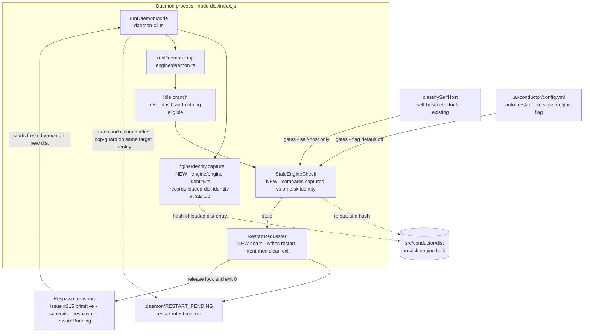

# Components: Daemon auto-restart on stale engine code

**Last updated:** 2026-07-03
**Scope:** Stale-engine detection + exit-to-respawn trigger at the daemon idle boundary. Self-host only. Restart/respawn primitives (versioned dist, tmux respawn-in-place, pause/resume) are issue #215 and OUT of scope — this feature consumes them through a seam.

## Diagram

## Legend

- **NEW** nodes are introduced by this feature; all others exist today.
- Solid arrows: control flow. Dotted arrows: reads/writes.
- The **RestartRequester** never respawns anything itself — it records intent and exits cleanly. The respawn transport is #215's restart primitive (or a later `ensureRunning` nudge); this feature only guarantees the process gets out of the way at a safe boundary.
  - **Superseded 2026-07-06 (#353):** the marker-and-exit contract left the daemon `stopped` in practice (marker filename mismatch with the #215 transport + `remain-on-exit` never actually armed). The RestartRequester now fires the respawn transport directly when a session exists; marker+exit survives only as the headless fallback. See `daemon-restart-leaves-the-daemon-stopped-when-orig.md`.
- Gates (all must pass before a restart is requested): daemon idle (`inFlight` empty, nothing eligible), self-host repo (`classifySelfHost` true), config flag enabled, identity check determinate, loop-guard clear.

## Failure semantics

- Identity capture or re-stat fails → check is **disabled for the process lifetime** (logged once); indeterminate never restarts (fail-closed, mirrors blocker-resolver semantics).
- Loop-guard: on startup the marker is read and cleared; if a stale verdict would target the **same on-disk identity** the marker says we already restarted onto, suppress and warn — a non-converging restart must not loop.
- Non-continuous (`once`) runs never restart — they exit at backlog-drained anyway.

## Change Log

| Date | Change | Reason |
|------|--------|--------|
| 2026-07-03 | Initial generation | DECIDE phase for issue jstoup111/ai-conductor#256 |
| 2026-07-06 | Legend note: exit-to-respawn contract superseded by respawn-in-place wiring | Issue #353 (respawn gap) |
