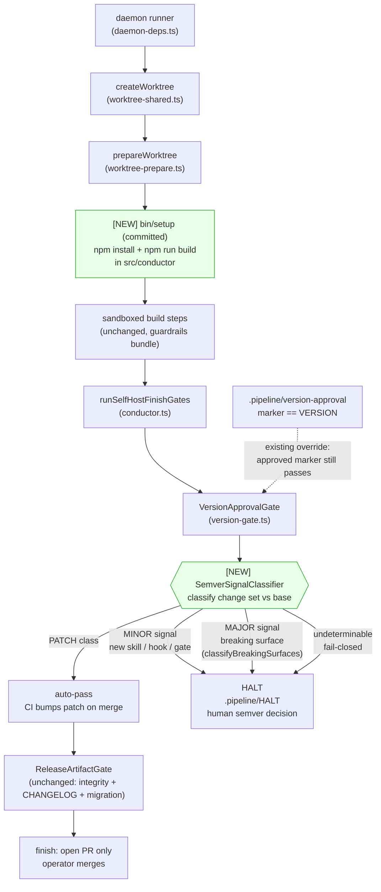
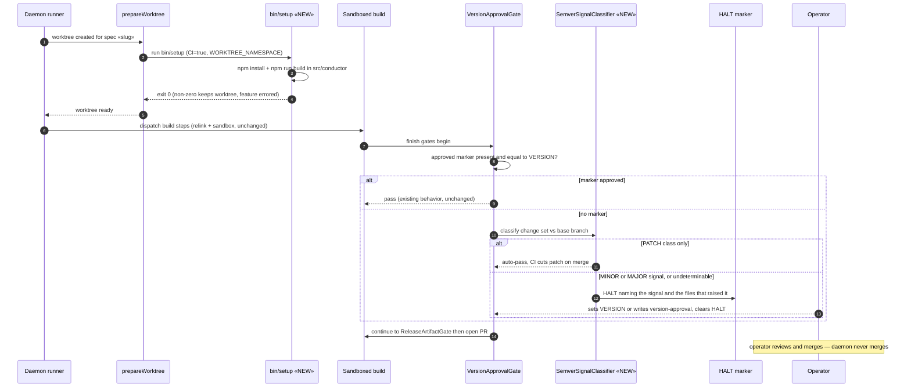

# Architecture: Harness Daemon Profile — build-to-PR enablement (#174)

**Last updated:** 2026-07-03
**Scope:** Completes daemon build-to-PR on the harness repo itself (issue #174): (1) a committed
`bin/setup` so daemon build worktrees get a working `src/conductor` toolchain, and (2) semver
escalation inside the existing `VersionApprovalGate` — PATCH-class change sets auto-pass (CI cuts
the patch on merge), MINOR/MAJOR signals or an undeterminable change set HALT for a human semver
decision. Extends `2026-06-30-harness-self-host-guardrails.md`; every invariant there
(HALT-based gates, daemon never merges — ADR-005/ADR-010) is preserved. New elements marked **[NEW]**.

## Diagram 1 — Components: where the two additions attach

## Diagram 2 — Sequence: self-build worktree prep + escalated version gate

## Legend

- **[NEW] / «NEW»** — elements introduced by this feature (green fill in Diagram 1).
- **bin/setup** — the repo's conventional post-worktree-creation hook, already invoked by
  `prepareWorktree` for every daemon worktree when present; this feature commits one for the
  harness repo itself. Non-zero exit throws: the worktree is kept and the feature marked errored.
- **SemverSignalClassifier** — pure function over the build branch's change set vs its base.
  MAJOR reuses the existing `classifyBreakingSurfaces` surfaces (bin/conduct, bin/install,
  hooks/, settings schema, removed/renamed skills); MINOR detects additive skill/hook/gate
  surface (new `skills/*/SKILL.md`, new hook file, new gate registration); anything it cannot
  classify is treated as HALT-worthy (fail-closed). It never edits `VERSION` — the human does.
- **Existing marker override** — `.pipeline/version-approval` matching `VERSION` still passes the
  gate unconditionally, so the operator's manual approval path is unchanged.

## Change Log

| Date | Change | Reason |
|------|--------|--------|
| 2026-07-03 | Initial generation | Created during /engineer DECIDE for harness-daemon-profile (#174, Tier M) |
