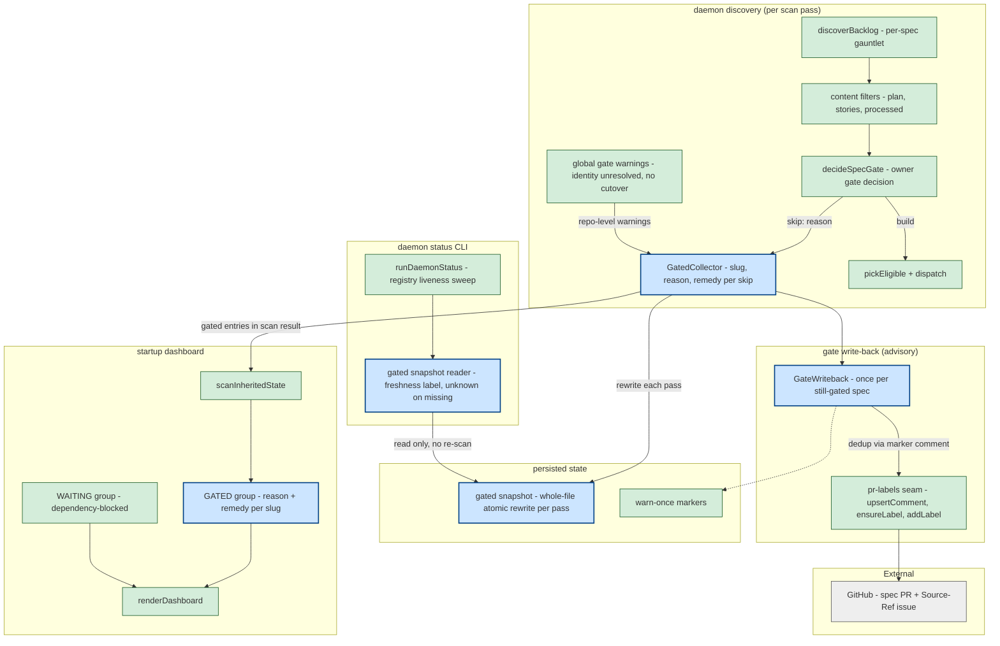
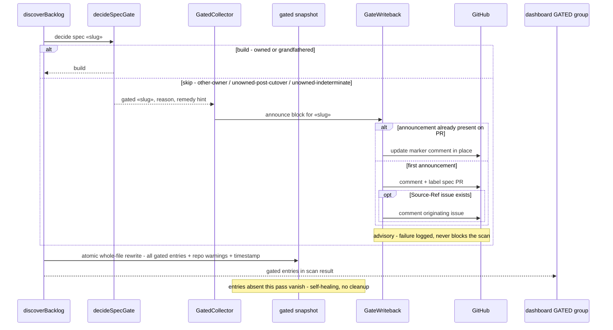
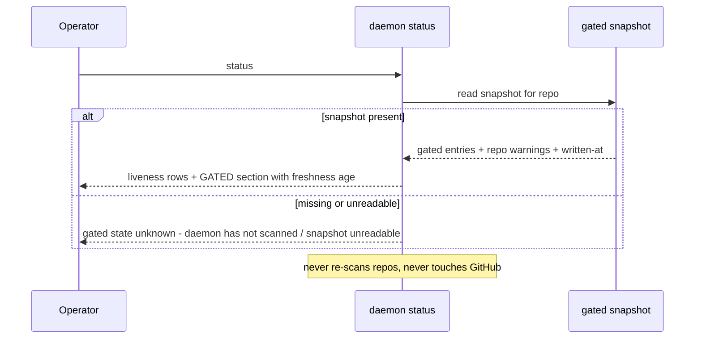

# Components + Sequences: Surface Owner-Gated Specs in Dashboard and Status

**Last updated:** 2026-07-03
**Scope:** How owner-gate skip decisions become first-class visible state: gated entries
returned from `discoverBacklog`, a GATED dashboard group (mirroring the WAITING pattern from
#246), a per-pass `.daemon/gated.json` snapshot read by `conduct-ts daemon status`, and a
warn-once GitHub write-back on the spec PR / Source-Ref issue. PRD:
`.docs/specs/2026-07-03-surface-owner-gated-specs-dashboard-status.md` (issue #208).

## Component View

## Sequence: scan pass surfaces a gated spec

## Sequence: phone-level status check

## Legend

- **GatedCollector** — the owner-gate skip path stops `continue`-dropping specs; each skip
  becomes a structured entry (slug, gate reason, remedy hint) carried in the scan result.
  Repo-level warnings (daemon identity unresolved, cutover unset) travel alongside as
  repo-scoped entries (FR-11).
- **GATED group** — new dashboard bucket beside HALTED / IN-PROGRESS / WAITING / ELIGIBLE /
  PROCESSED; a spec appears in exactly one bucket (FR-4). Mirrors the WAITING pattern
  introduced by dependency-ordered dispatch (#246).
- **gated snapshot** — single per-repo file rewritten atomically every scan pass; the ONLY
  input to the status CLI's gated section, keeping `daemon status` cheap (no re-scan, no
  network). Whole-file rewrite makes staleness self-healing (FR-7); its written-at timestamp
  is the freshness label (FR-6).
- **GateWriteback** — mirrors the needs-remediation escalation: hidden-marker comment
  edited in place (never duplicated, FR-10), plus a distinguishing label; all best-effort
  (FR-12).
- **existing vs new** — green nodes exist today (explore map: gate.ts, daemon-backlog.ts,
  daemon-dashboard.ts, daemon-observe-cli.ts, pr-labels.ts); blue nodes are this feature.

## Change Log

| Date | Change | Reason |
|------|--------|--------|
| 2026-07-03 | Initial feature diagram | Created during DECIDE for owner-gated spec visibility (#208) |
