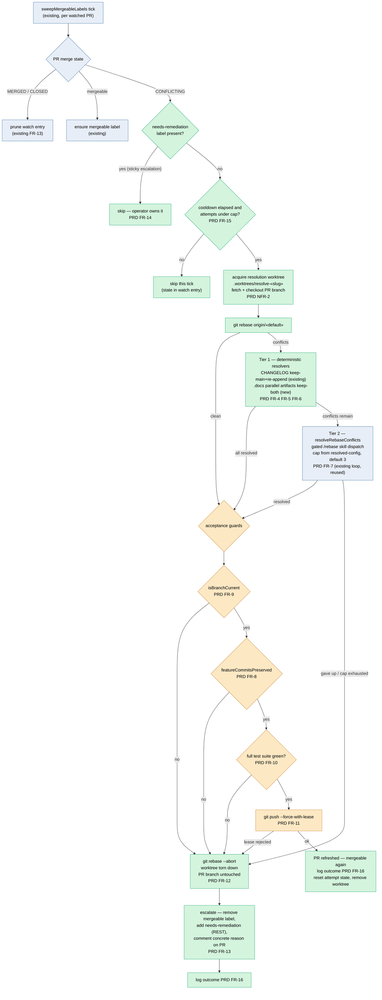

# Architecture: Auto-Resolve Merge Conflicts on Open Watched PRs

**Last updated:** 2026-07-04
**Scope:** The conflict-resolution flow wired from `sweepMergeableLabels`
(`mergeable-sweep.ts`) into the existing rebase engine (`rebase.ts`) for open PRs that
GitHub reports as CONFLICTING. Extends the finish-time resolution sub-loop
(`2026-06-29-rebase-resolution-subloop.md`) to already-open PRs. Reuses `resolveRebaseConflicts`,
the deterministic CHANGELOG resolver, the FR-8/FR-9 acceptance guards, and the gated `/rebase`
skill dispatch — all unchanged.
**Source PRD:** `.docs/specs/2026-07-04-auto-resolve-open-pr-conflicts.md`

---

## Control flow — sweep tick with auto-resolution

## Legend

- **Green** — new in this feature: the CONFLICTING branch of the sweep, cooldown/attempt
  gating, the resolution worktree, the `.docs` keep-both deterministic resolver, escalation
  and cleanup.
- **Orange** — the hard gates. Nothing is published unless the branch is current, every
  pre-rebase feature commit survives, the full suite is green, and the lease push succeeds.
  Any failure funnels to `abort`, which leaves the PR branch byte-for-byte untouched — the
  lease push is the only externally visible mutation on the success path.
- **Blue** — existing, unchanged machinery: the sweep's label logic and pruning, and
  `resolveRebaseConflicts` + `/rebase` dispatch (reused verbatim from finish-time).
- **Termination:** every path ends at `done` (refreshed), `esc` (sticky human escalation),
  or a skip. Attempts are capped and cooled down (FR-15), so a pathological PR converges to
  `esc`, never loops.

## Component placement

| Concern | Module | New/Existing |
|---------|--------|--------------|
| CONFLICTING detection + dispatch decision | `mergeable-sweep.ts` | extended |
| Attempt count / cooldown persistence | watch entry in `.daemon/mergeable-watch.jsonl` | extended schema |
| Resolution worktree lifecycle | `worktree-shared.ts` helpers | reused |
| Rebase + deterministic CHANGELOG resolver | `rebase.ts` | reused |
| `.docs` keep-both deterministic resolver | `rebase.ts` | new |
| Bounded skill resolution + guards | `rebase.ts` `resolveRebaseConflicts` | reused |
| Suite runner | project verify convention (arch-review decides) | new wiring |
| Labels + comments (REST) | `pr-labels.ts` | extended |

## Change Log

| Date | Change | Reason |
|------|--------|--------|
| 2026-07-04 | Initial generation | New auto-resolution flow for open watched PRs (intake #247) |
