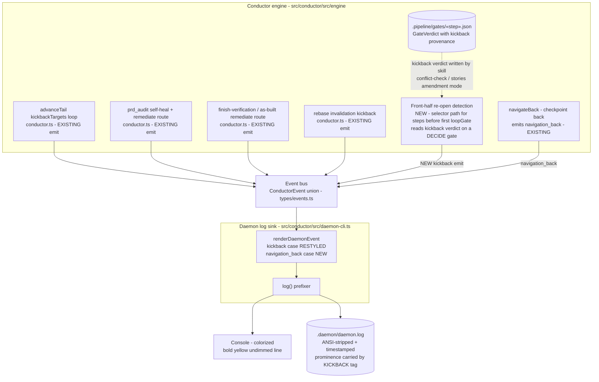

# Components: Daemon kickback log visibility

**Last updated:** 2026-07-04
**Scope:** Making backward pipeline motion (kickbacks) visually prominent and complete in the daemon log. Three paths: (a) restyle the existing `kickback` event line, (b) emit `kickback` events for DECIDE-phase amendment kickbacks that today produce no event, (c) render the currently-dropped `navigation_back` event. No new routing behavior — the ledger, gate verdicts, and kickback decisions are unchanged; this feature surfaces them.

## Diagram

## Legend

- **NEW / RESTYLED** nodes are this feature; all others exist today.
- Solid arrows: event flow. Dotted arrows: file reads/writes.
- **Line format (Approach A, selected at explore):** undimmed bold `↩ KICKBACK: «from» re-opened «to» — «reason» (׫count»)`. The uppercase `KICKBACK` tag is the structural prominence carrier — the durable file log is ANSI-stripped, so color alone cannot distinguish the line there.
- **Front-half gap being closed:** `advanceTail` returns before its kickbackTargets scan for any step earlier than the first loopGate (`build`), so conflict-check/stories re-opening architecture in amendment mode currently changes step state with **no emitted event**. The NEW detection emits the same `kickback` event shape so one renderer case covers every backward move.
- `navigation_back` is operator-initiated backward motion; it renders with its own marker (distinct from engine-initiated kickback) rather than falling through the renderer's silent default.

## Invariants

- `renderDaemonEvent` stays the single choke point translating engine events to log lines; no second logging path is introduced.
- Happy-path routing is unchanged: verdict writing, `markDownstreamStale`, step-status transitions, and linear front-half advance are untouched. The one behavior addition is cap enforcement — a front-half re-open past `MAX_KICKBACKS_PER_GATE` HALTs via the tail scan's exact sequence (`.pipeline/HALT`, remediation PR, `loop_halt`), sharing one per-gate counter with the tail.
- Byte-exact renderer tests (`test/engine/daemon-render.test.ts`) remain the format contract; the gate-loop integration test asserts the front-half emission and the cap-exceeded HALT.

## Change Log

| Date | Change | Reason |
|------|--------|--------|
| 2026-07-04 | Initial generation | DECIDE phase for issue jstoup111/ai-conductor#240 |
| 2026-07-04 | Front-half cap enforcement added to invariants | conflict-check amendment: operator expanded scope to enforce adr-2026-06-29's cap on front-half re-opens |
