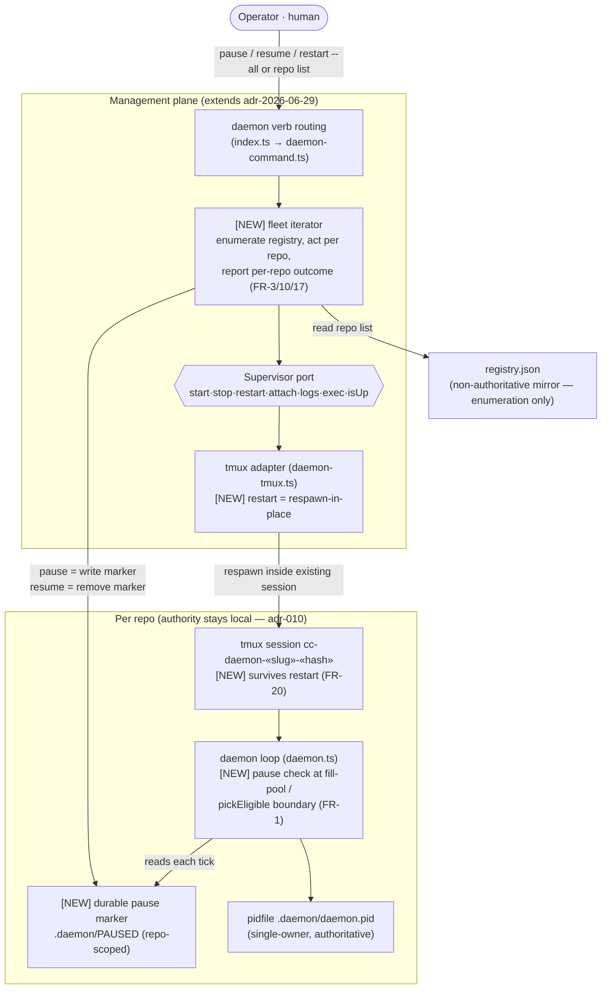
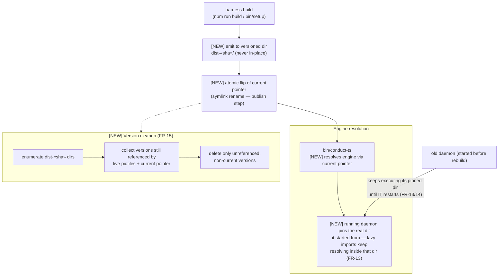
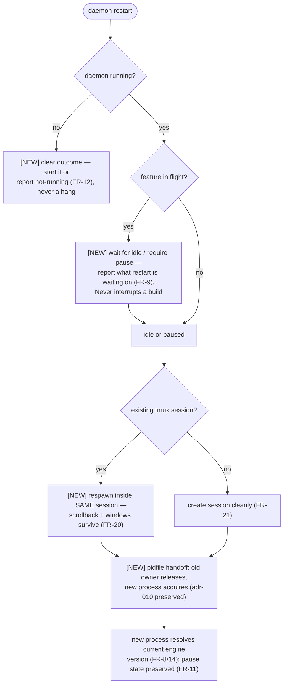

# Architecture: Daemon Lifecycle Controls

**Last updated:** 2026-07-04
**Scope:** Planned architecture for fleet **pause/resume**, idle-gated **restart-in-place**
(tmux session preserved), and **rebuild-safe engine versioning** (the #215 fix) in
`src/conductor`. Extends the supervised-hosting management plane (adr-2026-06-29) and the
pidfile-authority posture (adr-010). Proposed mechanisms shown here (versioned dist +
atomic current pointer, durable pause marker) are architecture-review's to confirm.
Current-state + additions. New elements marked **[NEW]**.

## Diagram 1 — Lifecycle control plane over the fleet

## Diagram 2 — Rebuild-safe engine versioning (proposed — closes #215)

## Diagram 3 — Restart decision (idle-gated, session-preserving)

## Legend

- **[NEW]** — added by this feature; unmarked elements exist today.
- Green class styling marks new subsystems where applied.
- `«slug»`, `«sha»`, `«hash»` — placeholders for repo slug, build content hash, path hash.
- Solid arrows: control/data flow. Dashed arrows: triggering/optional relationships.

## Notes

- **Pause gates pickup, not execution (FR-1):** the marker is read at the dispatch
  boundary (`pickEligible` / fill-pool guard and the idle tick). In-flight features drain
  normally; HALT parking is untouched. The marker follows the existing single-source
  signal-file pattern (`halt-marker.ts` precedent) but is **repo-scoped** (`.daemon/`),
  not feature-scoped (`.pipeline/`).
- **Durability (FR-4/7):** the pause marker is a file, so it survives crash, reboot, and
  restart, and a daemon launched by automation (`ensureRunning`) in a paused repo comes
  up paused. `ensureRunning` keeps its launch-not-manage contract (ADR-005) — it may
  start a daemon, but the started daemon immediately honors the marker.
- **Authority split preserved (adr-010):** fleet operations enumerate the registry but
  every control decision is per-repo against that repo's pidfile/marker; the registry
  mirror stays non-authoritative. Best-effort iteration: one repo's failure never aborts
  the rest (FR-17).
- **Restart-in-place vs today:** the current tmux adapter restart is kill-session +
  new-session (destroys scrollback). The new behavior respawns the daemon command
  inside the existing session; kill+recreate remains only the no-session fallback.
- **Versioned engine is the unconditional #215 fix:** running daemons are immune to
  rebuilds by construction (they pin their version directory), not by operator
  discipline. Pause-then-restart remains the orderly upgrade recipe, but forgetting it
  no longer crashes anything.

## Change Log

| Date | Change | Reason |
|------|--------|--------|
| 2026-07-04 | Initial planned-architecture diagrams | DECIDE phase for daemon-lifecycle-controls (ai-conductor#215) |
| 2026-07-04 | Confirmed against implementation plan (38 tasks, 3 phases); mechanisms now decided in the four 2026-07-04 ADRs | /plan update pass |
