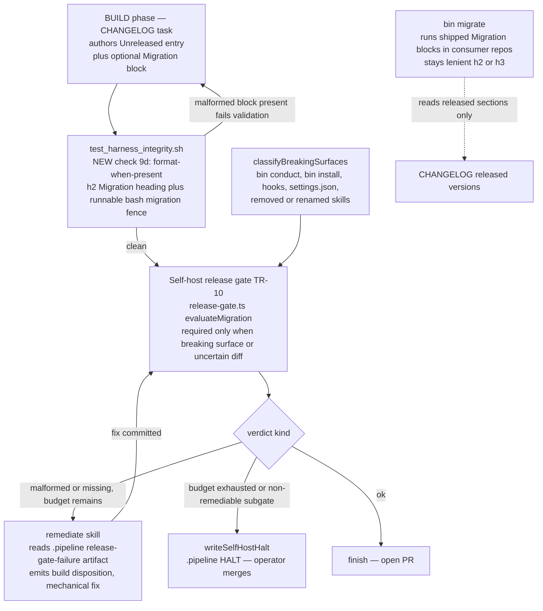

# Architecture: CHANGELOG Migration-block enforcement (fix #282)

**Date:** 2026-07-05
**Tier:** M
**Track:** technical
**Plan stem:** `2026-07-05-changelog-migration-block-enforcement`

Two enforcement points are added around the existing self-host release gate: an
authoring-time format check in the integrity suite, and a remediate route out of the gate
so a mechanical format defect no longer HALTs.

## C4 — Component view (self-host build + release gate)

## Enforcement points and their scopes

| Point | Language | Governs | h2/h3 policy | When it runs |
|---|---|---|---|---|
| `test_harness_integrity.sh` §9d (NEW) | bash | `[Unreleased]` block **format-when-present** | **h2-only** | every integrity run (pre-commit, CHANGELOG-task validation) |
| release gate TR-10 (`evaluateMigration`) | TS | `[Unreleased]` block **presence-when-breaking** + format | **h2-only** | self-host finish-time gate |
| `bin/migrate` (`extract_migration_blocks`) | Python | **released** version sections, execution | **h2 or h3 (lenient)** | consumer `conduct` update |

## Key invariant (locked by ADR)

**Gate-passing ⟹ migrate-executable.** The gate/integrity check is *stricter* (h2-only)
than `bin/migrate` (h2/h3). Because `h2 ⊂ {h2, h3}`, every block the gate accepts,
`bin/migrate` can still execute — the essential invariant is preserved. The asymmetry is
deliberate: the gate is a go-forward *authoring* contract; `bin/migrate` must stay lenient
to run already-shipped `### Migration` (h3) blocks (5 exist today in the CHANGELOG, some
with real `bash migration` fences). Tightening `bin/migrate` would silently skip those.

## Data flow: the new `.pipeline` remediation artifact

The gate already knows *why* it failed (malformed vs missing, which breaking surfaces, the
required format). Instead of HALTing, it writes that detail to a `.pipeline/` artifact and
the conductor dispatches `/remediate` pointed at it. Remediate reasons over the artifact
generically (a `build` disposition with a file-scoped task to fix `CHANGELOG.md`). The
self-host-specific knowledge lives entirely in the artifact + the TS self-host module —
**never** in the shared `remediate`/`tdd`/`finish` skill prose.
