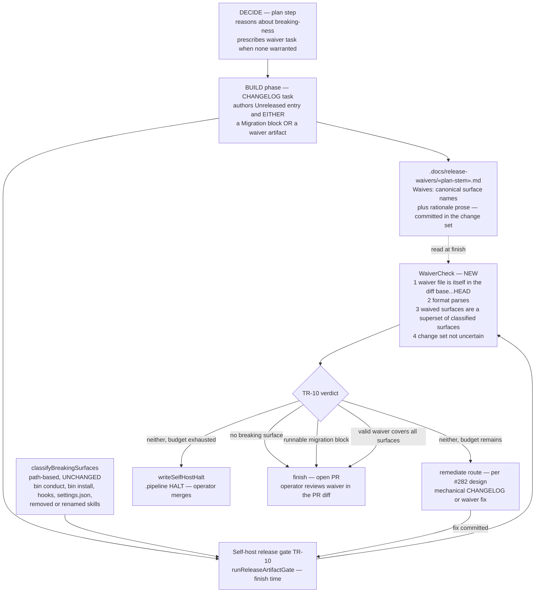
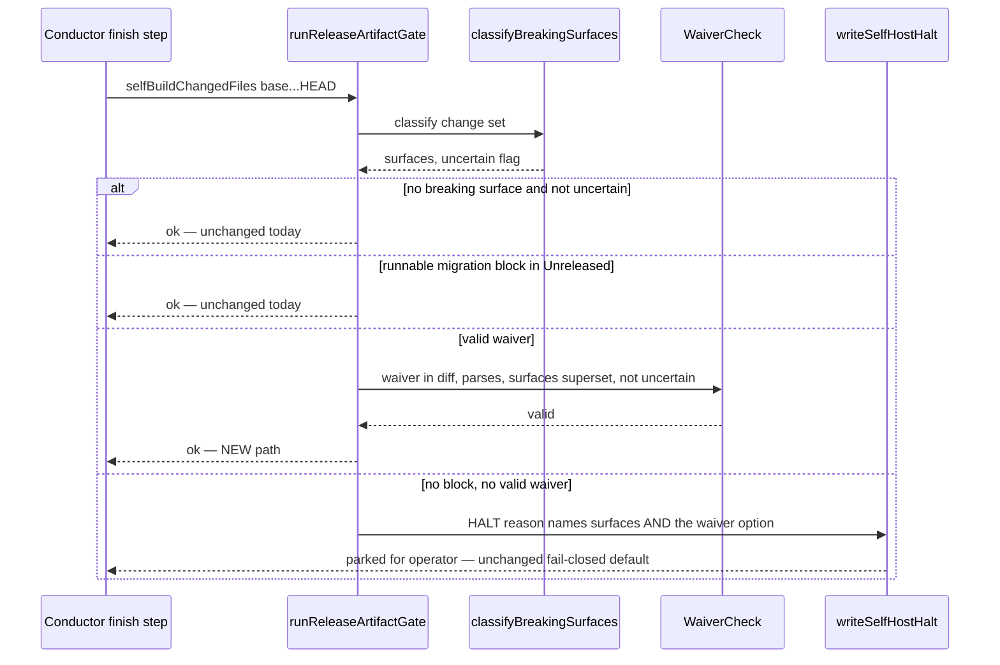

# Architecture: TR-10 migration-gate waiver for non-breaking surface touches (fix #354)

**Last updated:** 2026-07-06
**Tier:** M
**Track:** technical
**Plan stem:** `self-host-release-gate-bin-conduct-breaking-surfac`
**Scope:** self-host (`selfHost === true`) finish-time release gate only. Consumer-project
pipelines are byte-for-byte unchanged. `version-signal.ts` (semver-MAJOR signal) is explicitly
out of scope — follow-up issue.

The TR-10 migration sub-gate of `runReleaseArtifactGate`
(`src/conductor/src/engine/self-host/release-gate.ts`) gains a **waiver path**: when the
path-based classifier flags a breaking surface but the change is internal-only, the build can
satisfy the gate with a committed, machine-checkable waiver instead of a
```` ```bash migration ```` block. Absent both → HALT exactly as today (fail-closed,
per `adr-2026-06-30-halt-based-release-gates`).

## C4 — Component view (waiver authoring vs consumption)



## Sequence — gate evaluation order at finish



## Waiver validity rules (all four required — any miss falls through to HALT/remediate)

| # | Rule | Why |
|---|------|-----|
| 1 | The waiver file itself appears (A/M) in the `base...HEAD` change set | **Freshness binding** — a stale waiver from a previously merged change lives in `base`, so it can never silently waive a future diff. Structural per plan: the gate *discovers* waivers by scanning the change set for `.docs/release-waivers/*.md` (the gate has no plan-stem input), so an out-of-diff waiver is never even read; the `«plan-stem».md` name is an authoring convention |
| 2 | Format parses: `Waives:` list of canonical surface names + non-empty rationale | Machine-checkable, mirrors `hasRunnableMigrationBlock` rigor |
| 3 | Waived surfaces ⊇ classified surfaces (exact canonical strings, e.g. `bin/conduct CLI`) | A waiver written for `bin/conduct CLI` cannot leak coverage onto a later-added `hook wiring` touch in the same branch |
| 4 | Change set is NOT uncertain (null diff) | An undeterminable diff cannot prove rule 1, so it stays fail-closed — unwaivable, HALTs as today |

## Invariants preserved

- **Fail-closed default:** no waiver + no block → identical HALT behavior to today; uncertain
  change set is unwaivable.
- **ADR-005 human-merge:** the waiver is part of the PR diff the operator reviews before
  merging; nothing new becomes autonomous.
- **Containment:** all logic lives in `release-gate.ts` + the self-host BUILD prompt; gate runs
  only when `selfHost === true`. No new skill, hook, or step for consumer projects.
- **#282 composition:** WaiverCheck runs inside TR-10 *before* the missing/malformed
  disposition, so the remediate route (when built) sees waiver-satisfied builds as `ok`, never
  as remediable defects.

## Change Log

| Date | Change | Reason |
|------|--------|--------|
| 2026-07-06 | Initial generation | DECIDE phase for issue #354 |
| 2026-07-06 | W1 made structural: waiver discovery from the change set (no plan-stem input on `ReleaseGateOptions`) | Plan-phase verification of gate seams |
