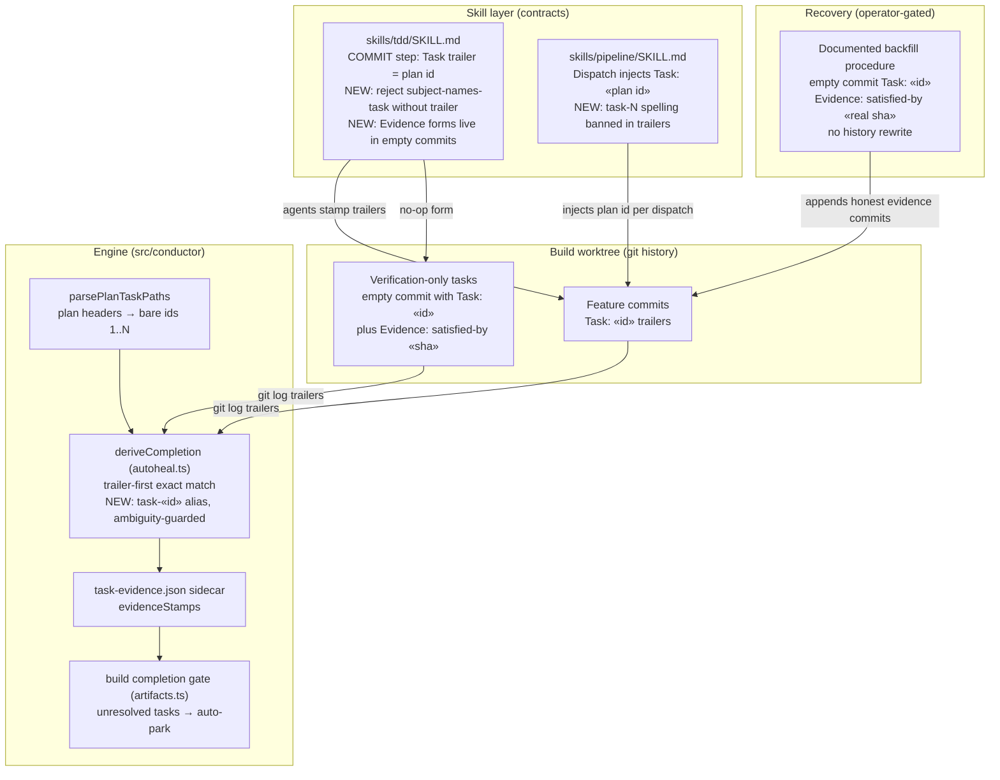

# Component Diagram: Evidence-Gate Task-Id Grammar Unification (#417)

**Last updated:** 2026-07-07
**Scope:** The build-evidence derivation path (plan → trailers → gate verdict), the two
skill contracts that feed it, and where the #417 fix lands: one id grammar declared at the
skill layer, trailer discipline at COMMIT, the engine-side `task-«id»` alias in
`deriveCompletion`, and the operator-gated recovery path for parked features.

## Diagram

## Legend

- **Skill layer** — Markdown contracts agents follow; the #417 root cause is a grammar
  split between these contracts and the engine's plan-id source of truth.
- **Engine** — deterministic TypeScript; `deriveCompletion` is the only completion
  authority (H6/H7: task-status.json rows are never trusted).
- **NEW** markers — surfaces this feature changes.
- `«id»` — placeholder for a plan task id (bare, e.g. `7`); `task-«id»` is the legacy
  prefixed spelling the alias accepts only when the plan does not itself declare a
  literal `task-N` id.

## Change Log

| Date | Change | Reason |
|------|--------|--------|
| 2026-07-07 | Initial generation | DECIDE phase for #417 (engineer worktree) |
