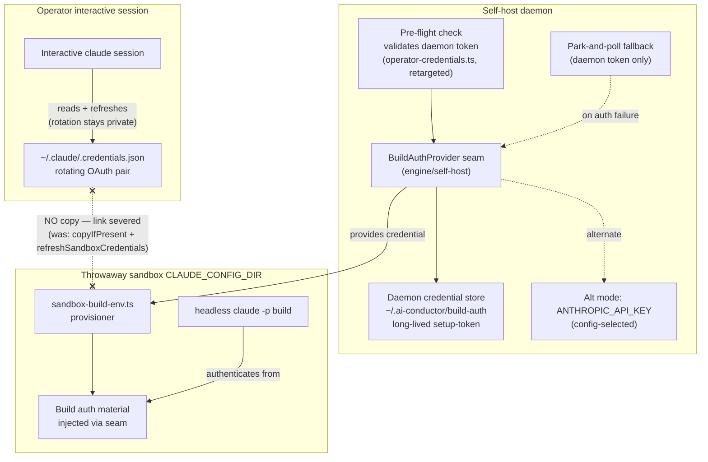
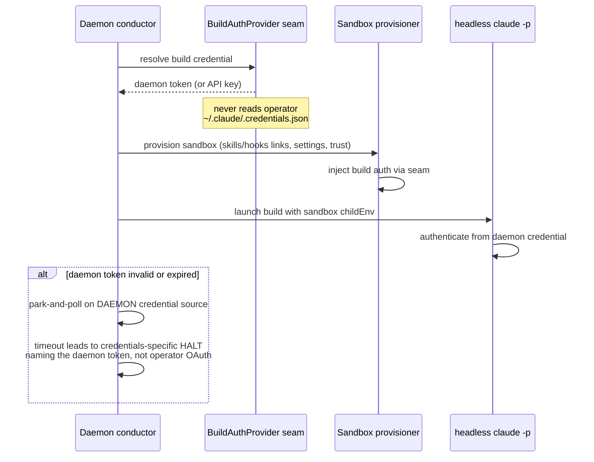

# Components: Isolate Daemon Build Auth from Operator OAuth

**Last updated:** 2026-07-07
**Scope:** Self-host build auth path (to-be) — daemon-owned build credential behind a
swappable auth seam, replacing the copy-operator-credentials design in
`sandbox-build-env.ts`. Feature: `isolate-daemon-build-auth-from-operator-oauth`
(jstoup111/ai-conductor#351).

## Diagram

## Legend

- **BuildAuthProvider seam** — new interface; resolves the build credential for a
  self-host sandbox. Default mode: daemon-owned long-lived token minted once via
  `claude setup-token`. Alternate mode: `ANTHROPIC_API_KEY`. Swappable later for
  platform identity (EKS direction, PR #175).
- **Daemon credential store** — daemon-side file/env source, disjoint from the
  operator's `~/.claude/.credentials.json`. Neither side can rotate the other's
  refresh token because they are separate grants.
- **`x-.NO copy.-x`** — the severed edge: sandbox provisioning no longer reads the
  operator's credentials file; `refreshSandboxCredentials` re-copy on park is retired.
- **Park-and-poll fallback** — adr-2026-07-04 machinery demoted: it now watches the
  daemon credential source (not the operator's file) and fires only when the
  daemon's own token is expired/invalid.

## Sequence: build auth on dispatch (to-be)

## Change Log

| Date | Change | Reason |
|------|--------|--------|
| 2026-07-07 | Initial to-be diagram | DECIDE phase for #351 — sever daemon/operator credential coupling |
