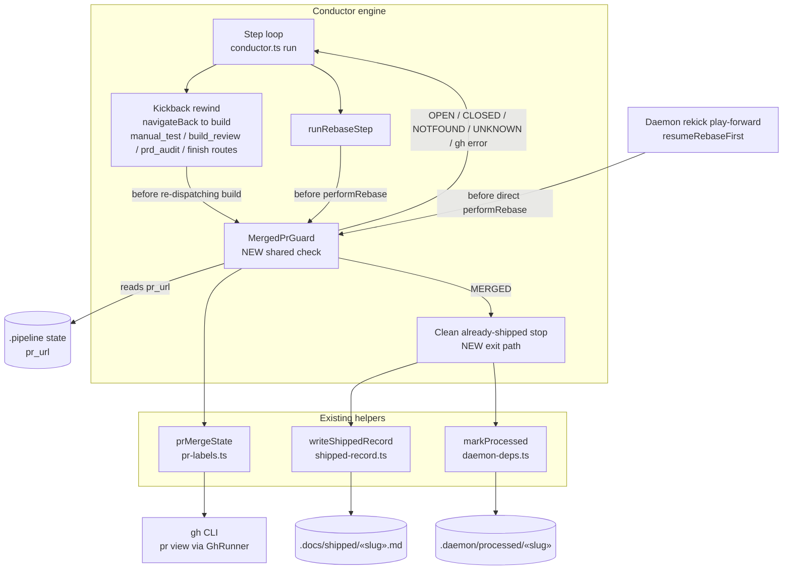

# Components: Daemon merged-PR guard on step retry (#358)

**Last updated:** 2026-07-09
**Scope:** The mid-run merged-PR guard — where it hooks into the conductor's kickback rewind
and rebase step, and the ship side-effects it triggers on a MERGED verdict.

## Diagram

## Legend

- **NEW** nodes are introduced by this feature; everything else exists today.
- `MergedPrGuard` is advisory on every verdict except `MERGED` — a gh failure or a
  non-merged state lets the normal retry/rebase proceed unchanged (fail-open on the
  guard, never a new HALT source).
- On `MERGED` the run stops cleanly: shipped record + processed marker written, no
  rebuild, no rebase, branch left reachable.

## Change Log

| Date | Change | Reason |
|------|--------|--------|
| 2026-07-09 | Initial generation | DECIDE phase for issue #358 |
| 2026-07-09 | Added rekick play-forward as third guard call site | Conflict-check found the resumeRebaseFirst blind spot; operator approved scope extension |
