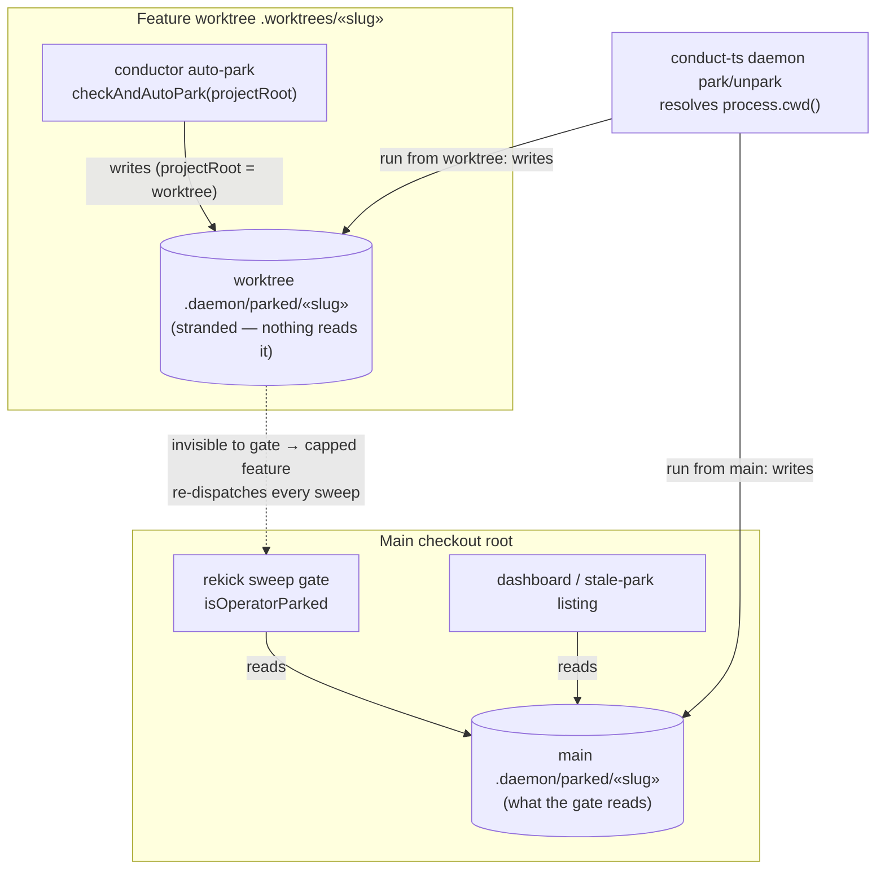
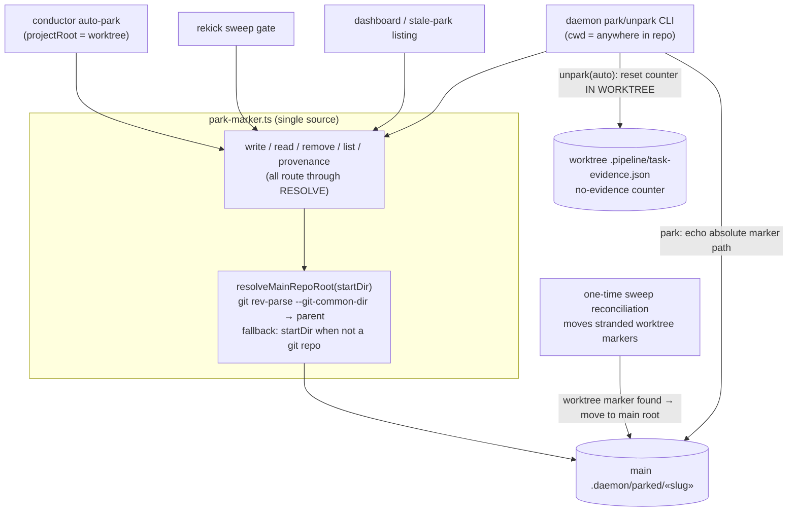
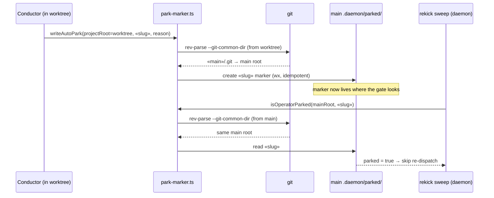

# Architecture: Park-Marker Main-Root Resolution (#486)

**Last updated:** 2026-07-10
**Scope:** Where `.daemon/parked/«slug»` markers are written and read across the daemon,
the conductor (running inside a feature worktree), the park/unpark CLI, and the
dashboard — before and after anchoring every park operation to the MAIN repository root.

## Diagram — before (bug): two disjoint roots

## Diagram — after (fix): one resolved root

## Sequence — auto-park then sweep (after fix)

## Legend

- Cylinders are filesystem state; boxes are code paths.
- `«slug»` is the feature slug placeholder.
- Dotted arrow (before-diagram) marks the fail-open gap: the gate never sees the
  worktree-stranded marker, so the capped feature re-dispatches on every sweep.
- `resolveMainRepoRoot` falls back to the given directory when it is not inside a git
  repository — this preserves tmp-dir unit tests and non-git consumers byte-for-byte.

## Change Log

| Date | Change | Reason |
|------|--------|--------|
| 2026-07-10 | Initial generation | Engineer DECIDE for #486 (tier M, technical track) |
