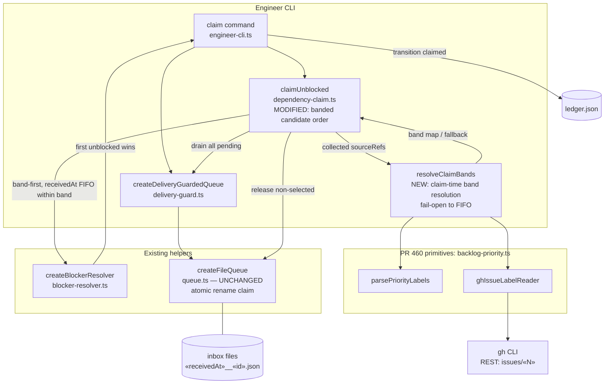

# Components: Priority-banded intake claim (#461)

**Last updated:** 2026-07-10
**Scope:** The `conduct-ts engineer claim` path — where claim-time priority banding hooks
into the dependency-claim walk, and which PR #460 primitives it reuses.

## Diagram

## Legend

- **NEW / MODIFIED** nodes are this feature; everything else exists today.
- `createFileQueue` is untouched — the ADR-011 C1 atomic-rename claim primitive stays the
  sole concurrency mechanism. Banding happens *above* the queue, on envelopes the walk
  already holds.
- `resolveClaimBands` is fail-open: a label-reader throw (gh outage, quota) logs once and
  returns no band map, leaving the walk in today's pure `receivedAt` FIFO order. A claim
  is never blocked or failed by the reader.
- Band vocabulary and ranking are imported from `backlog-priority.ts` (PR #460) — daemon
  backlog and intake claim share one definition; within-band order stays `receivedAt`
  FIFO (stable).
- Blocker-verdict deferral (#279 liveness, dependency blocks) is unchanged: verdicts are
  evaluated in banded order, deferred entries are still released untouched.

## Change Log

| Date | Change | Reason |
|------|--------|--------|
| 2026-07-10 | Initial generation | DECIDE phase for issue #461 |
