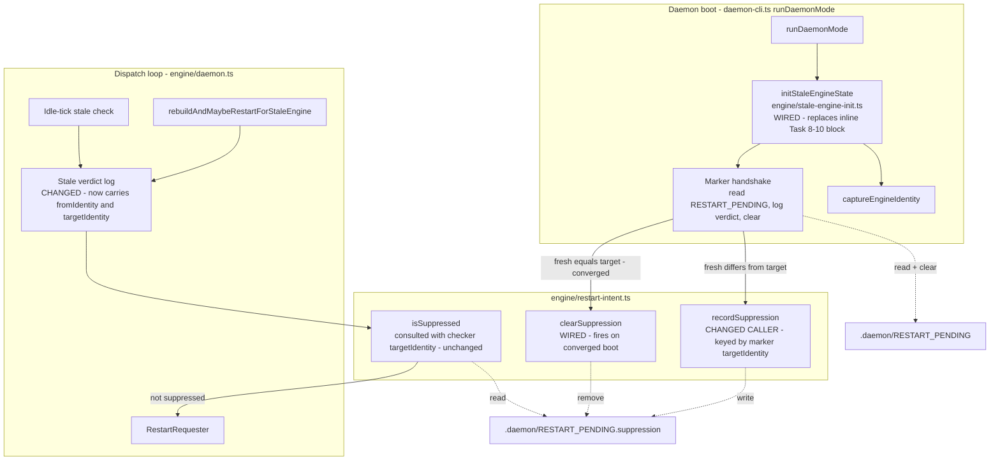

# Components: Stale-engine auto-restart residuals (#369)

**Last updated:** 2026-07-10
**Scope:** Repair of three residual gaps left by #307 (fixed-in-part by #320/#321): (1) wire the orphaned `initStaleEngineState` boot primitive so the parity test certifies the real path, (2) carry both identities in every stale-verdict log line, (3) fix the suppression record key (marker target, not fresh boot identity) and clear the record on convergence. Detection/restart machinery itself is unchanged — see `2026-07-03-daemon-auto-restart-stale-engine.md`.

## Diagram

## Legend

- **WIRED / CHANGED** nodes are touched by this feature; all others are existing machinery.
- Solid arrows: control flow. Dotted arrows: file reads/writes.
- **Gap 1 (wiring):** `daemon-cli.ts` currently duplicates the Task 8-10 boot block inline while the extracted `initStaleEngineState` has zero production callers — the parity acceptance test certifies dead code (the same escape pattern as #307). After this change the primitive is the single boot path and the inline duplicate is deleted.
- **Gap 2 (log identities):** both stale-verdict sites in `daemon.ts` (idle tick and rebuild path) log the verdict with `fromIdentity` and `targetIdentity`, matching the spec requirement the original Story 2 missed.
- **Gap 3 (suppression key):** the handshake previously recorded the **fresh boot identity**; a stale verdict requires on-disk ≠ captured(=fresh), so the record could never match within the boot that wrote it. It now records the **marker's targetIdentity** — "we already tried to restart onto this identity and failed to converge" — which is what `isSuppressed(targetIdentity)` consults. `clearSuppression` fires when a boot converges (fresh equals marker target) or when the marker handshake observes the identity has moved past the suppressed value, so a stale record cannot pin the daemon forever.

## Change Log

| Date | Change | Reason |
|------|--------|--------|
| 2026-07-10 | Initial generation | DECIDE phase for issue jstoup111/ai-conductor#369 |
