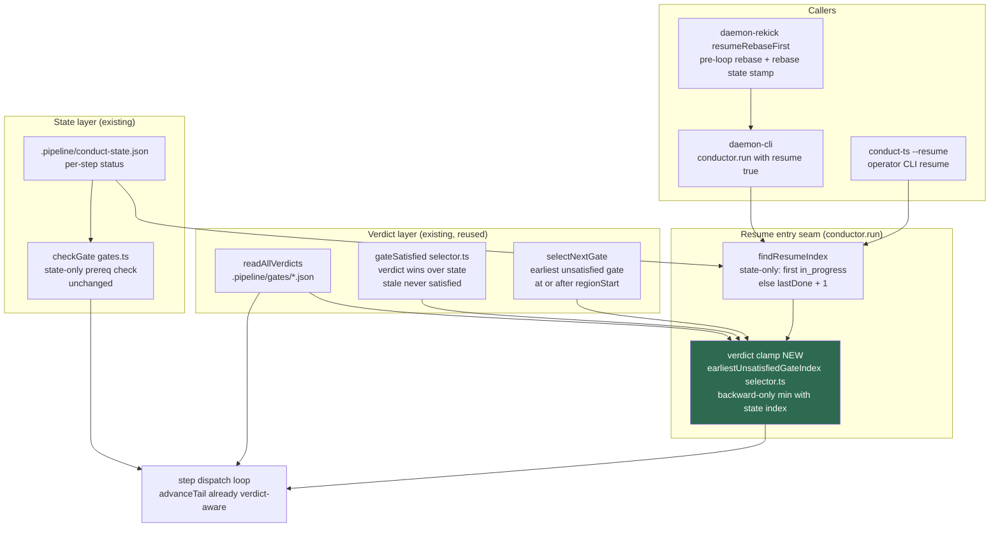

# Components: Verdict-Aware Resume Entry (#532)

**Last updated:** 2026-07-11
**Scope:** The conductor resume seam — how `conductor.run()` with `resume: true` picks its
starting step, and how the fix makes that derivation consult persisted gate verdicts via the
same selector the loop tail already trusts. Covers both resume entry branches and the daemon
rekick path that shares the seam.

## Diagram

## Legend

- **Green node** — the new element: a verdict clamp applied to the resume start index. All
  other nodes exist today and are reused unchanged.
- **Resume entry seam** — the only place the fix changes behavior. `findResumeIndex` stays
  as the state-derived candidate; the clamp overrides it when any loop-region gate's on-disk
  verdict is `satisfied: false` (or its state is `stale`), landing on the earliest such gate.
- **Verdict layer** — `gateSatisfied` and `selectNextGate` are the loop tail's existing,
  verdict-authoritative selection machinery (`selector.ts`); the fix feeds them
  `readAllVerdicts` output at resume entry instead of inventing a second authority.
- **checkGate is intentionally unchanged** — `finish`'s only prerequisite is `rebase`, whose
  verdict was correctly satisfied in the #532 incident; prereq-level verdict checks cannot
  block this failure mode (verified during explore).

## Change Log

| Date | Change | Reason |
|------|--------|--------|
| 2026-07-11 | Initial generation | DECIDE phase for #532 (verdict-aware resume entry) |
| 2026-07-11 | Clamp named: earliestUnsatisfiedGateIndex in selector.ts (plan update) | Plan located the helper beside selectNextGate to share its skip-aware scan |
