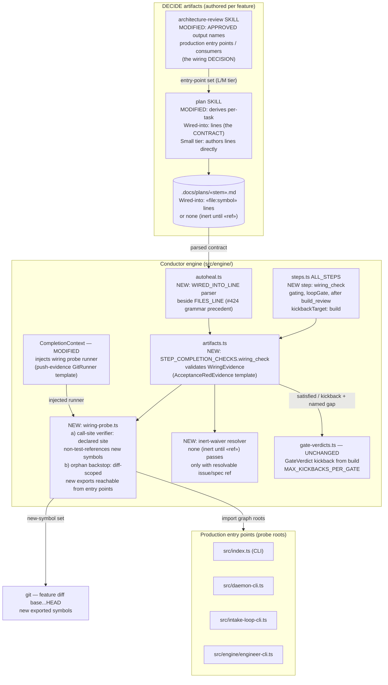

# Components: Wiring reachability gate (#462)

**Last updated:** 2026-07-12
**Scope:** The green-but-unwired guard — where the wiring decision originates (architecture-review),
where the engine-parsed contract lives (plan `Wired-into:` lines), and the new deterministic
`wiring_check` gate that verifies it, with a diff-scoped orphan-export backstop.

## Diagram

## Legend

- **NEW / MODIFIED** nodes are this feature; everything else exists today.
- The wiring **decision** is architectural: for M/L tiers, architecture-review's APPROVED
  output must enumerate the production entry points/consumers the feature hooks into.
  `/plan` derives the engine-parsed `Wired-into:` contract from it. **Small tier** (no
  architecture-review) falls back to plan-authored lines — the orphan backstop is the only
  net there.
- `wiring_check` is deterministic machinery (no LLM): it fails with a **named gap**
  (`«symbol» exported but unreachable from any entry point` / `declared call site
  «file:symbol» has no non-test reference`) and kicks back to build via the existing
  verdict plumbing. It never HALTs on the happy path; the stall cap
  (`MAX_KICKBACKS_PER_GATE`) provides the existing anti-ping-pong escalation.
- **INERT waiver:** `Wired-into: none (inert until «ref»)` passes only when `«ref»`
  resolves (issue/spec exists and is open work) — the follow-up wiring PR is never
  unenforced (closes the #179/#180 gap).
- Existing prompt-level guards are unchanged and complementary: architecture-review §12
  as-built reachability sweep (LLM judgment, catches unexercised-but-reachable),
  pipeline superseded-symbol grep, writing-system-tests real-entry-point rule.

## Change Log

| Date | Change | Reason |
|------|--------|--------|
| 2026-07-12 | Initial generation | DECIDE phase for issue #462 |
