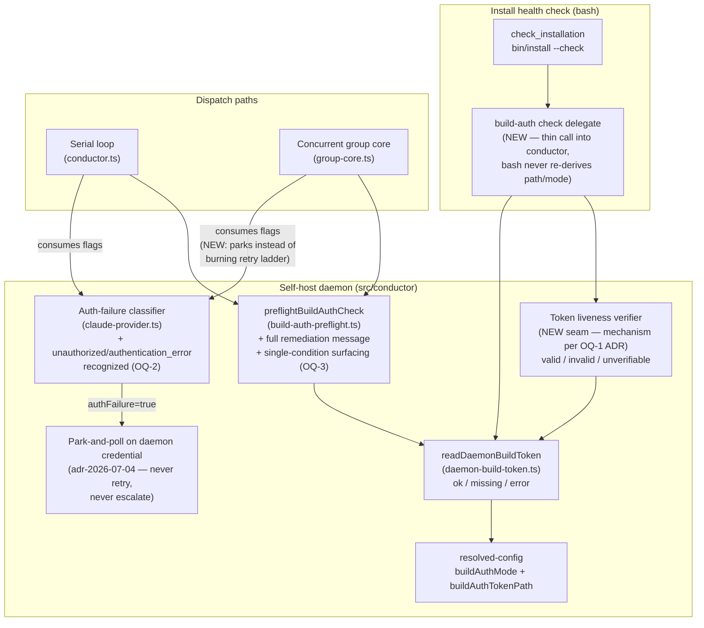
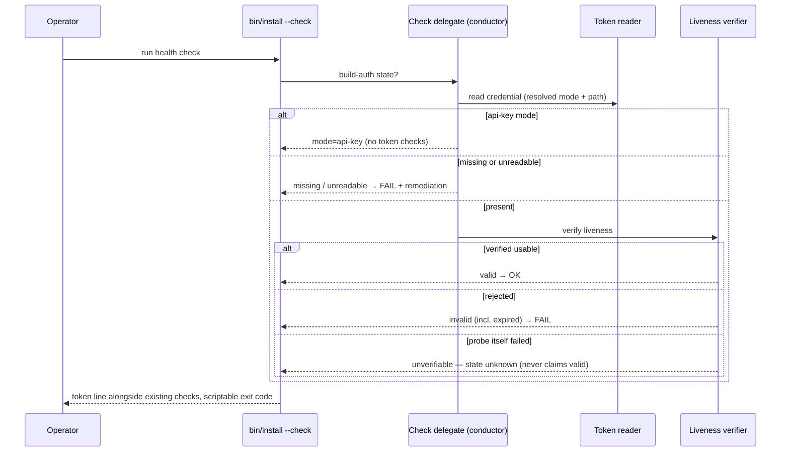
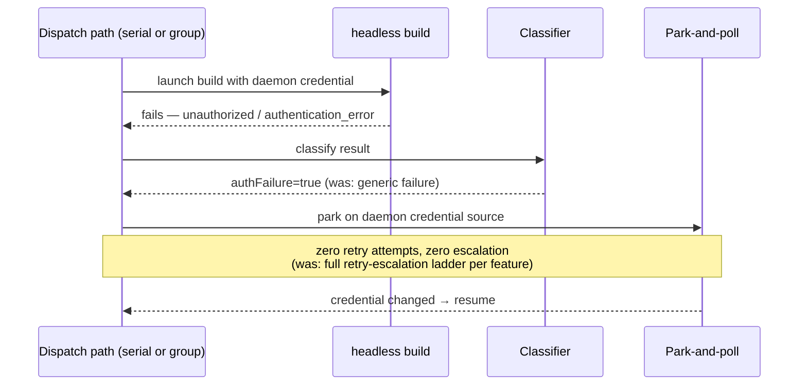

# Components: Build-Auth Token — Check and Classify

**Last updated:** 2026-07-22
**Scope:** To-be view for `build-auth-token-check-and-classify` (jstoup111/ai-conductor#498,
Tier M). Adds credential-state reporting to the install health check, a token liveness
verification seam, dispatch-time classification of rejected-credential failures on both
dispatch paths, and single-condition surfacing of a missing credential. Builds on the
2026-07-07 isolate-daemon-build-auth componentry; that diagram remains the base map.

## Diagram

## Legend

- **build-auth check delegate (NEW)** — the health check gains a build-token section by
  delegating to conductor-resolved state; the bash side only formats results. Keeps a
  single source of truth for mode/path resolution (config lives in TypeScript).
- **Token liveness verifier (NEW seam)** — answers "is this stored credential actually
  usable?" with `valid / invalid / unverifiable`. Concrete probe mechanism is OQ-1,
  decided in the architecture review ADR. Consumed by the health check; NOT run on
  every dispatch (dispatch keeps fail-fast read + classified failure).
- **Auth-failure classifier (+)** — extends the existing precedence classifier so a
  rejected credential (unauthorized / authentication_error) sets `authFailure` instead
  of falling through as a generic retryable failure. Both dispatch paths then take the
  park path; today only text like "invalid api key" is recognized.
- **Single-condition surfacing (OQ-3, resolved)** — a missing credential becomes ONE
  waiting condition for the daemon run rather than an independent HALT per queued
  feature; fail-closed semantics preserved. Decided form (plan 2026-07-22): a
  NON-BLOCKING skip-picks gate beside `checkPaused` (rate-limit-episode pattern) with
  a credential-file watcher arming the existing latched waker for auto-resume — never
  a loop-blocking wait.

## Sequence: health check reports credential state (to-be)

## Sequence: invalid credential at dispatch (to-be)

## Change Log

| Date | Change | Reason |
|------|--------|--------|
| 2026-07-22 | Initial to-be diagram | DECIDE phase for #498 — check-and-classify (Approach B) |
| 2026-07-22 | Legend: gate pinned as non-blocking skip-picks + waker | Plan update after conflict-check item 4 |
