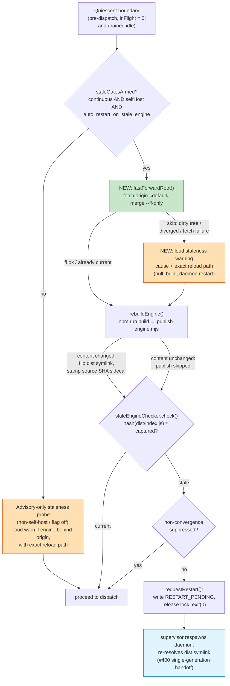
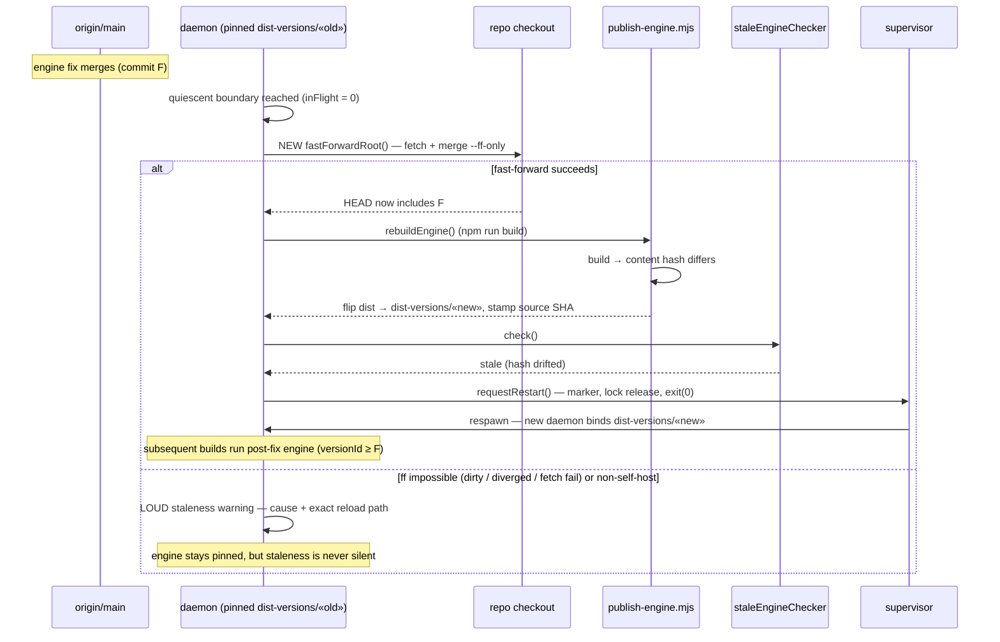

# Architecture: Daemon engine freshness on origin/main advance

**Last updated:** 2026-07-22
**Scope:** The quiescent-boundary engine-refresh gate — how a fix merged to
`origin/main` reaches the running daemon's loaded engine (fast-forward →
rebuild/publish → stale check → restart transport), and the loud-staleness
degraded paths when the self-heal chain cannot run. Feature:
`daemon-stale-engine-origin-advance` (intake #598, Tier M, technical track).

## Context (as-is gap)

The stale-engine checker hashes `dist/index.js` (engine-identity.ts). `dist` is
untracked (#309), so a merge to `origin/main` moves source only. The
pre-dispatch gate `rebuildAndMaybeRestartForStaleEngine` (daemon.ts:917-945)
rebuilds the daemon's own checkout **without fast-forwarding it first** —
`fastForwardRoot()` (daemon-backlog.ts:149) runs only on `refresh:true` paths
(startup / fully-drained idle). A behind checkout rebuilds byte-identical
content, `publish-engine.mjs:340` logs "content unchanged — publish skipped",
the checker returns `current`, and the daemon runs the pre-fix engine forever.

## Diagram: quiescent-boundary refresh gate (to-be)

## Diagram: merged-fix propagation sequence (to-be)

## Legend

- **Green** — new fast-forward step (reuses existing `fastForwardRoot`, same
  clean-tree + on-default-branch guards).
- **Orange** — new loud-staleness surfacing (degraded paths that previously
  stayed silent).
- **Blue** — existing #400 single-generation restart transport (unchanged).
- `«default»` / `«old»` / `«new»` — placeholder for the derived default branch
  and engine version ids.
- Invariants preserved: never swap code mid-build (quiescent-only), fail-closed
  on indeterminate hash, non-convergence suppression, single daemon generation.

## Change Log

| Date | Change | Reason |
|------|--------|--------|
| 2026-07-22 | Initial generation | Spec authoring for daemon-stale-engine-origin-advance (#598) |
