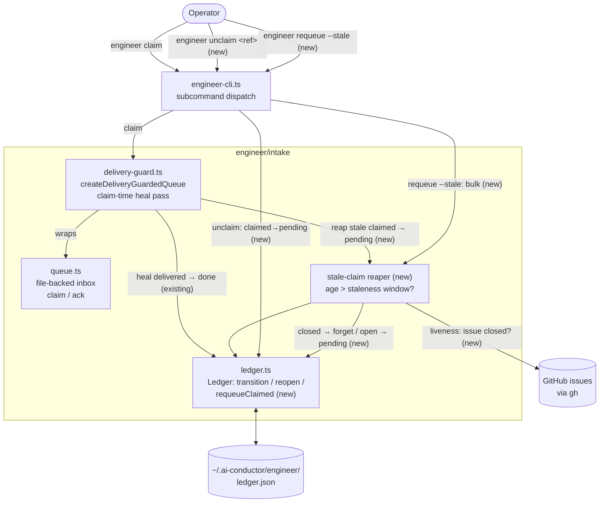
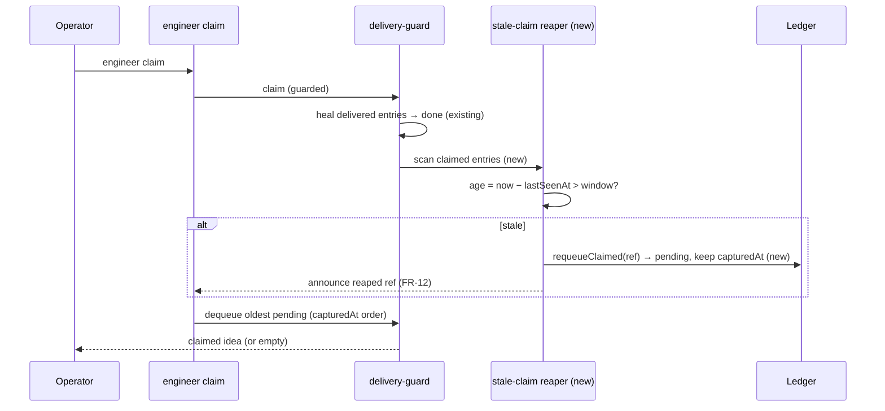
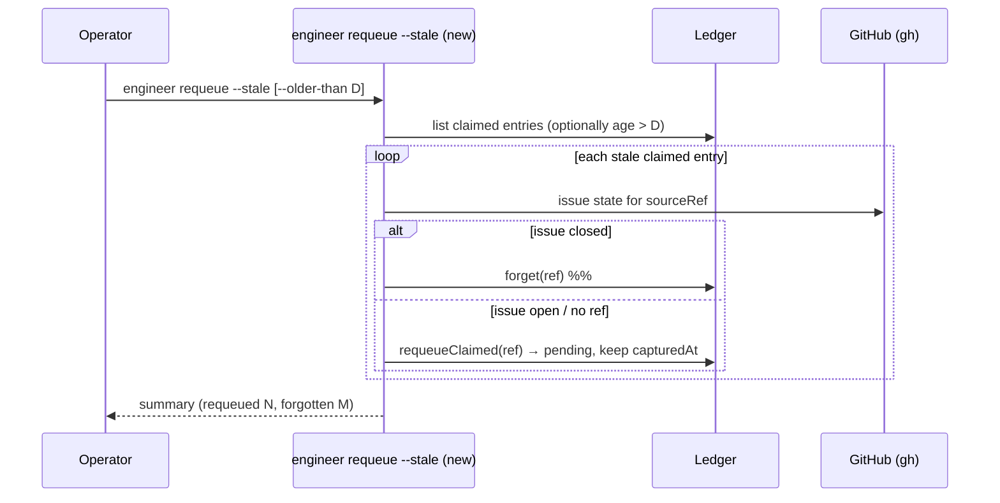

# Architecture: stale claim recovery (unclaim / requeue + claim-time auto-heal)

**Date:** 2026-07-22
**Feature:** engineer intake — recover stranded `claimed` entries
**Tier:** M

This is a bounded extension of the existing engineer intake machinery. New surfaces are
marked **(new)**; everything else already exists.

## Component view (C4 level 2/3)

## Sequence — automatic reap at claim time (FR-2, FR-4, FR-12)

## Sequence — bulk manual requeue with liveness (FR-8, FR-9)

## Key structural points

- **Reaper is one heal rule, not a new subsystem.** Automatic recovery lives inside the
  existing `createDeliveryGuardedQueue` claim-time pass, which already heals *delivered*
  entries to `done`. The new rule reaps *stale `claimed`* entries to `pending`. Same
  invocation point, same guard object — no new call site in the claim path.
- **New ledger transition is distinct from `reopen`.** `reopen` is `done → pending` (spec-PR
  closed-unmerged, FR-39/40) and increments `attempts`. Stale-claim recovery is
  `claimed → pending`; it preserves `capturedAt` (FR-4) and its `attempts` semantics are an
  ADR question. Modeled as a dedicated `requeueClaimed` operation to keep the two lifecycles
  from entangling.
- **Shared reaper core for auto + manual.** The claim-time reaper and the bulk `requeue --stale`
  verb share one predicate (age past window) and one transition (`requeueClaimed`); the manual
  bulk path adds the GitHub liveness branch (closed → `forget`). The single-idea `unclaim`
  verb is the same transition with an operator-supplied ref and a refuse-on-terminal guard.
- **Staleness signal is `now − lastSeenAt`.** `lastSeenAt` is stamped when the entry became
  `claimed`; no heartbeat refreshes it, so this is an age-since-checkout signal. The window's
  default is an ADR question (Open Questions in the PRD).
