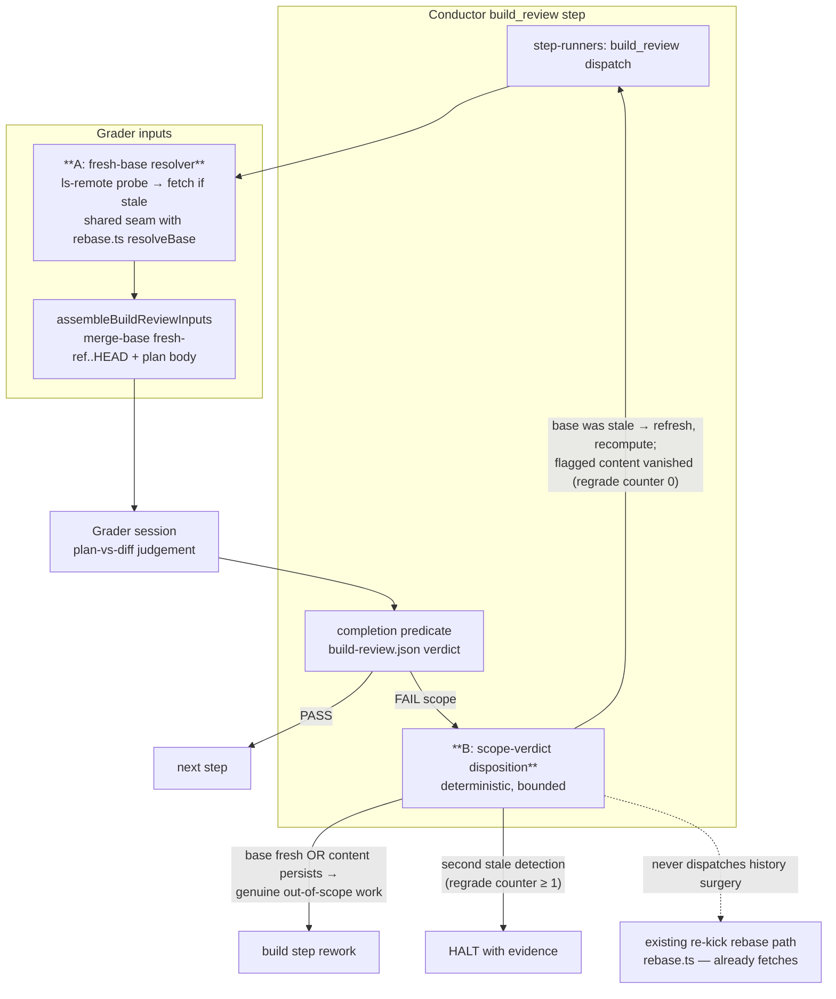

# Architecture: build_review fresh-base grading + bounded scope-verdict disposition

**Feature:** `build-review-grades-plan-vs-diff-against-a-stale-o`
**Date:** 2026-07-23
**Scope:** C4 component-level view of the build_review grading path, showing the two
new mechanisms: (A) verified-fresh base resolution and (B) the deterministic
disposition layer on a scope FAIL.

## Incident context (verified 2026-07-23)

The grader's diff is `merge-base(origin/<default>, HEAD)..HEAD`
(`build-review-inputs.ts`). The 9.0 rebase path (`rebase.ts#resolveBase`) fetches
before rebasing, but the grader never fetches — so a branch correctly rebased onto
true latest main can be graded against a lagging `refs/remotes/origin/<default>`,
which places main's own recent merges inside the "branch diff". Observed result: a
false `Scope` FAIL naming merged PRs (#870/#872) as bundled work, followed by a
"fix in build" rework dispatch that performed git-history surgery on a healthy
branch (benign this time: backup branch + rebase, no deletions).

## Component diagram

## Key invariants

1. **Grading never uses an unverified base.** Before `merge-base`, the resolver
   compares `refs/remotes/origin/<default>` to `git ls-remote origin <default>`;
   on mismatch it fetches and recomputes. No remote / probe failure → degrade to
   current local behavior with an advisory log (unchanged offline semantics).
2. **A scope FAIL never routes straight to agent rework while the base is
   unverified.** The disposition layer refreshes, recomputes the diff, and decides:
   flagged content vanished → the verdict was a stale-ref mirage → discard verdict,
   re-run build_review; content persists → genuine violation → kick to build
   (today's behavior).
3. **Hard loop bound.** At most ONE regrade per feature-session (persisted counter in
   `.pipeline/`); a second stale detection HALTs with the evidence (shas of the
   graded base, fresh base, and flagged paths). No regrade loop is reachable.
4. **The engine never edits history in this path.** Base refresh is ref/fetch work
   only; branch rebasing remains owned by the existing re-kick path. No rework prompt
   ever instructs removal of content present on the fresh remote default branch.
5. **Telemetry.** Every grading emits `{mergeBase, trackingRefSha, remoteHeadSha,
   fresh}` so the residual open question — which machinery leaves the tracking ref
   behind the branch base — is answered from live data rather than inference.
