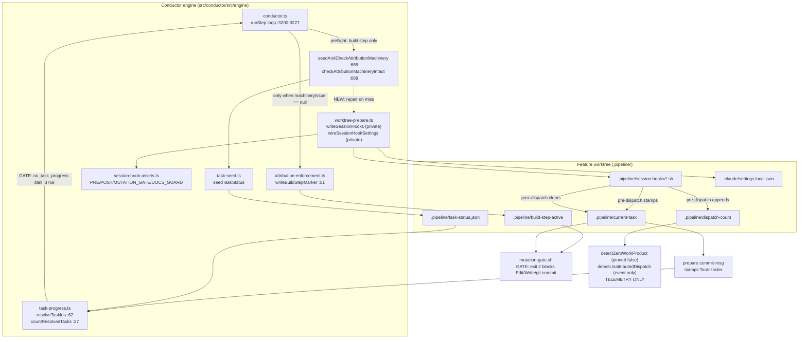

# Architecture: session-hook repair at the build-dispatch preflight (#896)

**Date:** 2026-07-23
**Scope:** C4 Level 3 (component) for the build-dispatch preflight seam and the session-hook
consumer chain it protects.

## C4 L3 — components in play

## Reading the diagram

- Two edges are labelled **GATE** and both terminate in build-stopping behavior. They are the
  reason removal is unsafe: `mutation-gate.sh` fail-closes unstamped mutations, and the
  `current-task → Task: trailer → resolveTaskIds → countResolvedTasks` chain feeds the
  `no_task_progress` stall breaker.
- The only **TELEMETRY ONLY** sink is `.pipeline/dispatch-count`. It is the sole artifact of these
  hooks that #773 actually stranded.
- The `machineryIssue == null` edge into `writeBuildStepMarker` is the ordering hazard: any design
  that lets the guard pass while hooks are still absent arms the mutation gate against a
  nonexistent script.

## Change footprint

- **New (extracted, exported):** `ensureSessionHooks(worktreeRoot, log?)` in `worktree-prepare.ts`
  — the existing `writeSessionHooks` + `wireSessionHookSettings` pair made outcome-reporting and
  callable from the guard. `prepareWorktree` keeps calling them with unchanged fail-open posture.
- **Changed:** `checkAttributionMachineryIntact` gains a repair-then-recheck step on the
  session-hooks branch only. Every other branch (pipeline-dir absent, task-status missing,
  plan unresolvable, stamp path unwritable) is byte-for-byte unchanged.
- **Unchanged:** hook script contents, settings wiring shape, `writeBuildStepMarker` call site and
  its `!machineryIssue` predicate, all consumers in `task-progress.ts` /
  `attribution-enforcement.ts`.

## Invariant this design must preserve

> The build-step-active marker is written **only** after the preflight has confirmed — post-repair,
> by re-reading the filesystem — that all three enforcement scripts exist on disk.

The mutation gate's fail-closed guarantee is exactly as strong as this invariant.
