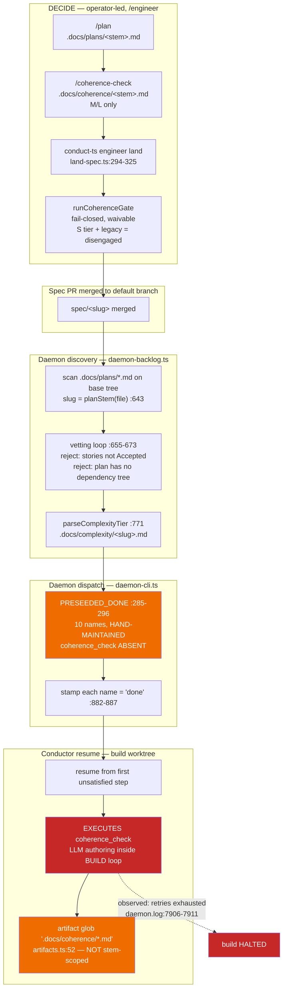
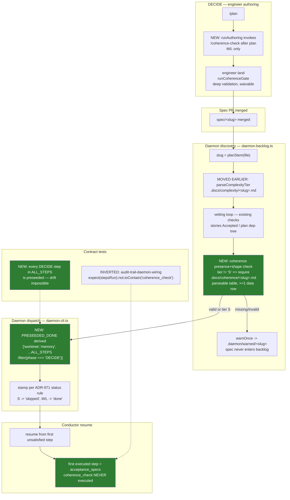

# Components: DECIDE-phase coherence ownership at the daemon boundary (#971)

**Last updated:** 2026-07-26
**Scope:** The phase-ownership seam between operator-led DECIDE authoring and autonomous daemon
execution — the engineer authoring sequence (`engineer/authoring.ts`), the daemon preseed constant (`daemon-cli.ts:285-296`, applied `:882-887`), the
discovery-time spec vetting loop (`daemon-backlog.ts:655-673`, tier resolved `:771`), the step
definition table (`steps.ts` / `types/steps.ts`), the conductor's tier-skip computation
(`conductor.ts:2549-2557`), and the already-existing land-time coherence gate
(`land-spec.ts:294-325` → `coherence-validator.ts`).

## Current architecture (the defect)

**Three defects are visible in the current graph:**

1. `PRESEEDED_DONE` is hand-maintained and omits `coherence_check` — the only one of the nine
   DECIDE steps left out — so the conductor resumes straight onto a DECIDE authoring step.
2. The vetting loop at `daemon-backlog.ts:655-673` — by its own comment *"the only place specs
   are vetted before autonomous build"* — checks stories and plan but not the coherence
   artifact, even though it resolves the tier 100 lines later at `:771`.
3. The post-step verifier is the unscoped glob `.docs/coherence/*.md`, which any unrelated
   prior-feature file in the full repo checkout satisfies, so the executed step's output is
   never actually checked for *this* feature.

## Target architecture

## Component responsibilities after the change

| Component | Responsibility | Change |
|---|---|---|
| `steps.ts` / `ALL_STEPS` | Sole declaration of which phase owns each step | none (already correct) |
| `engineer/authoring.ts` `runAuthoring` | Execute the canonical DECIDE sequence and commit its artifacts | **extended** — M/L invokes `coherence_check` after `plan` and commits `.docs/coherence/<slug>.md`; S skips it |
| `daemon-cli.ts` `PRESEEDED_DONE` | Derive the preseed set from `ALL_STEPS` phase membership | **replaced** — hand-list → derivation |
| `daemon-cli.ts` stamping loop | Stamp preseeded steps with a tier-correct status | **amended** per ADR |
| `daemon-backlog.ts` vetting loop | Reject un-buildable merged specs before dispatch | **extended** with a third check |
| `coherence-validator.ts` | Deep semantic validation at authoring time | none — deliberately not reused at discovery |
| `conductor.ts:2549-2557` | Compute tier skips for steps that reach it | none |
| `artifacts.ts:52` glob | Post-step verification | none — deferred (OQ3) |

## Layering decision made explicit

Validation is deliberately **asymmetric** rather than shared:

- **Land time (authoring side)** keeps the full semantic validator — coverage layers,
  fabricated-id detection, duplicate-claim detection, waivers. It has the change set (git diff)
  that those checks require.
- **Discovery time (build side)** performs only a shallow, fail-closed **presence + parseability**
  check. Discovery reads the base-branch tree through `tree.readFile` and has no change set, so
  the deep validator is not merely expensive there — it is not computable. The shallow check is
  a backstop for specs that bypassed `land` (hand-pushed spec branches, or the gate's own
  tier-S/legacy disengagement paths), not a second copy of the gate.

This keeps a single source of semantic truth and avoids the classic failure of two divergent
validators disagreeing about the same artifact.
