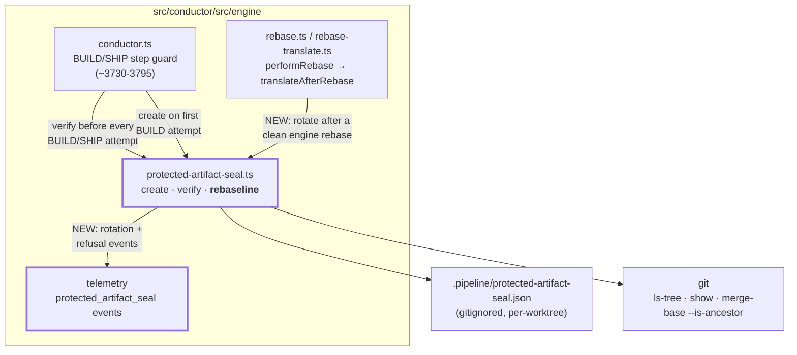
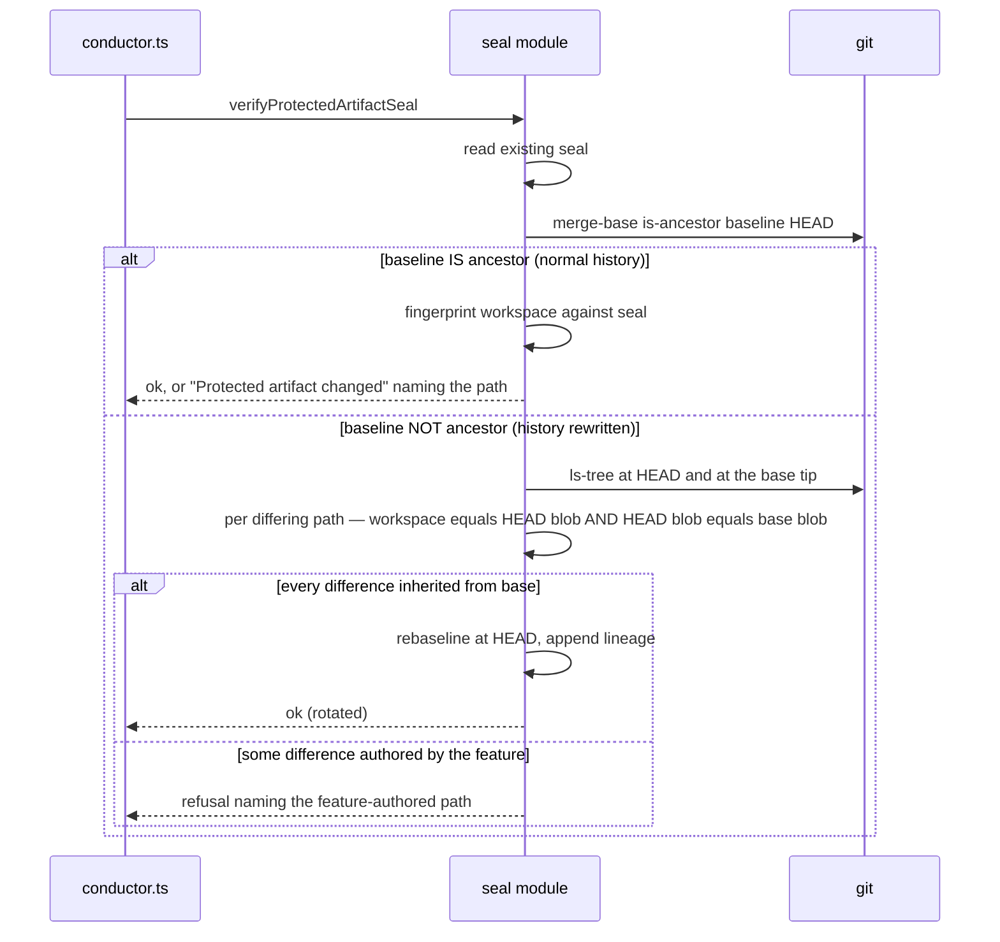

# Architecture: protected-artifact seal rebaselining (#976)

**Stem:** `2026-07-26-rebased-features-stale-protected-artifact-seal-976`
**Tier:** M — lightweight architecture pass

## Scope

One module gains a lifecycle: `.pipeline/protected-artifact-seal.json` may now be *replaced* under
a narrow, provable condition. Nothing else in the step topology moves.

## Component view (C4 level 3, seal boundary only)

The new dependency is `rebase → seal`, mirroring the existing `rebase → task-evidence /
task-status` translation. The seal module stays ignorant of the rebase module.

## Seal state machine

```mermaid
stateDiagram-v2
    [*] --> Absent
    Absent --> Sealed: first BUILD attempt<br/>(workspace matches HEAD)
    Absent --> MissingHalt: SHIP attempt with no seal

    Sealed --> Sealed: verify ok<br/>(baseline is ancestor of HEAD,<br/>content matches)
    Sealed --> Violation: content differs and<br/>divergence NOT explained by base
    Sealed --> Rebaselined: engine rebase completed cleanly<br/>(pre-state verified ok)
    Sealed --> Rebaselined: baseline NOT ancestor of HEAD<br/>AND divergence fully explained by base

    Rebaselined --> Sealed: new baseline = post-rebase HEAD,<br/>lineage appended

    Violation --> [*]: step fails, no dispatch;<br/>attempt >= 2 writes classified HALT
    MissingHalt --> [*]
```

The only two edges into `Rebaselined` are the proactive one (the engine performed the rebase and
verified the pre-state) and the defensive one (history was rewritten out from under the seal and
every differing path is provably inherited from the base branch). Every other verification failure
still lands in `Violation` exactly as today.

## Rotation decision sequence

## Key architectural decision

Recorded in `.docs/decisions/adr-2026-07-26-protected-artifact-seal-rebaseline.md` (APPROVED):
the rotation predicate is *provable inheritance from the base branch*, not *non-ancestry alone*.
Non-ancestry is the cheap trigger that tells us the seal can no longer be evaluated as-is; it is
never sufficient on its own to grant a rotation, because an agent can rewrite history.

## Invariants preserved

- A seal is never rotated to a later commit **on the same history** — the pinned immutability
  behaviour is narrowed, not removed.
- Uncommitted workspace edits to a protected artifact always fail; rotation requires the workspace
  to match the committed tree at HEAD.
- A missing seal at SHIP still fails closed.
- Non-git roots still bypass the boundary entirely (unchanged).
