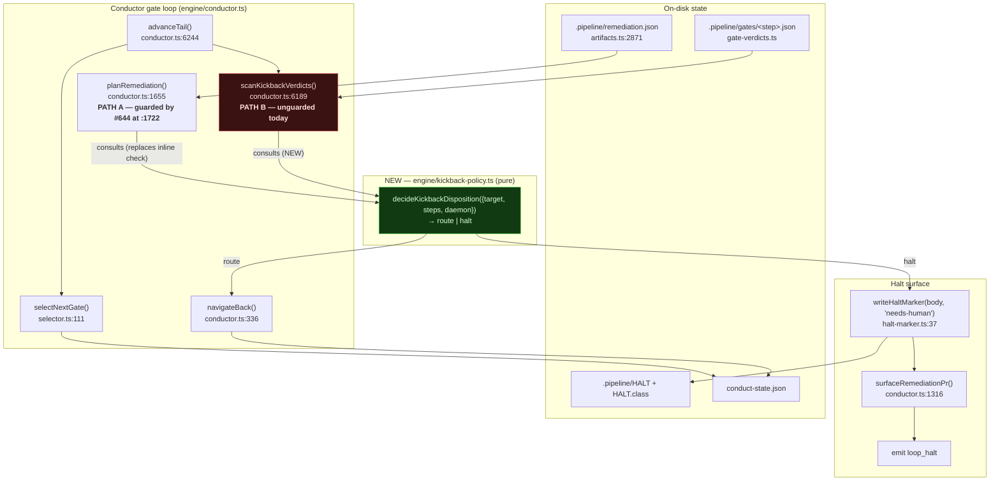
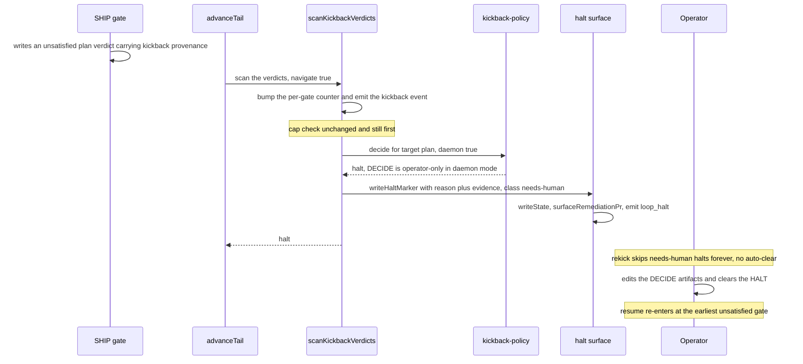
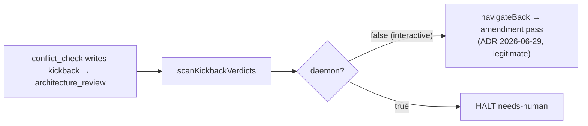

# Architecture: daemon-mode DECIDE kickback guard (#551)

**Date:** 2026-07-27
**Stem:** daemon-mode-kickbacks-route-human-judgment-gaps-in
**Tier:** M (technical track)

## Scope

The conductor's gate loop, specifically the two seams that can move the run index *backward*
to an earlier step, and the daemon-mode rule governing which targets are permissible.

## Component view (C4 L3 — inside the conductor engine)

## The invariant this enforces

> In daemon mode, the run index may never move backward into a `phase: 'DECIDE'` step.
> The condition that would have moved it becomes a `needs-human` HALT carrying the gap
> evidence.

Both backward-navigation seams are now derived from one predicate, so the invariant cannot be
half-true. `navigateBack` itself is deliberately *not* the enforcement point (see the ADR's
rejected options) — it is also called by the rebase-invalidation path (`conductor.ts:4203-4238`)
whose targets are all BUILD/SHIP and must keep working.

## Sequence — daemon, SHIP-phase gate kicks back to `plan`

## Interactive path (unchanged)

## Touch list

| Element | Change |
|---|---|
| `engine/kickback-policy.ts` | **new**, pure, no I/O |
| `engine/conductor.ts:1722-1737` | inline #644 check → delegate to the predicate (behavior-identical) |
| `engine/conductor.ts:6189-6231` | consult the predicate before `navigateBack`; halt via `writeHaltMarker(..., 'needs-human')` |
| `engine/steps.ts`, `types/steps.ts` | **unchanged** — phase data is read, never redefined |
| `engine/selector.ts` | **unchanged** — the dead `loopGatesOnly` clamp is explicitly not wired (see ADR) |
