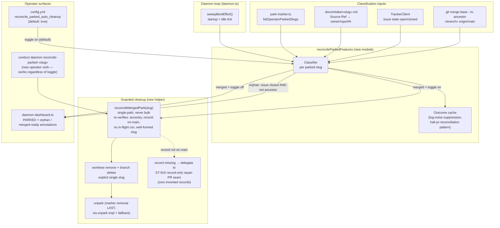

# Components: Parked-Feature Reconciliation Sweep (#1060)

**Last updated:** 2026-07-27
**Scope:** New `reconcileParkedFeatures` sweep, the guarded single-slug cleanup helper it shares with the operator verb, and the orphan category in the daemon dashboard.

## Diagram

## Legend

- **merged** — the parked branch tip is an ancestor of `origin/main`: every commit is already on main, so cleanup is information-lossless. With `reconcile_parked_auto_cleanup` on (default) the sweep reconciles it automatically; off → annotated `merged — ready to reconcile` only.
- **orphan** — target issue is closed but the branch is NOT an ancestor of main: may hold unique work; surfaced only, never auto-deleted.
- Deletion preconditions (re-verified inside the helper, never trusted from the caller): ancestry proof, shipped record on the base branch, no in-flight `.pipeline` run, single well-formed slug. Record missing → delegate creation to the ST-916 repair-PR seam and defer cleanup; never invent a record.
- Slugs with no intake marker or an unparseable `Source-Ref` (shared parser) are left untouched (fail-closed: no classification → no action, no orphan label from issue state alone).
- The guarded cleanup helper is the single shared deletion path for both the sweep and the operator verb; it operates on exactly one named slug per call. Park-marker removal is its LAST step. This is the scoped exception amended into the operator-park PRD/FR-7 (see ADR).

## Change Log

| Date | Change | Reason |
|------|--------|--------|
| 2026-07-27 | Initial generation | DECIDE for #1060 |
