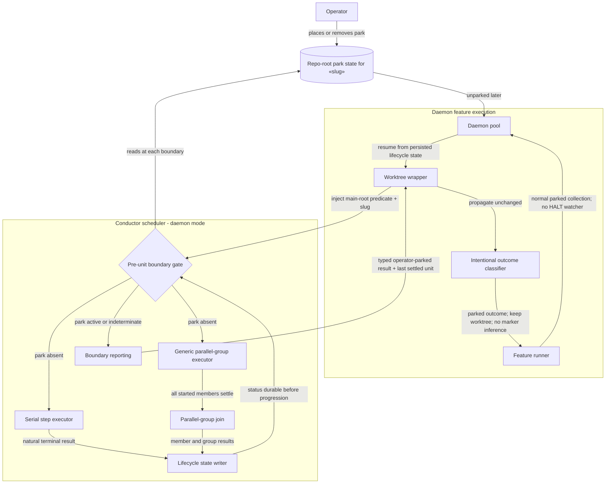

# Components: Boundary-aware operator parking

**Last updated:** 2026-07-29
**Scope:** Proposed daemon-only control flow that drains the active serial step or parallel group, persists its natural outcome, and honors an operator park before the next lifecycle unit starts.

## Diagram

## Legend

- **Pre-unit boundary gate** is the single policy point before any serial step or parallel group starts. It is enabled only for daemon-managed runs.
- **Lifecycle state writer** remains authoritative for the active unit's natural result; the park decision occurs only after those writes complete.
- **Generic parallel-group executor and join** represent every current and future parallel group. The boundary is after the complete join, never inside one member.
- **Intentional outcome classifier** keeps an operator boundary stop distinct from a machine failure or an indeterminate loop exit.
- **Worktree wrapper and feature runner** propagate the typed stop before terminal-marker inference;
  the daemon pool collects it without a machine-HALT watcher or completion side effects.
- An unreadable park decision fails toward stopped: no later lifecycle unit starts.

## Change Log

| Date | Change | Reason |
|------|--------|--------|
| 2026-07-29 | Initial proposed component flow | DECIDE for boundary-aware operator parking |
| 2026-07-29 | Added planned wrapper, typed-result, and pool wiring | Plan-update mode |
