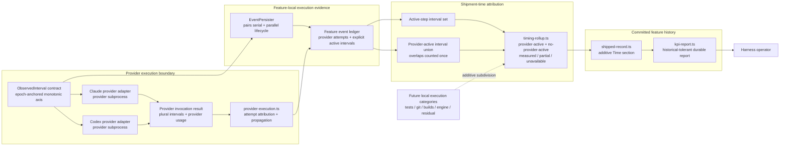

# Component Diagram: Durable Provider-Time Attribution

**Last updated:** 2026-07-29
**Scope:** Engine-observed provider intervals, overlap-safe feature attribution, and durable reporting

## Diagram

## Component Responsibilities

- **Provider adapters** observe each built-in provider subprocess from start through exit on normal,
  interactive, failure, and self-host paths. Engine-observed interval data remains separate from the
  provider's own usage payload and self-reported duration.
- **Provider execution coordinator** converts each actual invocation result into attempt evidence;
  cached or otherwise skipped candidates carry no interval.
- **Feature event ledger** remains the transient per-feature source for provider-attempt intervals and
  active step lifecycle boundaries. Failed, retried, and fallback attempts remain visible.
- **Shipment-time attribution** unions overlapping intervals before subtraction. Provider-active and
  no-provider-active elapsed time therefore form an exact, non-negative partition of the union of
  active step intervals.
- **Shipped feature record** is the durable per-feature surface. Its timing section is additive and
  distinguishes measured, partial, and unavailable evidence.
- **Durable performance report** tolerantly reads both new records and historical records without
  timing data.

## Existing and New Boundaries

| Boundary | Existing behavior | Required behavior |
|---|---|---|
| Provider process → invocation result | Claude may expose provider-reported duration; Codex exposes none | Both built-in adapters expose an engine-observed process interval with identical semantics |
| Invocation result → provider attempt | Usage and attribution metadata flow into feature events | Engine interval flows without replacing provider-reported duration |
| Feature event ledger → shipment rollup | Cost and usage are aggregated; step elapsed time is report-only | Active-step and provider intervals are unioned into an overlap-safe timing partition |
| Shipment rollup → committed history | An append-safe cost section is durable | A separate additive timing section records values plus evidence state |
| Committed history → performance report | Historical cost fields are parsed tolerantly | Timing fields are parsed tolerantly; missing evidence is unavailable, never fabricated zero |

## Legend

- Solid arrows are the #1101 capture, attribution, persistence, and read path.
- The dashed arrow is the future Approach C extension point; its categories are not part of #1101.
- “Interval union” means concurrent provider processes occupy the elapsed-time axis once, preserving
  the feature wall-time partition.

## Change Log

| Date | Change | Reason |
|---|---|---|
| 2026-07-29 | Added the concrete interval, persistence, rollup, shipment, and KPI modules | Plan-update mode: reflect the approved 20-task v1 dependency chain |
| 2026-07-29 | Initial feature component diagram | Define the Medium-tier architecture input for #1101 |
