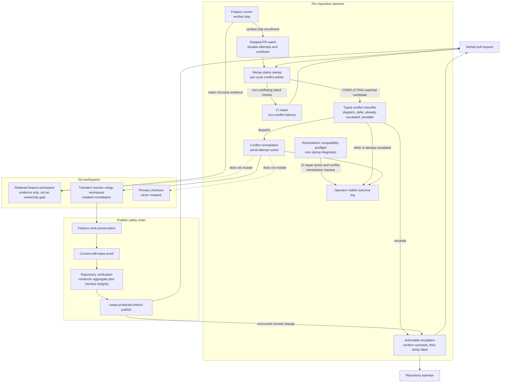
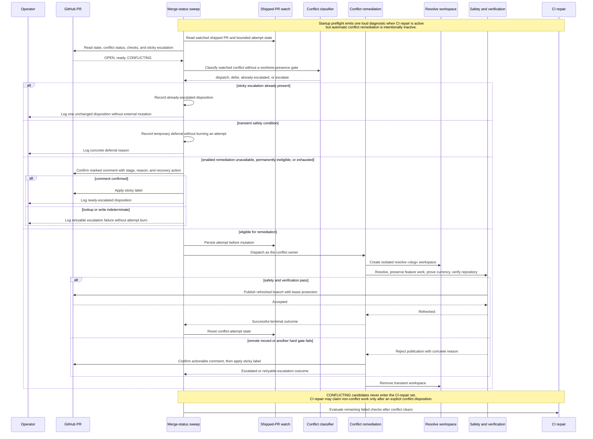

# Components and Sequence: Shipped-PR Conflict Remediation Ownership

**Last updated:** 2026-07-30
**Scope:** Proposed ownership, safety, and fallback flow for issues #737 and #1150.
**Source PRD:** `.docs/specs/2026-07-30-autoresolve-conflict-remediation-deadlock-737.md`

## Component Diagram

## Sequence Diagram

## Legend

- **Shipped-PR watch:** existing durable enrollment that is written only after a verified ship; it carries retry and cooldown state.
- **Retained feature workspace:** completed build evidence kept until the shipped record reaches the default branch. Its presence does not prove an active BUILD owner.
- **Conflict disposition:** exactly one observable result for a conflicting watched pull request in a sweep: started, temporarily deferred, already escalated, or newly escalated.
- **Deliberate opt-out:** suppresses automated pull-request mutations, emits one startup compatibility diagnostic, and reports manual conflict ownership truthfully.
- **Sticky escalation:** a confirmed marker-tagged actionable comment followed by the idempotent `needs-remediation` label. Comment failure leaves the label unapplied so a later cycle can retry safely.
- **Dashed relationships:** explicit non-mutation boundaries.

## Change Log

| Date | Change | Reason |
|------|--------|--------|
| 2026-07-30 | Initial proposed-state component and sequence diagrams | Restore autoresolve ownership and remove the retained-workspace deadlock for #737 and #1150 |
| 2026-07-30 | Preserve deliberate opt-out; add startup compatibility diagnostic | Operator-approved architecture-review correction to FR-7 |
| 2026-07-30 | Confirm actionable comment before applying sticky label | Conflict-check found label-first partial failure could suppress recovery permanently; operator selected comment-first ordering |
| 2026-07-30 | Add typed classifier, sweep arbitration, CI exclusion, and exact verification scope | Plan update mapped the approved design to production wiring and task boundaries |
