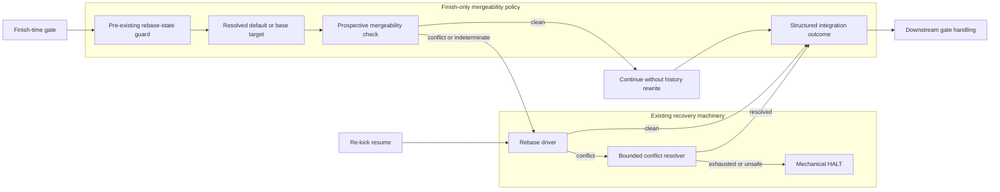
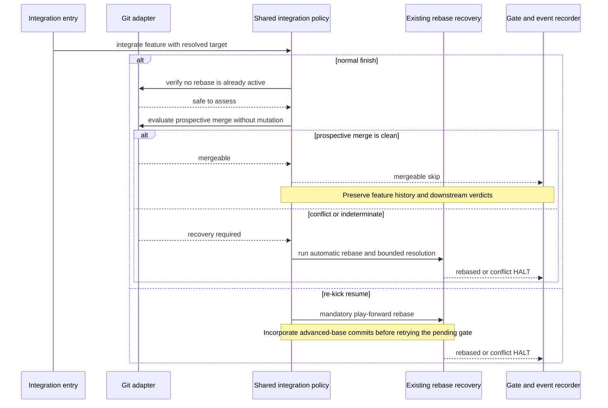

# Architecture: Mergeability-first daemon finish

**Last updated:** 2026-07-30
**Scope:** Finish-time mergeability skipping and preserved re-kick play-forward behavior.

## Component view

## Sequence: entry-specific integration policy

## Architectural notes

- Finish owns the prospective-merge decision because publication readiness is its goal.
- The finish caller enables that policy explicitly when it calls the shared rebase primitive; the
  primitive's default remains mandatory rebase so other callers cannot inherit the skip by omission.
- Re-kick bypasses mergeability skipping because it must incorporate advanced-base commits before
  retrying a previously halted gate.
- The prospective mergeability check is read-only. It cannot update the branch, index, worktree,
  protected-artifact seal, or evidence citations.
- A clean result is a new semantic outcome: the feature is mergeable but may not be current with the
  target branch.
- Conflict and indeterminate results reuse the existing rebase and bounded resolver path.
- Existing detection of an active or paused rebase runs first and retains its fail-closed behavior.

## Legend

- **Finish-time gate:** uses the deterministic mergeability-first decision introduced here.
- **Re-kick resume:** retains mandatory play-forward rebase under its existing contract.
- **Existing recovery machinery:** current rebase, resolver, and HALT behavior retained unchanged
  except for when it is entered.

## Change Log

| Date | Change | Reason |
|------|--------|--------|
| 2026-07-30 | Initial architecture | Describe mergeability-first finish and re-kick behavior |
| 2026-07-30 | Plan update: explicit caller policy | Keep mergeability skipping finish-only while preserving the shared recovery primitive |
