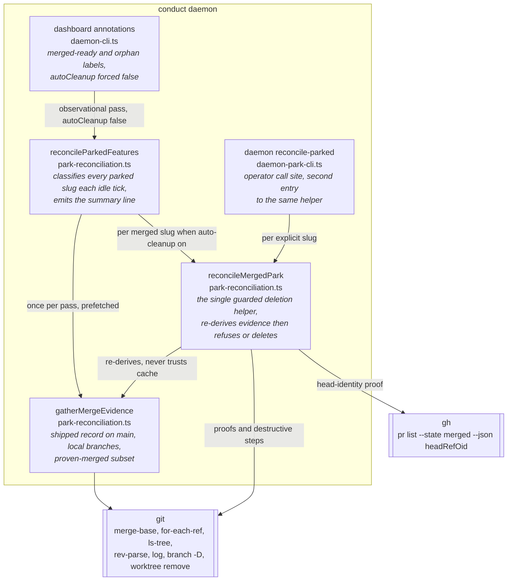
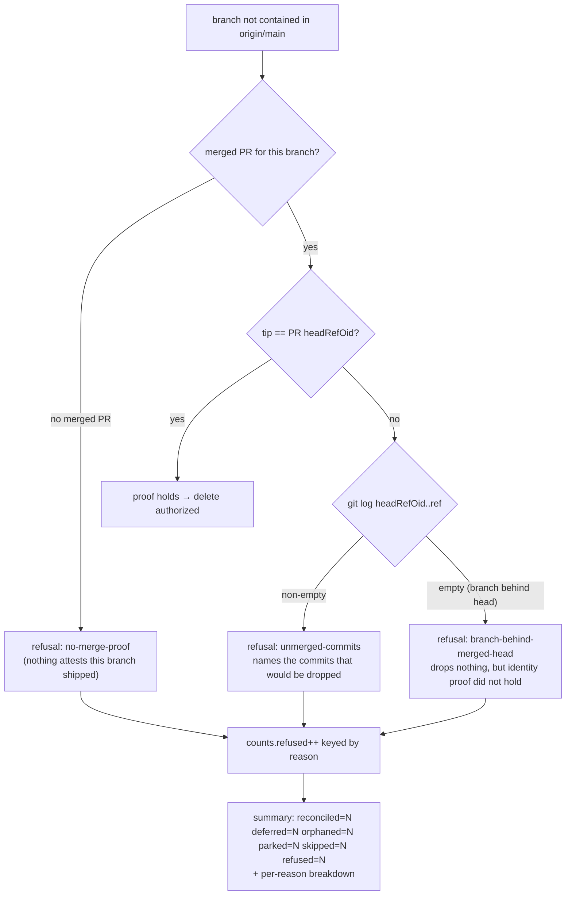

# Architecture: park-reconciliation refusal observability

Feature: park-reconciliation-refusal-observability-1114
Refs: jstoup111/ai-conductor#1114
Date: 2026-08-01

## Scope of change

No new components. The change is confined to one module's return vocabulary and one log line:

- `src/conductor/src/engine/park-reconciliation.ts` — refusal taxonomy + sweep counters
- `src/conductor/src/engine/daemon-park-cli.ts` — operator-verb output of the new reasons
- `src/conductor/src/daemon-cli.ts` — dashboard annotation map (unchanged shape, new inputs)
- `.docs/decisions/` — ADR amendment recording the second and third deletion proofs
- `docs/reference/cli.md`, `docs/guides/running-the-daemon.md` — refusal table + narrative

## C4 — Component view (unchanged topology)

## The change, in one diagram

Today every unproven branch collapses to a single `not-ancestor` refusal, and refusals never reach
the summary counters at all — a refused merged slug simply falls through to `parked++`. That is why
a structurally unreachable cleanup arm reads as a healthy `reconciled=0`.

`ancestry-check-failed` (git could not answer) keeps its present fail-closed meaning and is
reported as its own refusal reason; it is never merged into the new ones.

## Contracts held invariant

1. **Deletion strength is unchanged.** Every branch that is deleted today is still deleted; every
   branch refused today is still refused. This change only *names* and *counts* refusals. No new
   deletion authority is introduced.
2. **Both call sites share the helper.** The sweep and the operator verb continue to funnel through
   `reconcileMergedPark`, so the taxonomy lands on both without duplication.
3. **Fail-closed is preserved.** An unreadable ref, an unavailable `gh`, or an indeterminate log
   range refuses — and now says which of those it was, rather than claiming "not ancestor".
4. **Single-writer park invariant** (`test/engine/park-marker-invariant.test.ts:83`) is untouched.

## Data shape

`ParkedSweepResult.counts` gains `refused: number`. A parallel
`refusedByReason: Record<RefusalReason, number>` carries the breakdown so the summary line can
distinguish causes without callers parsing prose. `sweepSummarySignatures` (the log de-duplication
WeakMap) must include the new fields in its signature string, or a change in refusal mix would be
silently suppressed — the exact invisibility bug this feature exists to remove.
