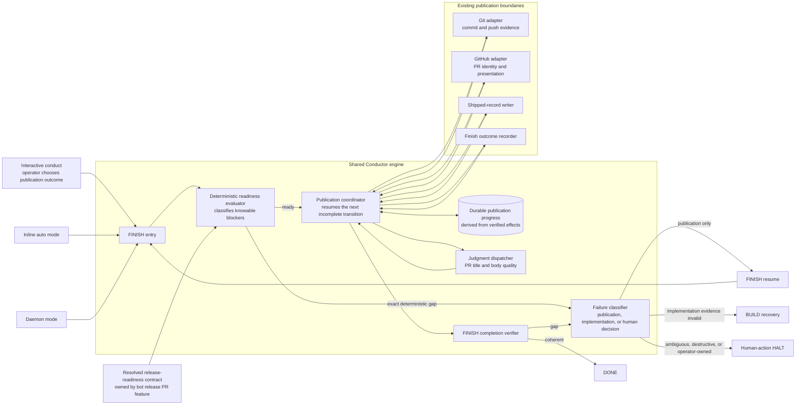
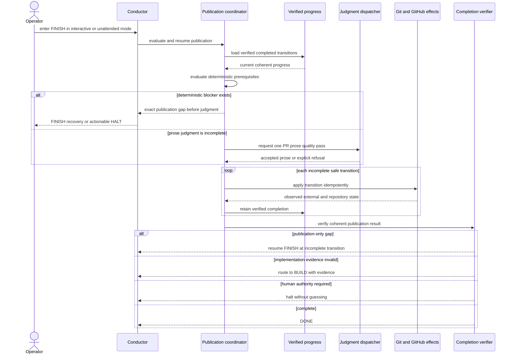

# Architecture: Resumable FINISH Publication

**Last updated:** 2026-08-01
**Scope:** Proposed shared FINISH publication boundary for interactive inline, unattended inline, and daemon execution.

## Component View

## Sequence: Safe Resume Across Modes

## Architectural Constraints

- The coordinator is shared by inline and daemon entry points; interaction policy differs by mode, but completion semantics do not.
- Release-note, changelog, semver, and version-cut state remain outside the coordinator. It consumes the resolved readiness result owned by upstream spec PR #1233.
- Progress is accepted only when verified against repository or external state. A local marker alone is not authority for an externally visible effect.
- The judgment dispatcher owns reader-facing prose quality, not mechanical publication sequencing.
- Publication failures cannot select BUILD unless current implementation evidence is invalid.
- No transition merges a pull request or guesses a destructive or operator-owned decision.
- Existing git, GitHub, shipped-record, and finish-record boundaries should be reused behind injectable adapters rather than duplicated.

## Legend

- Solid arrows are control or verified-effect flows.
- Cylinders represent durable progress derived from authoritative evidence.
- `FINISH resume` means retrying the next incomplete publication transition without replaying completed work.

## Change Log

| Date | Change | Reason |
|------|--------|--------|
| 2026-08-01 | Initial proposed component and sequence views | DECIDE phase for issue #1172 |
| 2026-08-01 | Plan update: externalized release readiness and fixed coordinator wiring | Avoid overlap with bot-owned release PR; keep `conductor.ts` as a thin composition seam |
