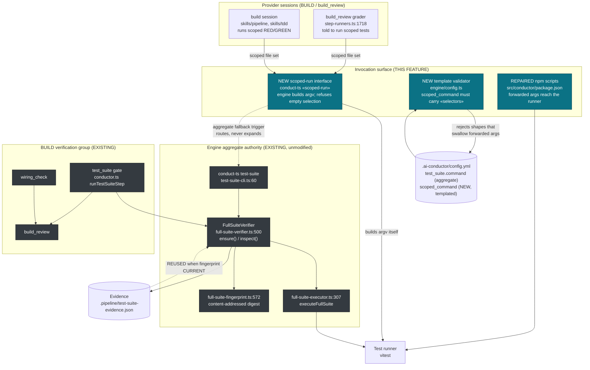
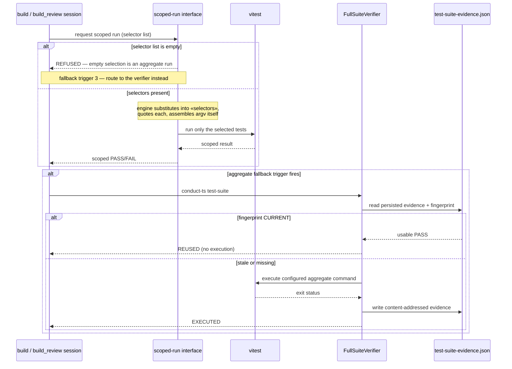

# Components: scoped test invocation cannot expand to the aggregate suite

**Last updated:** 2026-08-01
**Scope:** The test-invocation surface used during BUILD and build_review — how a scoped run
is requested, how a malformed aggregate-expanding command shape is rejected, and how the
already-built `FullSuiteVerifier` remains the single authority for aggregate runs. Scoped to
the invocation seam only; the verifier's internals (fingerprint, lock, evidence) are shown as
existing context and are not modified by this feature.

## Diagram

## Sequence: a scoped run during BUILD

## Legend

- **Teal nodes** are introduced or repaired by this feature; **dark nodes** already exist and
  are not modified.
- `«scoped-run»` is a placeholder for the interface's final verb, decided in `/plan`.
- `«selectors»` is the configured template's substitution point. Selectors are **opaque** to the
  engine — file paths for vitest/pytest/rspec, packages for `go test`, filter expressions for
  `dotnet test`. The engine substitutes and quotes them; it never interprets them.
- The dashed edge from the scoped-run interface to `conduct-ts test-suite` is the key
  invariant: a broad fallback is a **route to the shared verifier**, never an expansion of
  the scoped command in place.
- The dashed edge from evidence back to the verifier is the existing `REUSED` path — shown
  because it is what makes routing a fallback cheap, but it is out of this feature's scope.

## Why the invocation surface is a component boundary

The defect this feature fixes lives entirely at the seam between an agent's *intent* (run
these files) and the *command actually executed*. Today that translation happens inside an
npm script whose shape (`vitest run … && echo 'AGGREGATE_TEST_SUITE_PASS'`) causes npm's
`-- <args>` to be appended to the trailing `echo` rather than to the runner, so a scoped
intent silently becomes an aggregate run. Making the translation an owned interface, and
validating that no configured command can discard forwarded args, closes the seam
mechanically rather than by instruction.

## Change Log

| Date | Change | Reason |
|------|--------|--------|
| 2026-08-01 | Initial generation | DECIDE for intake #1173 — scoped commands must not expand to the aggregate suite |
| 2026-08-01 | Placeholder generalized from `«files»` to opaque `«selectors»`; empty-selection refusal added to the sequence | Operator challenge during architecture review: a file-path list cannot express scoped selection for `go test` (packages), `cargo test` (name filters), or `dotnet`/JVM (filter expressions) |
