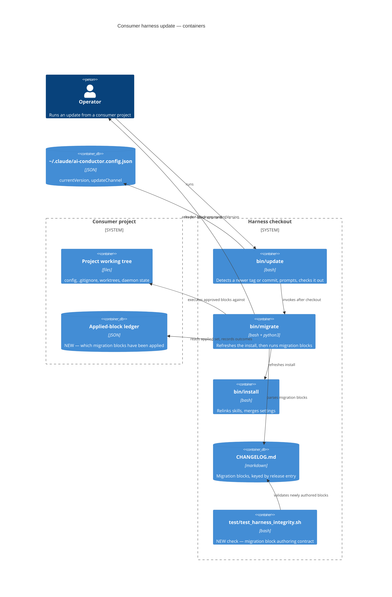
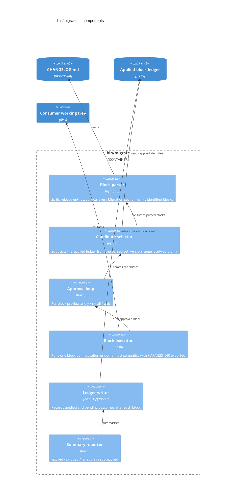
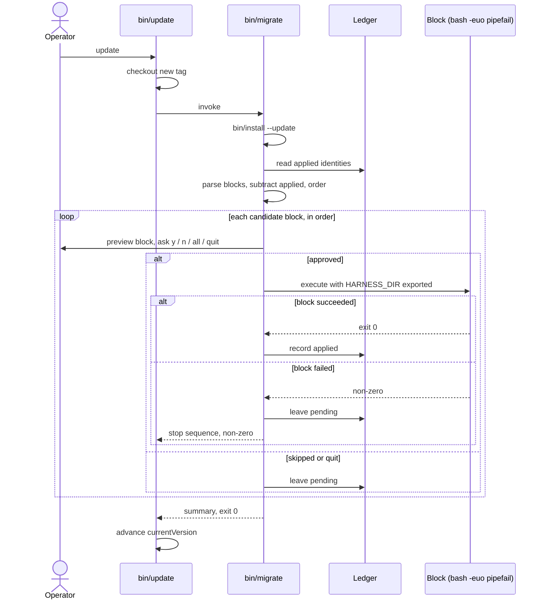

# Architecture: Safe multi-version harness migration

**Date:** 2026-08-03
**Feature:** `verify-bin-migrate-handles-a-multi-version-jump-wi` (`jstoup111/ai-conductor#219`)
**Tier:** M

## Scope

Only the consumer update path changes. The release PR workflow, the changelog renderer, and the
conductor engine are untouched. `bin/migrate` gains a durable applied-block ledger, a fail-fast
per-block executor, and per-block approval; the harness gains an integrity check over newly
authored migration blocks.

## Container view

## Component view — the reworked runner

## Execution sequence

## Key boundary decisions

- **The ledger, not the version string, decides what runs.** The version range stays as an
  advisory display bound. This is what makes the `main@<sha>` channel behave like the tagged
  channel and makes declining a block non-lossy.
- **The ledger lives with the consumer, not the harness.** One harness checkout serves many
  consumer projects, and migration blocks mutate the consumer.
- **One block per shell invocation, fail-fast.** Failure isolation stays at the block boundary, so
  a partial sequence is always representable as applied-prefix plus pending-suffix.
- **`bin/conduct`'s duplicated update logic is out of scope** and continues to call the same
  `bin/migrate`, so it inherits the fix without modification.
