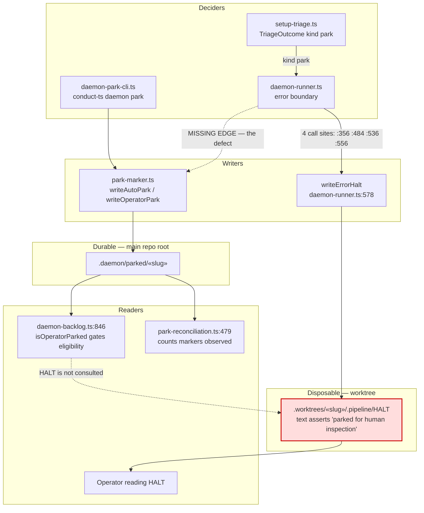
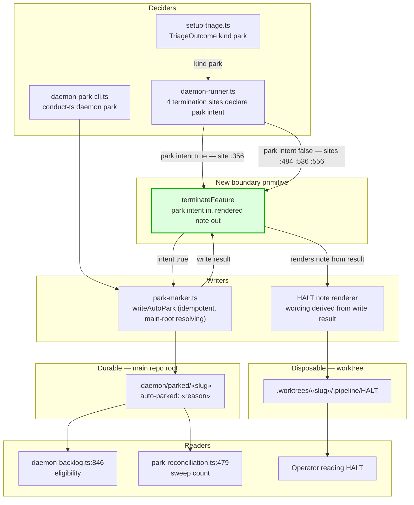

# Components: Honest park termination boundary

**Last updated:** 2026-08-06
**Scope:** The daemon's feature-termination boundary in `daemon-runner.ts` — how a park decision
becomes durable park state, how the `.pipeline/HALT` note is worded, and which downstream readers
consume each artifact. Covers intake `jstoup111/ai-conductor#1328`.

## Current state (defective)

The park decision and the durable park state are produced by two unrelated code paths. Only the
operator CLI reaches the marker writer; the automatic path stops at the HALT note.

The dotted `MISSING EDGE` is the whole bug: `daemon-runner.ts` decides `park`, writes a HALT that
claims the park happened, and returns `status: 'error'` — but nothing ever reaches `park-marker.ts`.
`daemon-backlog.ts:846` consults only `.daemon/parked/«slug»`, so the slug stays dispatchable and is
re-dispatched on the next scan, burning a fix-session each cycle. `park-reconciliation.ts:479`
derives its `parked` count from markers it observes, so it truthfully reports `parked=0`.

## Target state (approach B)

One boundary primitive owns the decision, the marker write, and the wording. The HALT text is
*derived* from what was actually written, so the note cannot assert a park that did not happen.

Ordering is load-bearing: the marker write precedes the HALT render, so a failure to park produces
a note that says so rather than a note that lies. Because `writeAutoPark` is idempotent on `EEXIST`
and resolves the main repo root via `git rev-parse --git-common-dir`, calling it from inside a
worktree is safe and repeat-safe.

## Legend

- **Disposable — worktree**: `.pipeline/HALT` lives inside `.worktrees/«slug»/`, which this repo
  treats as recreatable (CLAUDE.md, Daemon Operations Safety rule 3). It is operator-facing prose
  and must never be load-bearing for dispatch control.
- **Durable — main repo root**: `.daemon/parked/«slug»` survives worktree removal and is the only
  artifact `daemon-backlog.ts` honors. It is the single source of dispatch-stop truth.
- **Red node**: artifact whose content is currently false with respect to on-disk state.
- **Green node**: component introduced by this change.
- Dotted edges denote absent or unread relationships, not runtime calls.

## Change Log

| Date | Change | Reason |
|------|--------|--------|
| 2026-08-06 | Initial generation | Spec for intake #1328 — automatic park writes no marker |
