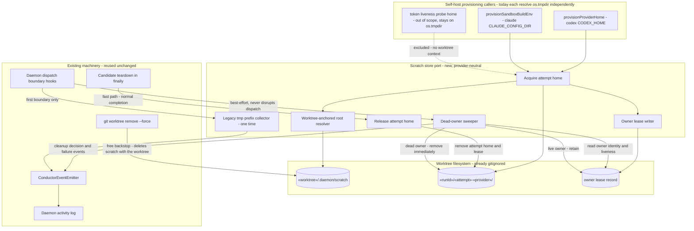

# Components: Worktree-local provider scratch lifecycle

**Last updated:** 2026-08-09
**Scope:** Proposed placement and ownership of throwaway provider homes. Replaces three independent `os.tmpdir()` resolutions with one worktree-anchored scratch port, adds a per-home owner lease, and adds a dead-owner sweep that complements the existing teardown and worktree-reap paths.

> **Amended 2026-08-09 by #1223:** the port covers the two build-path creators only — `provisionProviderHome` and `provisionSandboxBuildEnv`. The token-liveness probe home stays on `os.tmpdir()`: its only call site is `build-auth-cli.ts`'s `build-auth-status`, a foreground CLI with no worktree, run, or attempt to anchor to, and it is not a leak source. The original three-caller assertion is preserved above.

> **Amended 2026-08-09 by #1223:** the run id is injected into the port by the caller, not resolved by the port from `.pipeline/conduct-session-id`. Reading that file would recouple scratch placement to wherever durable run-state lives, which is the coupling this design exists to avoid.

> **Amended 2026-08-09 by #1223:** the scratch root is `«worktree»/.daemon/scratch/`, not `«worktree»/.pipeline/scratch/`. #564's approved placement (`adr-2026-07-21-run-state-home-dir-placement`) turns `«worktree»/.pipeline` into an outward symlink, so anything beneath it would resolve outside the worktree and lose the reap backstop. A new top-level name was also rejected: the live-boundary guard does not consult `.gitignore` (`live-boundary.ts:48`), so only a prefix already on `LIVE_CHECKOUT_VOLATILE` is safe. `.daemon` is the one prefix that is both already excluded and untouched by #564. This is the **worktree's** `.daemon`, not the repository root's.

## Diagram

## Legend

- **Scratch store port** is the single seam that replaces the three separate `os.tmpdir()` resolutions. Each caller keeps its own existing teardown contract; only base-directory resolution and lease bookkeeping move.
- **Worktree-anchored root resolver** anchors the root to the worktree itself, deliberately not to wherever durable run-state lives. It resolves under the worktree's `.daemon/` — a prefix that is already gitignored, already on the live-boundary exclusion list, and not relocated by #564 — so scratch stays behind when run-state moves out and the reap backstop keeps working.
- **Owner lease record** is durable state, not telemetry — it answers "is this home live, and which feature and run own it" and is read by name by the sweeper.
- **Dead-owner sweeper** deletes only homes whose recorded owner is no longer running. There is no retention window for dead homes: provider homes carry no post-attempt value, so the only reason to retain is liveness.
- **Legacy tmp prefix collector** runs once to collect homes already leaked under the historical `/tmp` prefixes; it is not part of the steady-state path.
- **Free backstop** is the existing `git worktree remove --force`, which deletes gitignored content along with the worktree. No new reaper is introduced for it.
- Cleanup decisions and failures ride the existing event spine; the daemon log is a consumer, never a second channel.

## Change Log

| Date | Change | Reason |
|------|--------|--------|
| 2026-08-09 | Initial generation | DECIDE for intake #1223 — interrupted self-host runs leak provider homes until the tmpfs quota fails |
| 2026-08-09 | Scratch root moved to the worktree's `.daemon/`; token-liveness excluded; run id injected | Architecture review found the #564 symlink collision and two scope corrections |
| 2026-08-10 | Normal-path release event removed | Conflict-check found it inconsistent with the three-variant set the stories enumerate |
